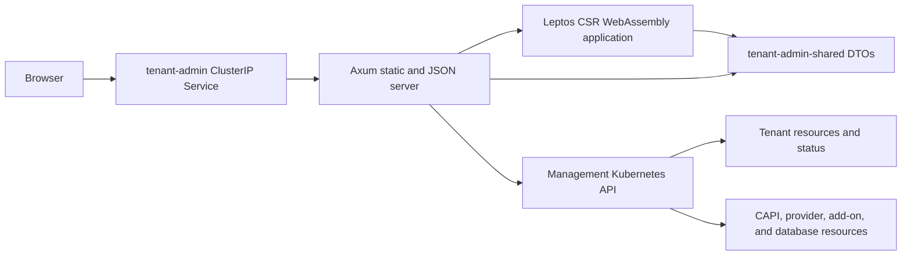

# Tenant Admin UI design

## Purpose and boundary

Tenant Admin is a read-only application deployed once in each local Kind or
Azure AKS management cluster. It gives administrators a browser view of the
same `Tenant` resources, conditions, provider status, and management resources
used by the lifecycle controller.

Kubernetes is the only durable data source. The application has no database,
filesystem journal, watch cache, Tenant kubeconfig, Azure credentials, or
direct browser-to-Kubernetes connection. Every API request performs bounded
reads against the management Kubernetes API and returns sanitized DTOs.

The first release has no mutation routes, forms, or write permissions. Future
create or delete support must be designed as separate authenticated command
endpoints with explicit authorization, idempotency, validation, audit, and
ownership contracts. It must not be added by broadening the current read-only
ServiceAccount.

## Architecture



The browser is a Leptos client-side WebAssembly application, and the native
process is an Axum server. The Cargo workspace contains three crates:

| Crate | Responsibility |
|---|---|
| `admin/shared` | Versioned JSON envelopes, query DTOs, route constants, and topology types shared by native and Wasm targets. |
| `admin/server` | Native Axum server, kube-rs reads, status projection, topology identity validation, health endpoints, and static-file fallback. |
| `admin/web` | Leptos client-side application, manual refresh, tables, detail panels, errors, and deterministic SVG layout. |

The server listens on `0.0.0.0:8080`. The generated Deployment,
ServiceAccount, ClusterRoleBinding, and ClusterIP Service are named
`tenant-admin` in `tenant-system`. Local installs the
`tenant-admin-local` ClusterRole and Azure installs `tenant-admin-azure`.
The Service exposes port `80`.

## Data and security model

The server initializes one in-cluster kube-rs client. It lists at most 500
Tenants, at most 500 resources of one catalog kind, and at most 2,000
management resources for one detail request. Catalog requests have bounded
concurrency. Kubernetes errors become typed service errors; oversized results
fail rather than being silently truncated.

Secrets are excluded from both the resource list and RBAC. Provider-specific
ClusterRoles are derived from the matching management-resource catalog:
Tenants receive `get` and `list`, the deterministic cluster-scoped Namespace
receives `get`, and every provider resource actually scanned receives `list`.
Each role grants only exact `get` and `list` verbs and no
provider-irrelevant resource, wildcard, subresource,
Secret, watch, create, update, patch, or delete access.

Installation and health checks compare the owned ServiceAccount, binding, and
selected ClusterRole with the tracked generated resources. They also submit
an impersonated `SelfSubjectRulesReview` and compare the complete effective
resource permissions with the generated contract. Incomplete evaluations,
extra bindings, mutations, subresources, wildcards, or provider-irrelevant
rights fail health. Only the exact Kubernetes self-review permissions and
bounded authenticated discovery URLs supplied by default cluster roles are
accepted outside the generated contract. The browser receives no
ServiceAccount token, kubeconfig, certificate, credential, or raw unbounded
Kubernetes object.

Displayed strings and identities are bounded and sanitized. Azure resource
IDs shown by the UI come from durable Tenant status; the server does not call
Azure APIs.

## Views and refresh behavior

### Management overview

The overview reports provider mode, total Tenant count, Ready, Progressing,
Degraded, Failed, and Deleting counts, plus the available management component
summary.

### Tenant table

The table shows name, provider, generation-aware classification, Kubernetes
version, requested workers and local databases, endpoint, age, and summarized
conditions. An empty management cluster produces a valid empty table and zero
counts.

### Tenant detail and topology

The detail view shows the immutable specification, current conditions and
blockers, provider-specific status, accepted management resources, and a
provider-neutral topology. The topology includes Tenant, control-plane,
worker-pool, Machine, Node, provider-resource, add-on, and database nodes when
the management API and durable Tenant status provide trusted identities.

Refresh is manual. Loading a page or selecting **Refresh** issues new API
requests; there is no polling, SSE stream, browser persistence, or server-side
cache. A Tenant deleted between list and detail returns a typed not-found
response and a non-fatal link back to the overview.

## HTTP API and DTO contract

Every successful JSON response is:

```json
{"schemaVersion":1,"data":{}}
```

Errors use schema version 1 plus a typed error code, sanitized message, and
retryable flag. The routes are:

| Route | Response |
|---|---|
| `GET /healthz` | Process liveness. |
| `GET /readyz` | Management Kubernetes API readiness. |
| `GET /api/v1/overview` | One `OverviewSnapshot` containing the overview and sorted Tenant summaries from the same list operation. |
| `GET /api/v1/tenants` | Sorted `TenantSummary[]`. |
| `GET /api/v1/tenants/{name}` | One `TenantSnapshot` containing detail and topology from the same Tenant UID/generation/resource read. |
| `GET /api/v1/tenants/{name}/topology` | `TopologyGraph`. |
| `GET /*` | Static asset or `index.html` fallback for browser routes. |

`/overview` and `/tenants/{name}` are the coherent snapshot routes. The
`/tenants` and `/tenants/{name}/topology` compatibility routes are validated
independently for schema and shape; health does not compare their values with
a snapshot returned by a separate request because normal reconciliation may
advance between calls.

The shared DTOs include:

- `TenantSummary`, generation-aware classifications, and bounded conditions;
- `TenantDetail`, `TenantSpecificationView`, provider status, blockers, and
  accepted management-resource identities;
- local allocation/foundation/Cluster identity;
- Azure binding, management roots, worker pool, Nodes, add-ons, and recorded
  provider resources;
- topology nodes, edges, health, display attributes, and exact resource
  identity.

Schema changes require a deliberate `schemaVersion` change and coordinated
server/web deployment. The UI treats a mismatched schema as a visible
non-retryable error.

## Topology identity rules

The projection never associates resources by a broad Tenant label alone.

For local Tenants, roots must match the controller catalog, deterministic
name, Tenant name and UID annotations, canonical specification hash,
foundation hash, resource role, recorded Cluster UID where applicable, and
the existing provider-owner validation contract. Descendants are accepted
only through a validated exact owner UID chain to an accepted root.

For Azure Tenants, roots must match the Azure catalog, durable binding and
operation markers, and UIDs recorded in Tenant status. Descendants must match
recorded GVK/name/namespace/UID entries and recorded owner UIDs, then connect
to an accepted root through the live owner chain. Secrets and ambiguous,
foreign, marker-only, missing-UID, or owner-inconsistent objects are excluded.

Node and add-on information is rendered only when already represented by
sanitized durable status. The admin server does not connect to Tenant APIs.
Partially reconciled Tenants retain available trusted nodes and show missing
components as blockers rather than inventing topology.

## Build and packaging

Rust `1.98.1`, the `wasm32-unknown-unknown` target, Trunk `0.21.14`, and
wasm-bindgen CLI `0.2.129` are pinned. `just cache` is the only online
acquisition path for Trunk and wasm-bindgen; `just cache admin-build` is the
CI-focused subset. Admin builds then use locked Cargo dependencies, Trunk
`--locked --offline`, and the verified local binaries.

Useful commands are:

```bash
just admin-fetch
just admin-generate-check
just admin-lint
just admin-test
just admin-metrics
just admin-package-check
just admin-image
```

`admin-package-check` performs two release builds and compares the static
server plus the exact HTML, JavaScript, Wasm, and CSS inventory by SHA-256.
The server is rejected if ELF `INTERP` or `NEEDED` entries are present. The
scratch image contains only `/tenant-admin` and `/web` and runs as UID/GID
65532.

The Deployment uses `Recreate` rather than a rolling update. Each image owns
one content-hashed frontend generation, so old and new server/assets are never
simultaneously selected by the Service. Missing `.js`, `.wasm`, and `.css`
paths return 404; only extensionless browser routes receive the SPA shell.

Generated browser bundles under `.runtime/rendered/admin/web` are ignored
build output, not source or checked-in generated fixtures. The authoritative
inputs are the Rust, HTML, CSS, Trunk configuration, Cargo lockfile, pinned
tool identities, generated Kubernetes resources, and Dockerfile.

Fast CI uploads the static server and exact web inventory with the controller
manager. PR E2E accepts those files only when they are owned, non-writable,
regular sibling artifacts below `.tools/artifacts`; it revalidates the static
ELF and exact browser inventory before copying them into private runtime state.
Scheduled/manual high-capacity CI rebuilds independently from the verified
cache.

### Local Kind

Management creation builds or accepts the validated CI artifact, creates the
provider-neutral scratch image, loads its exact tag into Kind, applies the
local least-privilege resources and Deployment, waits for rollout, and
validates Deployment UID, image, provider mode, Pod, Service, complete
effective RBAC, health, overview, list, detail, and topology.

### Azure AKS

`azure-create-management` builds the same provider-neutral image, pushes the
configured repository/tag to the shared ACR, verifies the registry digest,
and deploys the immutable digest with provider mode `azure`. Foundation
inventory records `adminImage` and `adminDeploymentUid` together after a
healthy rollout. Foundation health validates repository binding, immutable
image, Deployment UID and readiness, Pod security, provider mode, resource
limits, probes, Service, the Azure-specific complete effective RBAC contract,
and API health. Existing
pre-admin foundation inventory remains valid until management installation
adds both optional fields.

## Usage

After management creation:

```bash
just admin-status
just admin-port-forward
```

`just admin-port-forward` runs:

```text
kubectl -n tenant-system port-forward service/tenant-admin 8080:80
```

Open <http://127.0.0.1:8080/>. The Service is ClusterIP-only; there is no
Ingress, public endpoint, or application authentication in this experiment.
Access therefore depends on the operator's authenticated management-cluster
kubeconfig and local port-forward process.

## Troubleshooting

- **`admin-fetch` fails offline**: refresh Cargo dependencies with the explicit
  online `just admin-fetch`, or run the complete `just cache` before an
  enforced-offline gate.
- **Trunk or wasm-bindgen is missing or has the wrong version**: run
  `just cache` followed by `just tools`; do not install an unpinned global
  replacement.
- **Generated resources are stale**: run
  `python3 scripts/generate_admin_resources.py`, review the exact RBAC and
  Deployment changes, then rerun `just admin-generate-check`.
- **`/readyz` returns 503**: inspect management API reachability and
  ServiceAccount authorization. Liveness can remain healthy while Kubernetes
  reads fail.
- **Overview works but detail omits resources**: inspect Tenant status UIDs,
  controller markers, and owner references. Foreign or ambiguous objects are
  intentionally excluded.
- **Nested browser route returns an error**: verify the static web inventory
  and server/web schema are from the same build; the Axum fallback should
  return `index.html`.
- **Azure foundation health reports admin drift**: compare the recorded
  immutable digest and Deployment UID with the live `tenant-admin` resources;
  rerun `azure-create-management` only after resolving unexpected ownership
  or identity changes.

## Limitations

This is an experimental administrative view, not a production control plane.
It has no Ingress, application authentication, authorization by Tenant,
pagination UI, watch/poll stream, historical data, metrics backend, audit
store, Tenant workload topology, or mutation support. Local Nodes and database
health are summarized from management-observable state; the server never uses
a Tenant kubeconfig. Azure Disk and CloudNativePG remain outside the Azure
experiment. The fixed list limits intentionally fail closed for larger
management clusters and will require a separately designed pagination model.
