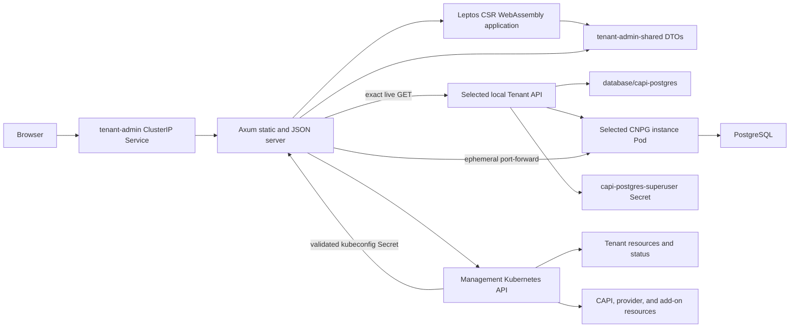

# Tenant Admin UI design

## Purpose and boundary

Tenant Admin is an administrative application deployed once in each local
Kind or Azure AKS management cluster. It gives administrators a browser view
of the same `Tenant` resources, conditions, provider status, and management
resources used by the lifecycle controller. Local Tenant detail pages also
provide an explicitly unsafe PostgreSQL superuser console. The overview can
create provider-compatible Tenants, and detail pages can delete the exact
displayed Tenant identity.

Kubernetes is the only durable data source. The application has no database,
filesystem journal, watch cache, persisted Tenant kubeconfig, Azure
credentials, or direct browser-to-Kubernetes connection. Overview requests
perform bounded reads against the management Kubernetes API. A selected local
Tenant detail request additionally validates the exact provider-owned
kubeconfig Secret, constructs an in-memory Tenant client, and performs exact
live reads of the managed CNPG Cluster before returning sanitized DTOs. A
query request repeats that trust validation, reads the exact CNPG instance Pod
and generated superuser Secret, and opens an ephemeral Kubernetes API
port-forward to PostgreSQL. SQL and result data are transient and are not
persisted.

Browser mutation requests must have a same-authority `Origin`/`Host` pair and the
`X-Tenant-Admin-Unsafe-Request: 1` header emitted by the Leptos client. The
host must be `localhost` or an IPv4/IPv6 literal, preserving local and WSL
access while rejecting DNS names that can be rebound to the forwarded service.
The custom header also blocks simple cross-origin form requests. No-`Origin`
Kubernetes service-proxy requests remain available for operational validation.

The management-cluster ServiceAccount can create and delete only top-level
Tenant resources. It also reads the exact named controller Deployment to
discover provider/version capability; it has no allocation-Lease or downstream
infrastructure mutation authority. The SQL endpoint is a separate,
deliberately unsafe data-plane capability obtained through the
validated Tenant administrative kubeconfig. It can execute DDL, DML,
transaction control, and multiple statements as PostgreSQL superuser.

## Architecture



The browser is a Leptos client-side WebAssembly application, and the native
process is an Axum server. The Cargo workspace contains three crates:

| Crate | Responsibility |
|---|---|
| `admin/shared` | Versioned JSON envelopes, query DTOs, route constants, and topology types shared by native and Wasm targets. |
| `admin/server` | Native Axum server, kube-rs reads, status projection, topology identity validation, health endpoints, and static-file fallback. |
| `admin/web` | Leptos client-side application, manual refresh, tables, detail panels, errors, and deterministic SVG layout. |

The server listens on `0.0.0.0:8080`. The generated Deployment,
ServiceAccount, ClusterRoleBinding, and ClusterIP Service are named
`tenant-admin` in `tenant-system`. Local installs the
`tenant-admin-local` ClusterRole and Azure installs `tenant-admin-azure`.
The Service exposes port `80`. These checked-in resources and deployment
templates are canonical indented JSON, generated and validated with only the
Python standard library so offline installation never needs PyYAML or pip.

## Data and security model

The server initializes one management-cluster kube-rs client. It lists at most 500
Tenants, at most 500 resources of one catalog kind, and at most 2,000
management resources for one detail request. Catalog requests have bounded
concurrency. Kubernetes errors become typed service errors; oversized results
fail rather than being silently truncated.

Secrets remain excluded from management-resource inventory and responses.
Provider-specific ClusterRoles are derived from the matching
management-resource catalog. Tenants receive `get`, `list`, `create`, and
`delete`; the exact `tenant-controller` Deployment receives named `get`; the
deterministic cluster-scoped Namespace
receives `get`, and every provider resource actually scanned receives `list`.
Local mode additionally receives only `get` on core Secrets so it can fetch
the deterministic `<tenant>-kubeconfig` Secret. Kubernetes RBAC cannot scope a
ClusterRole to dynamically named Secrets, so this is deliberately broad
administrative read authority; the server narrows use to the selected Tenant
namespace and validates the exact Secret name, control-plane ownership,
markers, endpoint, CA, context, and credential structure before use. It never
lists or watches Secrets. Azure mode receives no Secret permission.

The validated Tenant kubeconfig exists only in request memory. The resulting
client has fixed connect/read/write timeouts, no proxy URL, and retries
disabled. Detail observations perform an exact GET of
`postgresql.cnpg.io/v1`, `Cluster`, `database/capi-postgres`. Query requests
additionally exact-GET the selected instance Pod and
`database/capi-postgres-superuser` Secret, then use the Pod port-forward
subresource through the Tenant client. They never list Tenant workloads or
Secrets. Each management role otherwise grants only exact read verbs and no
provider-irrelevant resource, wildcard, subresource, watch, update, patch, or
downstream delete access.

Installation and health checks compare the owned ServiceAccount, binding, and
selected ClusterRole with the tracked generated resources. They also submit
an impersonated `SelfSubjectRulesReview` in every live Namespace from a
bounded management-admin inventory and compare the complete effective
resource permissions with the generated contract. This catches additive
RoleBindings outside `tenant-system`. Incomplete evaluations, extra bindings,
mutations, subresources, wildcards, or provider-irrelevant rights fail health.
Only the exact Kubernetes self-review permissions and bounded authenticated
discovery URLs supplied by default cluster roles are accepted outside the
generated contract. The browser receives no ServiceAccount token, kubeconfig,
certificate, PostgreSQL credential, connection URI, pgpass value, or raw
unbounded Kubernetes object.

Displayed strings and identities are bounded and sanitized. Azure resource
IDs shown by the UI come from durable Tenant status; the server does not call
Azure APIs.

## Views and refresh behavior

### Management overview

The overview reports provider mode, total Tenant count, Ready, Progressing,
Degraded, Failed, and Deleting counts, plus the available management component
summary. It also reports creation capability independently from Tenant reads.
The create form uses the controller-supported Kubernetes version and accepts
name/workers plus local-only database count; Azure CIDRs are controller
allocated.

### Tenant table

The table shows name, provider, generation-aware classification, Kubernetes
version, requested workers and local databases, endpoint, age, and summarized
conditions. An empty management cluster produces a valid empty table and zero
counts.

### Tenant detail and topology

The detail view shows the immutable specification, current conditions and
blockers, provider-specific status, accepted management resources, and a
provider-neutral topology. For local Tenants it also shows a live CNPG panel:
cluster phase, desired/observed/ready counts, primary and failover target,
promotion timestamps, image and timeline, read/write Services, topology
placement, PVC health, conditions, and sorted primary/standby instances. The
topology includes the exact CNPG Cluster and observed instances when available,
or an explicit unavailable node when Tenant access is pending or fails.
Azure reports database observation as not applicable.

The detail page also exposes destructive Tenant deletion. The administrator
must type the exact Tenant name, and the server binds deletion to the displayed
UID and current resourceVersion. Same-name replacements are rejected.
Deletion is asynchronous; refresh shows Deleting conditions and blockers.

When a local database observation is available, the detail page also shows an
unsafe SQL console. The administrator selects an observed primary, standby, or
unknown-role instance, chooses the PostgreSQL database, and submits arbitrary
SQL. The backend executes the request on that exact instance and returns
ordered result sets with column names, text values, NULL values, affected-row
counts, timing, and explicit truncation state. PostgreSQL errors remain
visible with SQLSTATE and sanitized server messages.

Execution has a 30-second transport deadline. On expiry the server opens a
second UID-revalidated port-forward, sends a PostgreSQL cancellation request,
and reaps the query connection. It reports a timeout only when termination is
confirmed; otherwise it returns the explicit non-retryable
`query-outcome-unknown` error so the administrator does not assume that a
mutation stopped. PostgreSQL backend frames are length-checked before they are
forwarded to the client decoder, preventing a single declared value from
bypassing the response-memory boundary.

Refresh is manual. Loading a page or selecting **Refresh** issues new API
requests; there is no polling, SSE stream, browser persistence, or server-side
cache. Overview and list requests never fan out to Tenant APIs. Tenant or CNPG
unavailability is represented as a bounded partial observation so the rest of
the detail page remains usable. A Tenant deleted between list and detail
returns a typed not-found response and a non-fatal link back to the overview.

## HTTP API and DTO contract

Every successful JSON response is:

```json
{"schemaVersion":4,"data":{}}
```

Errors use schema version 4 plus a typed error code, sanitized message,
retryable flag, and optional bounded field errors. The routes are:

| Route | Response |
|---|---|
| `GET /healthz` | Process liveness. |
| `GET /readyz` | Management Kubernetes API readiness. |
| `GET /api/v1/overview` | One `OverviewSnapshot` containing the overview and sorted Tenant summaries from the same list operation. |
| `GET /api/v1/tenants` | Sorted `TenantSummary[]`. |
| `POST /api/v1/tenants` | Create one Tenant for the configured provider using the active supported version. |
| `GET /api/v1/tenants/{name}` | One `TenantSnapshot` containing detail, live database observation, and topology from the same Tenant UID/generation/resource read. |
| `DELETE /api/v1/tenants/{name}` | Delete the exact displayed Tenant UID with typed-name confirmation. |
| `GET /api/v1/tenants/{name}/topology` | `TopologyGraph`. |
| `POST /api/v1/tenants/{name}/database/query` | Execute unrestricted SQL as CNPG PostgreSQL superuser on one exact observed instance and return bounded ordered results. |
| `GET /*` | Static asset or `index.html` fallback for browser routes. |

`/overview` and `/tenants/{name}` are the coherent snapshot routes. The
`/tenants` and `/tenants/{name}/topology` compatibility routes are validated
independently for schema and shape; health does not compare their values with
a snapshot returned by a separate request because normal reconciliation may
advance between calls. If a per-Tenant request fails, health re-reads the
overview once and accepts the failure only when that coherent snapshot proves
the Tenant was concurrently deleted.

The shared DTOs include:

- `TenantSummary`, generation-aware classifications, and bounded conditions;
- `TenantDetail`, `TenantSpecificationView`, provider status, blockers, and
  accepted management-resource identities;
- local allocation/foundation/Cluster identity;
- explicit available, unavailable, or not-applicable database observation;
- bounded CNPG identity, phase, primary/standby instances, placement, storage,
  Services, conditions, and observation timestamp;
- database query request, ordered result sets, NULL values, affected-row
  counts, timing, and truncation state without credentials;
- creation capability, provider-neutral create request/result, UID-bound
  delete request/result, and field-associated validation errors;
- Azure binding, management roots, worker pool, Nodes, add-ons, and recorded
  provider resources;
- topology nodes, edges, health, display attributes, and exact resource
  identity.

Schema changes require a deliberate `schemaVersion` change and coordinated
server/web deployment. The UI treats a mismatched schema as a visible
non-retryable error.

## Topology identity rules

The projection never associates resources by a broad Tenant label alone.

For local Tenants, roots must match the controller catalog, deterministic
name, Tenant name and UID annotations, canonical specification hash,
foundation hash, resource role, recorded Cluster UID where applicable, and
the existing provider-owner validation contract. Descendants are accepted
only through a validated exact owner UID chain to an accepted root.

For Azure Tenants, roots must match the Azure catalog, durable binding and
operation markers, and UIDs recorded in Tenant status. Descendants must match
recorded GVK/name/namespace/UID entries and recorded owner UIDs, then connect
to an accepted root through the live owner chain. Secrets and ambiguous,
foreign, marker-only, missing-UID, or owner-inconsistent objects are excluded.

Node and add-on information is rendered only when already represented by
sanitized durable status. For local CNPG only, the admin server connects to
the selected Tenant API after validating the provider-owned kubeconfig and
reads the deterministic Cluster. CNPG instance topology is derived only from
that Cluster's bounded status fields; raw objects, arbitrary labels, internal
IPs, system IDs, managed roles, Secrets, and credentials are excluded.
Partially reconciled Tenants retain available trusted nodes and show missing
components as blockers rather than inventing topology.

## Build and packaging

Rust `1.98.1`, the `wasm32-unknown-unknown` target, Trunk `0.21.14`, and
wasm-bindgen CLI `0.2.129` are pinned. `just cache` is the only online
acquisition path for Trunk and wasm-bindgen; `just cache admin-build` is the
CI-focused subset. Admin builds then use locked Cargo dependencies, Trunk
`--locked --offline`, and the verified local binaries.

Useful commands are:

```bash
just admin-fetch
just admin-generate-check
just admin-lint
just admin-test
just admin-metrics
just admin-package-check
just admin-image
```

`admin-package-check` performs two release builds and compares the static
server plus the exact HTML, JavaScript, Wasm, and CSS inventory by SHA-256.
The server is rejected if ELF `INTERP` or `NEEDED` entries are present. The
scratch image contains only `/tenant-admin` and `/web` and runs as UID/GID
65532.

The Deployment uses `Recreate` rather than a rolling update. Each image owns
one content-hashed frontend generation, so old and new server/assets are never
simultaneously selected by the Service. Missing `.js`, `.wasm`, and `.css`
paths return 404; only extensionless browser routes receive the SPA shell.

Generated browser bundles under `.runtime/rendered/admin/web` are ignored
build output, not source or checked-in generated fixtures. The authoritative
inputs are the Rust, HTML, CSS, Trunk configuration, Cargo lockfile, pinned
tool identities, generated Kubernetes resources, and Dockerfile.

Fast CI uploads the static server and exact web inventory with the controller
manager. PR E2E accepts those files only when they are owned, non-writable,
regular sibling artifacts below `.tools/artifacts`; it revalidates the static
ELF and exact browser inventory before copying them into private runtime state.
Scheduled/manual high-capacity CI rebuilds independently from the verified
cache.

### Local Kind

Management creation builds or accepts the validated CI artifact, creates the
provider-neutral scratch image, loads its exact tag into Kind, applies the
local least-privilege resources and Deployment, waits for rollout, and
validates Deployment UID, image, provider mode, Pod, Service, complete
effective RBAC, health, overview, list, detail, and topology.

### Azure AKS

`azure-create-management` builds the same provider-neutral image, pushes the
configured repository/tag to the shared ACR, verifies the registry digest,
and deploys the immutable digest with provider mode `azure`. Foundation
inventory records `adminImage` and `adminDeploymentUid` together after a
healthy rollout. Foundation health validates repository binding, immutable
image, Deployment UID and readiness, Pod security, provider mode, resource
limits, probes, Service, the Azure-specific complete effective RBAC contract,
and API health. Existing
pre-admin foundation inventory remains valid until management installation
adds both optional fields.

## Usage

After management creation:

```bash
just admin-status
just admin-port-forward
```

`just admin-port-forward` runs:

```text
kubectl -n tenant-system port-forward service/tenant-admin 8080:80
```

Open <http://127.0.0.1:8080/>. The Service is ClusterIP-only; there is no
Ingress, public endpoint, or application authentication in this experiment.
Access therefore depends on the operator's authenticated management-cluster
kubeconfig and local port-forward process. Anyone who can load this UI can use
the local SQL console as PostgreSQL superuser and can destroy Tenant data.

## Troubleshooting

- **`admin-fetch` fails offline**: refresh Cargo dependencies with the explicit
  online `just admin-fetch`, or run the complete `just cache` before an
  enforced-offline gate.
- **Trunk or wasm-bindgen is missing or has the wrong version**: run
  `just cache` followed by `just tools`; do not install an unpinned global
  replacement.
- **Generated resources are stale**: run
  `python3 scripts/generate_admin_resources.py`, review the exact RBAC and
  Deployment changes, then rerun `just admin-generate-check`.
- **`/readyz` returns 503**: inspect management API reachability and
  ServiceAccount authorization. Liveness can remain healthy while Kubernetes
  reads fail.
- **Overview works but detail omits resources**: inspect Tenant status UIDs,
  controller markers, and owner references. Foreign or ambiguous objects are
  intentionally excluded.
- **Database panel is unavailable**: inspect the deterministic Tenant
  kubeconfig Secret ownership, Tenant endpoint reachability, CNPG CRD, and
  `database/capi-postgres`. The response reason distinguishes pending access,
  invalid credentials, Tenant API failure, missing Cluster, and malformed
  status without exposing credential details.
- **Nested browser route returns an error**: verify the static web inventory
  and server/web schema are from the same build; the Axum fallback should
  return `index.html`.
- **Azure foundation health reports admin drift**: compare the recorded
  immutable digest and Deployment UID with the live `tenant-admin` resources;
  rerun `azure-create-management` only after resolving unexpected ownership
  or identity changes.

## Limitations

This is an experimental administrative tool, not a production control plane.
It has no Ingress, application authentication, authorization by Tenant,
pagination UI, watch/poll stream, historical data, metrics backend, audit
store, or general Tenant workload topology. Local CNPG metadata is a
point-in-time exact read, not monitoring: there are no LSN, replication-lag,
or historical metrics. The SQL console is intentionally unrestricted and can
modify schemas, roles, configuration, and data. Transport and response limits
protect the Admin process but are not a safety boundary. The local admin ServiceAccount can
read any known Secret name because Kubernetes ClusterRole rules cannot filter
dynamic Tenant Secret names; deployment compromise therefore has
administrative Tenant impact despite application-level exact-name and
ownership checks. The validated Tenant kubeconfig and CNPG superuser Secret
raise that impact to complete local Tenant and PostgreSQL administration.
Azure Disk and CloudNativePG remain outside the Azure
experiment. The fixed list limits intentionally fail closed for larger
management clusters and will require a separately designed pagination model.
