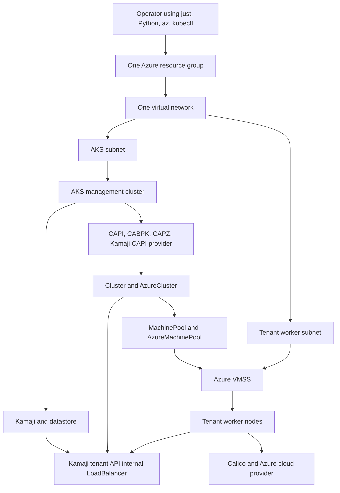

# AKS, Kamaji, CAPZ, and VMSS experiment design

## Purpose

This experiment extends the local Cluster API lab to Azure. It proves that an
AKS management cluster can host Kamaji tenant control planes while Cluster API
Provider Azure (CAPZ) creates VMSS-backed tenant workers with tenant
networking and cloud-provider integration, targeted deletion, and recreation.

The design optimizes for a small, understandable experiment. It is not a
production platform design. The lifecycle is tenant-keyed, while the live gate
uses one tenant at a time with broad resource-group-scoped permissions, one
virtual network, one management identity, the smallest practical node SKUs,
and upstream add-on manifests.

## Success criteria

The experiment succeeds when:

1. AKS hosts Kamaji, Cluster API, CABPK, CAPZ, and the Kamaji control-plane
   provider.
2. A CAPI `Cluster` creates one Kamaji tenant control plane and one
   VMSS-backed worker pool.
3. One worker joins through the Kamaji private API endpoint and becomes Ready.
4. Generic status verifies the control plane, MachinePool, Node identity,
   Azure cloud provider, and Calico.
5. Explicitly confirmed tenant deletion removes the CAPZ-owned VMSS and all
   tenant resources without changing the shared foundation.
6. Recreating the same tenant specification reaches Ready again.
7. Final whole-experiment cleanup removes the recorded resource group.

## Scope

The experiment includes:

- one Azure subscription selected explicitly by the operator;
- one resource group;
- one virtual network;
- one AKS management cluster;
- one Kamaji datastore;
- one CAPZ and CAPI controller stack;
- one tenant control plane;
- one VMSS-backed tenant worker pool;
- Calico VXLAN networking;
- the external Azure cloud provider components required by the tenant nodes;
- strict tenant-keyed create, status, delete, and recovery state;
- controller-owned VMSS deletion, foundation preservation, and recreation
  checks.

VMSS scaling, Azure Disk, and CloudNativePG remain later experiment
extensions after the tenant lifecycle is repeatable.

## Non-goals

The experiment does not initially provide:

- multiple tenants;
- production availability or disaster recovery;
- a private AKS cluster;
- separate resource groups or identities per tenant;
- custom Azure RBAC roles;
- custom VM images;
- autoscaling;
- public tenant API endpoints;
- public DNS or certificate automation;
- hub-and-spoke networking or VNet peering;
- GitOps;
- Key Vault integration;
- database backup or snapshot workflows;
- Azure Disk CSI and CloudNativePG workload validation;
- VMSS instance replacement and persistence validation;
- production monitoring, alerting, or upgrade automation;
- hostile-tenant isolation guarantees.

These can be evaluated after the basic lifecycle works.

## Architecture



AKS is independently provisioned management infrastructure. Tenant CAPI
objects do not own or delete AKS. Kamaji runs the tenant API server,
controller manager, and scheduler as workloads on AKS. CAPZ owns only the
tenant Azure infrastructure and workers.

## Azure foundation

The foundation uses one resource group and one VNet with two subnets:

| Resource | Purpose |
|---|---|
| AKS subnet | Hosts the AKS management node pool and Kamaji load balancers. |
| Tenant subnet | Hosts the tenant VMSS network interfaces. |
| AKS | Runs all management and tenant control-plane workloads. |
| User-assigned managed identity | Authenticates CAPZ and, for the experiment, tenant Azure integrations. |

AKS enables its OIDC issuer and Azure Workload Identity. The user-assigned
identity receives Contributor on the experiment resource group. CAPZ uses a
federated credential for the `capz-manager` ServiceAccount. If the selected
CAPZ release installs Azure Service Operator (ASO), the same identity receives
a second federated credential for ASO's ServiceAccount because each federated
credential has one subject.

The default compute profile minimizes cost:

| Compute | Initial setting |
|---|---|
| AKS pricing tier | Free |
| AKS system node pool | Two `Standard_D4as_v5` nodes |
| Tenant VMSS | `Standard_B2s`, initially one instance and later three |

The AKS Free tier removes the cluster-management charge and provides no
financially backed uptime SLA. The underlying system-node VMs, disks,
networking, load balancers, and tenant VMSS instances are still billed.

AKS system pools currently require at least two nodes, at least four vCPUs and
4 GiB of memory per node, and do not support B-series VMs. The default
`Standard_D4as_v5` is a broadly available experiment choice that satisfies
those restrictions; it is not assumed to be the cheapest SKU in every region.
Preflight verifies its availability and accepts an explicit operator override
to another supported four-vCPU-or-larger SKU. It does not silently select a
larger machine.

The CAPZ-managed tenant VMSS is not an AKS system pool, so it can use
`Standard_B2s`. Component resource requests and the Kamaji datastore replica
count are kept intentionally small for this experiment.

Reusing one identity and broad resource-group scope is accepted for this
experiment. Credentials are not written to repository files. Commands bind
all mutations to the configured subscription ID and resource group before
creating or deleting resources.

The Azure foundation is declared in one small subscription-scope Bicep
deployment. It creates the resource group, network, identity, role assignment,
federated credential, and AKS cluster. Bicep uses Azure Resource Manager as its
state and does not introduce a separate state service. A reusable module
hierarchy is not required for the first experiment.

`just` remains the top-level operator interface and invokes `az deployment`,
`clusterctl`, Helm or kubectl, and focused Python validation commands.

## Controller stack and version compatibility

AKS runs:

- cert-manager;
- Cluster API core;
- CABPK;
- CAPZ;
- Kamaji;
- the Kamaji Cluster API control-plane provider.

The Azure profile has its own immutable version registry. The local profile's
CAPI v1beta2 stack must not be assumed compatible with CAPZ, whose current
public APIs and documentation use the CAPI v1beta1 contract. Before creating
Azure resources, a compatibility spike selects and tests one version set for
CAPI, CABPK, CAPZ, Kamaji, the Kamaji provider, and Kubernetes.

The Azure profile may share high-level tenant intent with the local profile,
but it renders environment-specific API versions and infrastructure objects.
The tested version set also determines the exact CAPZ reference image and
tenant Kubernetes version.

The selected experimental matrix uses the providers' v1beta1 contracts. The
released Kamaji provider still reads the deprecated
`Cluster.status.infrastructureReady` boolean, while current CAPI reports the
equivalent InfrastructureReady condition. Until the provider removes that
legacy read, orchestration may mirror the boolean through the status
subresource only after verifying the exact owned `AzureCluster` has a True
Ready condition. This compatibility shim does not infer readiness from Azure
resource existence or bypass a failed infrastructure condition.

The first tested matrix is:

| Component | Version |
|---|---|
| AKS management Kubernetes | `1.35.7` |
| Tenant Kubernetes and CAPZ image | `1.32.13` |
| CAPI core, CABPK, and Kubeadm control-plane provider | `v1.10.7` |
| CAPZ | `v1.21.1` |
| Kamaji CAPI provider | `v0.19.0` |
| Kamaji | `26.8.6-edge` |
| Azure cloud provider | `v1.32.3` |
| Calico | `v3.32.2` |

The CAPZ reference image requires the kubelet
`KubeletCrashLoopBackOffMax=true` feature gate for this Kubernetes version.
Calico v3.32 also requires its separate CRD Helm chart before installing the
Tigera operator chart.

### External-control-plane compatibility

CAPZ `v1.21.1` correctly accepts
`AzureCluster.spec.controlPlaneEnabled: false` for a Kamaji control plane, but
its mutating webhook clears `networkSpec.apiServerLB` while load-balancer
reconciliation still dereferences that field. The result is a nil-pointer
panic during normal or delete reconciliation.

Management installation applies an exact object selector only to the CAPZ
AzureCluster mutating webhook. Tenant AzureClusters carry
`cnpg-vcluster-external-control-plane=true`, so the webhook leaves a
non-owning `apiServerLB.type: Public` placeholder in the object.
`controlPlaneEnabled` remains false, so CAPZ does not create or own an
API-server load balancer. Foundation status rejects a missing, broadened, or
conflicting selector.

## Technology boundaries

| Technology | Responsibility |
|---|---|
| `just` | Short, discoverable operator commands and command ordering. |
| Bicep | Azure management foundation: resource group, VNet, subnets, identity, role assignment, federated credential, and AKS. |
| `clusterctl` and Helm | Install the pinned CAPI, CAPZ, Kamaji, and supporting controller stack. |
| CAPI, CABPK, and CAPZ resources | Reconcile the tenant control-plane contract, VMSS worker pool, bootstrap data, replacement, and deletion. |
| Kustomize or deterministic templates | Render the one-tenant Azure profile and tenant add-ons without duplicating shared manifests. |
| Python | Preflight, configuration validation, subscription/resource-group binding, readiness checks, status, evidence, and end-to-end verification. |
| Azure CLI | Authenticate, submit Bicep deployments, query Azure state, and perform final resource-group cleanup. |

Python does not imperatively create the VNet, AKS cluster, identity, or VMSS.
Bicep owns the management foundation, while CAPZ owns the tenant VMSS. This
keeps retry and deletion semantics in the controllers designed for those
resources.

The local `tenancy.cnpg-vcluster.io/v1alpha1` CRD and Go controller are not the
Azure lifecycle API in this experiment. Azure continues to use explicit JSON
TenantSpec files, the Python adapter, and Azure-specific identity/evidence
records. Local condition names, endpoint allocations, Docker ownership, image
bootstrap, and finalizer checkpoints must not be copied into Azure without a
separate CAPZ design and migration plan. Conversely, local deletion never
uses Azure foundation snapshots, ASO discovery, or VMSS operations.

Terraform/OpenTofu, Pulumi, Ansible, Crossplane, and Azure Developer CLI are
not required for the first experiment. Terraform/OpenTofu would introduce a
second state model, Ansible would make cloud lifecycle imperative, and
Crossplane would overlap with CAPZ. They can be reconsidered only if later
work expands beyond this Azure-focused experiment.

## Experiment parameters and resource names

Azure account identity and resource names are not hardcoded in manifests,
Bicep, Python, or `just` recipes. Configuration is split into:

| File or source | Contents | Tracked |
|---|---|---|
| `config/azure/defaults.env` | Foundation sizing/network defaults plus supported tenant version, worker SKU, component versions, and timeouts. | Yes |
| `config/azure.local.env` | Subscription ID, location, and operator-selected resource prefix. | No |
| Explicit Azure TenantSpec JSON | Tenant name, Kubernetes version, worker count, Pod CIDR, and Service CIDR. | Yes when stored as a non-secret example |
| Active `az` login | Tenant identity and authentication tokens. | No |
| `.runtime/azure/resources.json` | Foundation-only names, Azure resource IDs, deployment outputs, controller identities, and foundation checksum. | No |
| `.runtime/azure/tenants/<tenant>/` | Generated tenant manifests, endpoint, and kubeconfig. | No |
| `.runtime/lifecycle/azure/<tenant>/` | Tenant operation journal, exact identity record, Ready evidence, and timing evidence. | No |

The local file contains only non-secret selectors:

```dotenv
AZURE_SUBSCRIPTION_ID=<subscription-id>
AZURE_LOCATION=<region>
AZURE_PREFIX=<short-lowercase-prefix>
```

It is owner-only and ignored by Git. Authentication remains in Azure CLI's
credential store; no client secret or access token is copied into the
repository. The tenant ID is read from the active `az account` rather than
duplicated in the local file.

Foundation names are deterministically derived from `AZURE_PREFIX`; tenant
names are derived from the explicit TenantSpec:

```text
resource group: <prefix>-rg
AKS:            <prefix>-mgmt
VNet:           <prefix>-vnet
identity:       <prefix>-identity
tenant cluster: <spec.name>
worker pool:    <spec.name>-worker
```

Preflight validates the prefix character and length constraints, verifies
that the active Azure subscription exactly matches
`AZURE_SUBSCRIPTION_ID`, renders all derived names, and refuses collisions
unless the existing resource IDs match the owner-only runtime inventory.
Resources also receive common experiment, prefix, and ownership tags.

The experiment does not currently create a resource that requires a globally
unique generated name. If one is added later, only that resource should
receive an explicit uniqueness component rather than adding a suffix to every
resource.

After Bicep deployment, its outputs and the exact IDs of the resource group,
AKS cluster, AKS-managed node resource group, VNet, subnets, identity, role
assignments, and federated credentials are atomically recorded in
`.runtime/azure/resources.json`. Controller UIDs are added after management
installation.
Status and cleanup use these exact IDs rather than rediscovering resources by
a broad name or tag query. The inventory schema and checksum cover only
foundation-owned inputs. A pre-cutover schema or changed subscription, prefix,
location, or foundation checksum is rejected and requires a clean foundation
redeploy; it is never migrated or adopted.

The operator can keep multiple experiments by using separate working copies
or explicitly selected local parameter files. Commands never infer a
subscription or resource group from the current Azure portal context.

## Tenant resource model

The management cluster contains this conceptual resource graph:

```text
Cluster
|- controlPlaneRef: KamajiControlPlane
|- infrastructureRef: AzureCluster
|
|- KamajiControlPlane
|- AzureCluster
|  `- spec.controlPlaneEnabled: false
|
`- MachinePool
   |- bootstrap configRef: KubeadmConfig
   `- infrastructureRef: AzureMachinePool
      `- Azure VMSS
```

`AzureCluster.spec.controlPlaneEnabled: false` is required because Kamaji,
not CAPZ, supplies the control plane.

The tenant namespace also contains an `AzureClusterIdentity` using Workload
Identity. `AzureCluster.spec.identityRef` references it. The
`AzureMachinePool` attaches the same user-assigned identity to the VMSS and
selects the Bicep-created tenant subnet.

`AzureCluster.networkSpec` references the Bicep-created VNet by name and
resource group and declares the tenant subnet with the node role. This marks
the network as pre-existing while leaving CAPZ responsible for the tenant
VMSS. The CAPI `managed-by` annotation is not used because it would disable
CAPZ reconciliation.

The first run creates one worker. After the worker joins reliably, the
`MachinePool` is scaled to three. VMSS instance IDs and Azure resource IDs
replace the Docker container and `DevMachine` identities used by the local
profile.

## Control-plane endpoint

Kamaji exposes the tenant API through an AKS internal `LoadBalancer` Service.
The service includes:

```yaml
service.beta.kubernetes.io/azure-load-balancer-internal: "true"
```

Its private IP is the authoritative endpoint used by:

- the CAPI `Cluster`;
- `AzureCluster`;
- `KamajiControlPlane`;
- generated tenant kubeconfig;
- CABPK bootstrap data.

The tenant worker subnet can route directly to this private IP because both
subnets are in the same VNet. The first experiment uses the IP directly and
does not require private DNS.

The operator workstation is not assumed to reach the private endpoint.
Tenant add-ons are rendered locally but applied by a short-lived Job in AKS
using the generated tenant kubeconfig. The Job installs Calico and the Azure
cloud components before the first worker is required to become Ready. The
same mechanism can install later tenant add-ons without adding VPN or public
API access to this experiment.

## Worker bootstrap

CABPK supplies kubeadm join data for the VMSS workers. The selected CAPZ image
must already support the chosen Kubernetes version and include or install:

- containerd;
- kubelet;
- kubeadm;
- required kernel modules and sysctls;
- Azure networking prerequisites.

The experiment uses the Kubernetes-ready reference images that CAPZ publishes
in its public Azure Community Gallery. The selected image version must match
the tenant Kubernetes version. We do not build or maintain a custom image.

CABPK provides cloud-init bootstrap data that configures the node and runs
`kubeadm join`. Small experiment-specific adjustments may use
`preKubeadmCommands`, but the boot script is not responsible for constructing
the complete node from a minimal OS image. Installing containerd, kubelet, and
kubeadm from scratch on every boot would add external package dependencies,
increase bootstrap time, and make VMSS replacement less deterministic.

The bootstrap configuration uses systemd cgroups, the Kamaji private endpoint,
and `--cloud-provider=external`. It writes CAPZ's generated worker cloud
configuration to `/etc/kubernetes/azure.json` before `kubeadm join`.

The Kamaji tenant controller manager also runs with
`--cloud-provider=external`; configuring only the kubelet is insufficient.

## Tenant networking

Calico runs in VXLAN mode:

- IP-in-IP is disabled because Azure networking does not carry IP-in-IP
  traffic;
- each tenant retains distinct Pod and Service CIDRs;
- no custom route tables or Azure CNI integration are introduced initially;
- kube-proxy and CoreDNS remain standard tenant add-ons.

The Azure cloud controller manager and cloud node manager are installed from
version-pinned upstream or CAPZ-provided manifests. Their experiment values:

- clear the cloud controller manager's default control-plane node selector,
  because a Kamaji tenant has no control-plane Nodes;
- run one cloud controller manager replica on the tenant worker;
- tolerate `node.cloudprovider.kubernetes.io/uninitialized`;
- set the tenant cluster name and Pod CIDR;
- set `configureCloudRoutes=false`, because Calico VXLAN provides Pod routing;
- run cloud-node-manager on the tenant worker.

Tenant creation also installs a marked, tenant-owned status-probe Deployment
in the management cluster. It keeps the tenant kubeconfig mounted and provides
an in-VNet `kubectl` execution point, allowing generic status to inspect Nodes
and add-ons without making the private tenant API public or creating resources
during a status request.

The Pod, Service, VNet, and AKS address ranges must not overlap. The tenant
subnet must reach the Kamaji API port, and VMSS workers must be able to
exchange VXLAN traffic on UDP 4789.

The experiment does not require tenant `LoadBalancer` Services; the important
Azure load balancer is the Kamaji API endpoint managed by AKS.

## Future storage and CloudNativePG extension

The current lifecycle gate stops after worker, cloud-provider, and Calico
readiness. A later extension can scale to three workers and add:

- Azure Disk CSI controller and node components;
- one simple StorageClass using `disk.csi.azure.com`;
- `WaitForFirstConsumer`;
- dynamically provisioned managed disks;
- one three-instance CloudNativePG cluster.

In that extension, each PostgreSQL instance receives its own PVC and Azure
managed disk.
CloudNativePG pod anti-affinity spreads the instances across the three
workers. The experiment does not initially require zone-aware storage,
snapshots, backups, disk encryption customization, or a particular premium
disk SKU.

## Operator workflow

The proposed interface remains `just`:

| Command | Purpose |
|---|---|
| `just azure-preflight` | Verify Azure CLI login, subscription, required providers, tools, version pins, and configuration. |
| `just azure-create-foundation` | Create the resource group, VNet, identity, and AKS foundation. |
| `just azure-create-management` | Install the CAPI, CAPZ, Kamaji, and ASO controller stack. |
| `just azure-foundation-status` | Report only shared Azure foundation health. |
| `just tenant-create azure <spec.json>` | Create the explicitly selected Kamaji control plane and VMSS-backed worker pool, install tenant add-ons, and persist exact tenant identities. |
| `just tenant-status azure <tenant>` | Report one tenant through the provider-neutral status envelope, separately from foundation health. |
| `just tenant-delete azure <tenant> azure/<tenant>` | Delete the exact tenant through CAPI/CAPZ after explicit confirmation and verify canonical absence plus foundation preservation. |
| `just azure-test-tenant-lifecycle` | Destructively prove create, Ready, targeted delete, absence, foundation preservation, and recreation for the example tenant. |
| `just azure-destroy` | Delete the entire recorded Azure foundation resource group. |

The implementation reuses the repository's `just` interface, Python
validation helpers, fail-closed command execution, immutable version
configuration, and sanitized evidence patterns. It should not copy local
Docker ownership logic into the Azure profile or use Python as an Azure
resource provider.

## Measured clean redeployment

On 2026-09-15, the first-milestone topology was deleted and rebuilt in
`westus2` using the tested version matrix and default sizing documented above.
Cleanup was measured until both the experiment resource group and the
AKS-managed node resource group no longer existed. Buildout steps were measured
from invocation through each command's readiness gate.

| Step | Elapsed time |
|---|---:|
| Delete the existing Azure resources | 10m 12s |
| Explicit `azure-preflight` | 6m 03s |
| Create the Bicep foundation and AKS | 12m 51s |
| Install the management controllers | 9m 29s |
| Create the Kamaji tenant control plane | 7m 59s |
| Create the VMSS worker through its kubeadm join marker | 6m 55s |
| Install the Azure cloud provider and Calico; wait for Node Ready | 7m 26s |
| Final pre-refactor `azure-status` | 2.67s |
| **Reconstructed clean buildout, excluding cleanup and final status** | **50m 42s** |

Each create or install command also runs Azure preflight internally. The
command-level measurements therefore include repeated subscription, provider,
quota, tool, and configuration validation; the explicit preflight row is the
additional operator-invoked preflight at the beginning of the workflow.

The worker command initially reached the kubeadm join marker after 6m 55s but
continued waiting and eventually timed out after 25m 46s. The readiness check
incorrectly required `AzureMachinePool.status.provisioningState` to become
`Succeeded` before the next step installed the cloud provider. CAPZ can remain
`Updating` until that cloud initialization occurs, so this requirement formed
a circular gate. Worker registration now uses the expected VMSS instance count
and each instance's completed kubeadm join marker. The worker manifest also
uses CAPZ's canonical `template.networkInterfaces` form so the same resource
can be server-side applied again.

The 50m 42s total is reconstructed from the successful measurements in this
redeployment after excluding diagnosis and retries; it is not yet a single
uninterrupted run with the corrected worker gate. The final observed state was
AKS Running, Kamaji Ready, and one `Standard_B2s` VMSS worker Ready.

## Measured targeted tenant lifecycle

The final Phase 5 gate reused the healthy schema-v2 foundation and exercised
the generic tenant commands. It completed successfully on 2026-09-18:

| Phase | Elapsed time |
|---|---:|
| Reconcile the existing Ready tenant and verify status | 4m 12s |
| Targeted deletion to canonical absence | 9m 21s |
| Compare exact foundation identities | 17.9s |
| Recreate from the same specification and reach Ready | 9m 24s |
| **Complete gate** | **23m 49s** |

The deletion phase included Machine and VMSS absence, Cluster and Kamaji
cleanup, repeated Azure and ASO discovery, namespace removal, and final
foundation verification. Evidence is written as owner-only redacted JSON below
`.runtime/azure-gate/evidence/`.

## Lifecycle

### Management creation

1. Verify the active Azure subscription.
2. Register required Azure resource providers.
3. Create the experiment resource group.
4. Create the VNet and two subnets.
5. Create the user-assigned identity and role assignment.
6. Create AKS with OIDC and Workload Identity.
7. Install the compatible controller stack.
8. Verify controller deployments and CAPZ authentication.

### Tenant creation

1. Apply `Cluster`, `AzureCluster`, and `KamajiControlPlane`.
2. Wait for the internal Kamaji endpoint.
3. Apply a one-replica `MachinePool` and `AzureMachinePool`.
4. Wait for the VMSS instance to register as a Node; `NotReady` is expected.
5. From an AKS-resident Job, install Calico VXLAN, Azure cloud controller
   manager, and cloud-node-manager into the tenant cluster.
6. Wait for the first Node to become Ready.

### Future replacement verification

1. Record the VMSS instance IDs, Nodes, PVCs, disks, CNPG primary, and marker.
2. Delete one non-primary VMSS instance through Azure.
3. Wait for CAPZ and VMSS reconciliation to restore desired capacity.
4. Verify a replacement Node becomes Ready.
5. Verify CNPG returns to three healthy instances.
6. Verify the SQL marker remains readable.

### Cleanup

1. Verify the active subscription, exact foundation, tenant specification,
   management UIDs, Azure IDs/tags, and ASO ownership.
2. Mark only exact UID- and marker-verified tenant Machines with CAPI's
   `machine.cluster.x-k8s.io/exclude-node-draining=true` annotation. Whole
   tenant removal would otherwise deadlock on the single-node Calico
   disruption budget.
3. Delete the CAPI `MachinePool` with Kubernetes UID/resourceVersion
   preconditions and wait for MachinePool, AzureMachinePool, Machines, and the
   CAPZ-owned VMSS to disappear.
4. Delete the CAPI `Cluster` with the same preconditions.
5. Wait for Kamaji, CAPZ, ASO, and every recorded or late-discovered tenant
   child to disappear. Shared ResourceGroup, VNet, and subnet references are
   accepted only with exact foundation IDs and ASO `reconcile-policy: skip`.
6. Delete exact orchestration-owned add-on objects,
   AzureClusterIdentity, and Namespace.
7. Verify canonical tenant absence and compare the exact resource group, AKS,
   VNet, subnets, identity, role/federation, controller, and inventory
   identities with the pre-delete snapshot.

CAPZ remains responsible for VMSS deletion. The normal path does not issue
`az vmss delete` or remove Azure provider finalizers. `just azure-destroy` is a
separate whole-foundation cleanup operation.

## Verification boundaries

The Azure experiment proves:

- CAPI and CAPZ can reconcile VMSS-backed workers against a Kamaji control
  plane hosted on AKS;
- the private endpoint is used consistently;
- workers join and recover to desired capacity;
- targeted deletion removes CAPZ-owned resources while preserving the shared
  foundation;
- recreation from the same specification returns to Ready.

It does not prove production security isolation, regional resilience,
availability-zone behavior, disaster recovery, backup correctness, production
Azure Disk/CNPG behavior, upgrade safety, autoscaling, or large tenant counts.

## Implementation sequence

1. **Compatibility and AKS bootstrap:** pin the provider versions and install
   the controllers on AKS.
2. **Single worker:** create one tenant API and one VMSS worker that becomes
   Ready.
3. **Three workers:** scale the VMSS-backed MachinePool and verify all Nodes.
4. **Azure Disk and CNPG:** install CSI and require a healthy three-instance
   database.
5. **Replacement and cleanup:** delete one VMSS instance, verify recovery and
   persistence, then perform complete cleanup.

Each step is independently useful and should be kept runnable while later
steps are developed.

## References

- [CAPZ documentation](https://capz.sigs.k8s.io/)
- [CAPZ AKS management cluster setup](https://capz.sigs.k8s.io/getting-started-with-aks)
- [CAPZ identities](https://capz.sigs.k8s.io/topics/identities)
- [Kamaji on Azure](https://kamaji.clastix.io/getting-started/kamaji-azure/)
- [Azure cloud provider](https://kubernetes-sigs.github.io/cloud-provider-azure/)
- [Azure Disk CSI driver](https://github.com/kubernetes-sigs/azuredisk-csi-driver)
