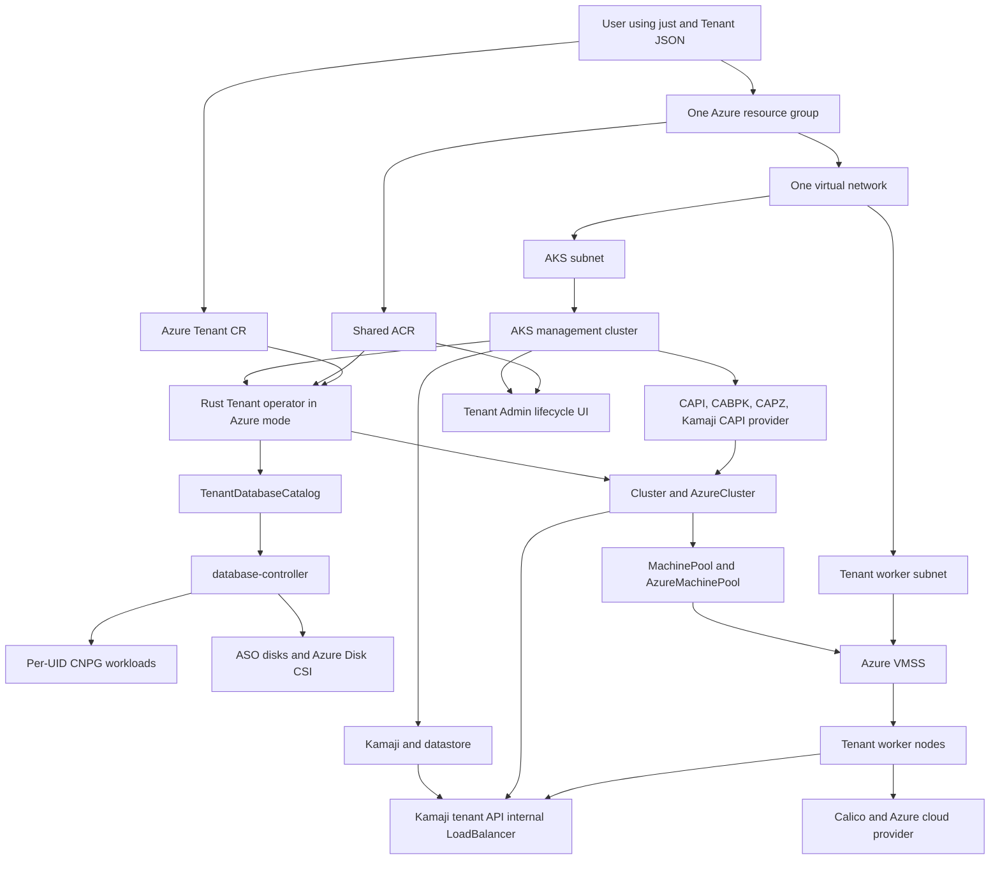

# AKS, Kamaji, CAPZ, and VMSS experiment design

## Purpose

This experiment extends the local Cluster API lab to Azure. It proves that an
AKS management cluster can host Kamaji tenant control planes while Cluster API
Provider Azure (CAPZ) creates VMSS-backed tenant workers with tenant
networking and cloud-provider integration, targeted deletion, and recreation.
Each Tenant may explicitly own up to three catalog-backed CloudNativePG
clusters with one to three instances. Database provisioning and exact disk
cleanup are implemented but require a separate credentialed destructive
release gate.

The design optimizes for a small, understandable experiment. It is not a
production platform design. The lifecycle is tenant-keyed, while the live gate
uses one tenant at a time with broad resource-group-scoped permissions, one
virtual network, one management identity, the smallest practical node SKUs,
and upstream add-on manifests.

## Success criteria

The experiment succeeds when:

1. AKS hosts Kamaji, Cluster API, CABPK, CAPZ, and the Kamaji control-plane
   provider.
2. A CAPI `Cluster` creates one Kamaji tenant control plane and one
   VMSS-backed worker pool.
3. Three distinct VMSS-backed workers join through the Kamaji private API
   endpoint and become Ready.
4. The destructive gate deletes one exactly mapped non-primary VMSS instance,
   waits for CAPZ to restore exactly three Ready workers, and proves unchanged
   survivors plus one new Node/instance pair.
5. Generic status verifies the control plane, MachinePool, Node identities,
   Azure cloud provider, and Calico from current Tenant status.
6. Explicitly confirmed tenant deletion removes the CAPZ-owned VMSS and all
   tenant resources without changing the shared foundation.
7. Recreating the same tenant specification reaches Ready again.
8. Final whole-experiment cleanup removes the recorded resource group.
9. Before a database rollout is accepted, a credentialed three-cluster,
   three-instance run must prove exact CNPG/SQL isolation and direct absence
   of all nine ASO/ARM disk identities after deletion. This gate has **not
   run**; the earlier worker-only proof does not satisfy it.

## Scope

The experiment includes:

- one Azure subscription selected explicitly by the operator;
- one resource group;
- one virtual network;
- one AKS management cluster;
- one Kamaji datastore;
- one CAPZ and CAPI controller stack;
- one Tenant control plane and an explicit database catalog;
- one VMSS-backed tenant worker pool;
- Calico VXLAN networking;
- the external Azure cloud provider components required by the tenant nodes;
- operator-owned tenant-keyed create, status, delete, and recovery state;
- exact gate-only VMSS instance failure injection and three-worker recovery;
- CAPZ-owned whole-VMSS deletion, foundation preservation, and
  recreation checks;
- a separate database-controller, pinned CNPG/Azure Disk CSI runtime and
  per-entry ASO Disk/static PV/PVC lifecycle (staged, not live-proven).

The Tenant add-on Job verifies pinned SHA-256 values for both Calico chart
archives before Helm reads them. This permits the experiment to tolerate an
invalid GitHub TLS interception certificate without accepting unverified chart
content; any byte drift fails the Job before installation.

Azure Disk and CloudNativePG are installed independently of infrastructure
readiness; their credentialed destructive validation remains an unmet
release-acceptance gate.

The database-controller normally receives a resource-group-scoped custom role
with only managed-disk read and delete. Subscriptions that have exhausted the
tenant-wide custom role-definition quota can explicitly select the built-in
Azure Backup Snapshot Contributor role by its pinned definition ID. Its
assignment is still limited to the experiment resource group, but it grants
additional disk, restore-point, and VM operations and is therefore a
documented experiment-only fallback rather than the default.

## Non-goals

The experiment does not initially provide:

- multiple tenants;
- production availability or disaster recovery;
- a private AKS cluster;
- separate resource groups or identities per tenant;
- custom Azure RBAC roles;
- custom VM images;
- autoscaling;
- public tenant API endpoints;
- public DNS or certificate automation;
- hub-and-spoke networking or VNet peering;
- GitOps;
- Key Vault integration;
- database backup or snapshot workflows;
- production Azure Disk/CNPG resilience or backup guarantees;
- production monitoring, alerting, or upgrade automation;
- hostile-tenant isolation guarantees.

These can be evaluated after the basic lifecycle works.

## Architecture


```mermaid
flowchart TB
  User[User using just and Tenant JSON]
  AzureRG[One Azure resource group]
  VNet[One virtual network]
  AKSSubnet[AKS subnet]
  TenantSubnet[Tenant worker subnet]
  AKS[AKS management cluster]
  ACR[Shared ACR]
  Controllers[CAPI, CABPK, CAPZ, Kamaji CAPI provider]
  TenantOperator[Rust Tenant operator in Azure mode]
  Admin[Tenant Admin lifecycle UI]
  TenantCR[Azure Tenant CR]
  Catalog[TenantDatabaseCatalog]
  DatabaseController[database-controller]
  CNPG[Per-UID CNPG workloads]
  Disks[ASO disks and Azure Disk CSI]
  Kamaji[Kamaji and datastore]
  TenantAPI[Kamaji tenant API internal LoadBalancer]
  Cluster[Cluster and AzureCluster]
  Pool[MachinePool and AzureMachinePool]
  VMSS[Azure VMSS]
  Workers[Tenant worker nodes]
  Addons[Calico and Azure cloud provider]

  User --> TenantCR
  User --> AzureRG
  AzureRG --> VNet
  AzureRG --> ACR
  VNet --> AKSSubnet
  VNet --> TenantSubnet
  AKSSubnet --> AKS
  AKS --> Controllers
  AKS --> TenantOperator
  AKS --> Admin
  ACR --> TenantOperator
  ACR --> Admin
  TenantCR --> TenantOperator
  TenantOperator --> Catalog --> DatabaseController --> CNPG
  DatabaseController --> Disks
  TenantOperator --> Cluster
  AKS --> Kamaji
  Kamaji --> TenantAPI
  Controllers --> Cluster
  Cluster --> TenantAPI
  Cluster --> Pool
  Pool --> VMSS
  TenantSubnet --> VMSS
  VMSS --> Workers
  Workers --> TenantAPI
  Workers --> Addons
```

AKS is independently provisioned management infrastructure. Tenant CAPI
objects do not own or delete AKS. Kamaji runs the tenant API server,
controller manager, and scheduler as workloads on AKS. CAPZ owns only the
tenant Azure infrastructure and workers.

## Azure foundation

The foundation uses one resource group and one VNet with two subnets:

| Resource | Purpose |
|---|---|
| AKS subnet | Hosts the AKS management node pool and Kamaji load balancers. |
| Tenant subnet | Hosts the tenant VMSS network interfaces. |
| AKS | Runs all management and tenant control-plane workloads. |
| Shared ACR | Stores the static Tenant manager and provider-neutral Tenant Admin images deployed by immutable digest. |
| User-assigned managed identity | Authenticates CAPZ and, for the experiment, tenant Azure integrations. |

AKS enables its OIDC issuer and Azure Workload Identity. The user-assigned
identity receives Contributor on the experiment resource group. CAPZ uses a
federated credential for the `capz-manager` ServiceAccount. If the selected
CAPZ release installs Azure Service Operator (ASO), the same identity receives
a second federated credential for ASO's ServiceAccount because each federated
credential has one subject.
The AKS kubelet identity receives `AcrPull` on the shared ACR. The Tenant
operator receives no Azure credentials. Tenant Admin also receives no Azure
credentials.

The default compute profile minimizes cost:

| Compute | Initial setting |
|---|---|
| AKS pricing tier | Free |
| AKS system node pool | Two `Standard_D4as_v5` nodes |
| Tenant VMSS | Three `Standard_B2s` instances |

The AKS Free tier removes the cluster-management charge and provides no
financially backed uptime SLA. The underlying system-node VMs, disks,
networking, load balancers, and tenant VMSS instances are still billed.

AKS system pools currently require at least two nodes, at least four vCPUs and
4 GiB of memory per node, and do not support B-series VMs. The default
`Standard_D4as_v5` is a broadly available experiment choice that satisfies
those restrictions; it is not assumed to be the cheapest SKU in every region.
Preflight verifies its availability and accepts an explicit operator override
to another supported four-vCPU-or-larger SKU. It does not silently select a
larger machine.

The CAPZ-managed tenant VMSS is not an AKS system pool, so it can use
`Standard_B2s`. Component resource requests and the Kamaji datastore replica
count are kept intentionally small for this experiment.

Reusing one identity and broad resource-group scope is accepted for this
experiment. Credentials are not written to repository files. Commands bind
all mutations to the configured subscription ID and resource group before
creating or deleting resources.

The Azure foundation includes a shared Azure Container Registry (ACR) and is
declared in one small subscription-scope Bicep
deployment. It creates the resource group, network, identity, role
assignments, federated credentials, AKS cluster, shared ACR, and kubelet
`AcrPull` assignment. Bicep uses Azure Resource Manager as its state and does
not introduce a separate state service.

`just` remains the top-level operator interface and invokes `az deployment`,
`clusterctl`, Helm or kubectl, and focused Python validation commands.

## Controller stack and version compatibility

AKS runs:

- cert-manager;
- Cluster API core;
- CABPK;
- CAPZ;
- Kamaji;
- the Kamaji Cluster API control-plane provider.

The Azure profile has its own immutable version registry. The local profile's
CAPI v1beta2 stack must not be assumed compatible with CAPZ, whose current
public APIs and documentation use the CAPI v1beta1 contract. Before creating
Azure resources, a compatibility spike selects and tests one version set for
CAPI, CABPK, CAPZ, Kamaji, the Kamaji provider, and Kubernetes.

The Azure profile may share high-level tenant intent with the local profile,
but it renders environment-specific API versions and infrastructure objects.
The tested version set also determines the exact CAPZ reference image and
tenant Kubernetes version.

The selected experimental matrix uses the providers' v1beta1 contracts. The
released Kamaji provider still reads the deprecated
`Cluster.status.infrastructureReady` boolean, while current CAPI reports the
equivalent InfrastructureReady condition. Until the provider removes that
legacy read, orchestration may mirror the boolean through the status
subresource only after verifying the exact owned `AzureCluster` has a True
Ready condition. This compatibility shim does not infer readiness from Azure
resource existence or bypass a failed infrastructure condition.

The first tested matrix is:

| Component | Version |
|---|---|
| AKS management Kubernetes | `1.35.7` |
| Tenant Kubernetes and CAPZ image | `1.32.13` |
| CAPI core, CABPK, and Kubeadm control-plane provider | `v1.10.7` |
| CAPZ | `v1.21.1` |
| Kamaji CAPI provider | `v0.19.0` |
| Kamaji | `26.8.6-edge` |
| Azure cloud provider | `v1.32.3` |
| Calico | `v3.32.2` |

The CAPZ reference image requires the kubelet
`KubeletCrashLoopBackOffMax=true` feature gate for this Kubernetes version.
Calico v3.32 also requires its separate CRD Helm chart before installing the
Tigera operator chart.

### External-control-plane compatibility

CAPZ `v1.21.1` correctly accepts
`AzureCluster.spec.controlPlaneEnabled: false` for a Kamaji control plane, but
its mutating webhook clears `networkSpec.apiServerLB` while load-balancer
reconciliation still dereferences that field. The result is a nil-pointer
panic during normal or delete reconciliation.

Management installation applies an exact object selector only to the CAPZ
AzureCluster mutating webhook. Tenant AzureClusters carry
`cnpg-vcluster-external-control-plane=true`, so the webhook leaves a
non-owning `apiServerLB.type: Public` placeholder in the object.
`controlPlaneEnabled` remains false, so CAPZ does not create or own an
API-server load balancer. Foundation status rejects a missing, broadened, or
conflicting selector.

## Technology boundaries

| Technology | Responsibility |
|---|---|
| `just` | Short, discoverable operator commands and command ordering. |
| Bicep | Azure management foundation: resource group, VNet, subnets, identity, role assignment, federated credential, and AKS. |
| `clusterctl` and Helm | Install the pinned CAPI, CAPZ, Kamaji, and supporting controller stack. |
| CAPI, CABPK, and CAPZ resources | Reconcile the tenant control-plane contract, VMSS worker pool, bootstrap data, replacement, and deletion. |
| Rust Tenant operator | Reconcile exact CAPI/CAPZ/Kamaji/add-on objects, create and drain the catalog, publish durable status, and finalize infrastructure only after database cleanup. |
| Rust database-controller | Reconcile per-logical-UID CNPG workloads and ASO/Azure Disk CSI storage; prove exact disk absence with its dedicated workload identity. |
| Python | Provision and inspect the foundation, submit/observe the Tenant CR, externally prove Azure absence, and run the destructive gate. |
| Azure CLI | Authenticate, submit Bicep deployments, query Azure state, perform the one gate-only VMSS instance injection, and clean up the whole foundation. |

Python does not imperatively create tenant management resources or patch CAPZ
compatibility state. Bicep owns the management foundation, the Rust operator
owns the Kubernetes desired state, and CAPZ/ASO own Azure tenant mutation.
The explicit JSON TenantSpec is translated to
`tenancy.cnpg-vcluster.io/v1alpha4`; there is no second Python tenant runtime.
Local allocation, Docker volume and hostPath storage remain local-only.
The database catalog and Admin schema-v5 routes span both providers.

Terraform/OpenTofu, Pulumi, Ansible, Crossplane, and Azure Developer CLI are
not required for the first experiment. Terraform/OpenTofu would introduce a
second state model, Ansible would make cloud lifecycle imperative, and
Crossplane would overlap with CAPZ. They can be reconsidered only if later
work expands beyond this Azure-focused experiment.

## Experiment parameters and resource names

Azure account identity and resource names are not hardcoded in manifests,
Bicep, Python, or `just` recipes. Configuration is split into:

| File or source | Contents | Tracked |
|---|---|---|
| `config/azure/defaults.env` | Foundation sizing/network defaults, controller ACR repository/tag, supported tenant version, worker SKU, component versions, and timeouts. | Yes |
| `config/azure.local.env` | Subscription ID, location, and operator-selected resource prefix. | No |
| Explicit Azure TenantSpec JSON | Tenant name, Kubernetes version, and worker count. | Yes when stored as a non-secret example |
| Active `az` login | Tenant identity and authentication tokens. | No |
| `.runtime/azure/resources.json` | Foundation-only names, Azure resource IDs, ACR and AcrPull identity, immutable controller/admin digests, Deployment/configuration identities, and foundation checksum. | No |

Ordinary Tenant commands do not persist a separate Tenant specification or
deletion checkpoint locally. The Tenant/catalog and provider objects remain
authoritative in Kubernetes. The guarded management installer retains an
owner-only bootstrap CREATE probe/activation identity if cutover is uncertain;
the destructive gate holds exact external proof identity only in memory for
its active run.

The local file contains only non-secret selectors:

```dotenv
AZURE_SUBSCRIPTION_ID=<subscription-id>
AZURE_LOCATION=<region>
AZURE_PREFIX=<short-lowercase-prefix>
```

It is owner-only and ignored by Git. Authentication remains in Azure CLI's
credential store; no client secret or access token is copied into the
repository. The tenant ID is read from the active `az account` rather than
duplicated in the local file.

Foundation names are deterministically derived from `AZURE_PREFIX`; tenant
names are derived from the explicit TenantSpec:

```text
resource group: <prefix>-rg
AKS:            <prefix>-mgmt
VNet:           <prefix>-vnet
identity:       <prefix>-identity
ACR:            <prefix-without-hyphens>acr
tenant cluster: <spec.name>
worker pool:    <spec.name>-worker
```

Preflight validates the prefix character and length constraints, verifies
that the active Azure subscription exactly matches
`AZURE_SUBSCRIPTION_ID`, renders all derived names, and refuses collisions
unless the existing resource IDs match the owner-only runtime inventory.
Resources also receive common experiment, prefix, and ownership tags.

The ACR name is the deterministic lowercase alphanumeric prefix plus `acr`.
Operators must choose an experiment prefix whose derived registry name is
available in Azure; identity is never replaced with a random suffix.

After Bicep deployment, its outputs and the exact IDs of the resource group,
AKS cluster, AKS-managed node resource group, VNet, subnets, identity, role
assignments, and federated credentials are atomically recorded in
`.runtime/azure/resources.json`. Controller UIDs are added after management
installation. The optional `adminImage` and `adminDeploymentUid` fields are
added together only after the admin Deployment, Service, lifecycle RBAC,
health endpoints, overview, and Tenant list pass validation. A healthy
pre-admin foundation remains loadable until management installation records
both fields.
Status and cleanup use these exact IDs rather than rediscovering resources by
a broad name or tag query. The inventory schema and checksum cover only
foundation-owned inputs. A pre-cutover schema or changed subscription, prefix,
location, or foundation checksum is rejected and requires a clean foundation
redeploy; it is never migrated or adopted.

The operator can keep multiple experiments by using separate working copies
or explicitly selected local parameter files. Commands never infer a
subscription or resource group from the current Azure portal context.

## Tenant resource model

The management cluster contains this conceptual resource graph:

```text
Cluster
|- controlPlaneRef: KamajiControlPlane
|- infrastructureRef: AzureCluster
|
|- KamajiControlPlane
|- AzureCluster
|  `- spec.controlPlaneEnabled: false
|
`- MachinePool
   |- bootstrap configRef: KubeadmConfig
   `- infrastructureRef: AzureMachinePool
      `- Azure VMSS
```

`AzureCluster.spec.controlPlaneEnabled: false` is required because Kamaji,
not CAPZ, supplies the control plane.

The tenant namespace also contains an `AzureClusterIdentity` using Workload
Identity. `AzureCluster.spec.identityRef` references it. The
`AzureMachinePool` attaches the same user-assigned identity to the VMSS and
selects the Bicep-created tenant subnet.

`AzureCluster.networkSpec` references the Bicep-created VNet by name and
resource group and declares the tenant subnet with the node role. This marks
the network as pre-existing while leaving CAPZ responsible for the tenant
VMSS. The CAPI `managed-by` annotation is not used because it would disable
CAPZ reconciliation.

The tracked tenant specification creates three workers. Exact VMSS instance
IDs and Kubernetes Node name/UID identities replace the Docker container and
`DevMachine` identities used by the local profile. The destructive gate maps
those identities one-to-one and fails closed on missing, duplicate, malformed,
or cross-VMSS provider IDs.

## Control-plane endpoint

Kamaji exposes the tenant API through an AKS internal `LoadBalancer` Service.
The service includes:

```yaml
service.beta.kubernetes.io/azure-load-balancer-internal: "true"
```

Its private IP is the authoritative endpoint used by:

- the CAPI `Cluster`;
- `AzureCluster`;
- `KamajiControlPlane`;
- generated tenant kubeconfig;
- CABPK bootstrap data.

The tenant worker subnet can route directly to this private IP because both
subnets are in the same VNet. The first experiment uses the IP directly and
does not require private DNS.

The operator workstation is not assumed to reach the private endpoint. The
Tenant operator reconciles a short-lived in-cluster Job using the exact
kubeconfig Secret. The Job installs Calico and the Azure cloud components
without adding VPN or public API access to this experiment.

## Worker bootstrap

CABPK supplies kubeadm join data for the VMSS workers. The selected CAPZ image
must already support the chosen Kubernetes version and include or install:

- containerd;
- kubelet;
- kubeadm;
- required kernel modules and sysctls;
- Azure networking prerequisites.

The experiment uses the Kubernetes-ready reference images that CAPZ publishes
in its public Azure Community Gallery. The selected image version must match
the tenant Kubernetes version. We do not build or maintain a custom image.

CABPK provides cloud-init bootstrap data that configures the node and runs
`kubeadm join`. Small experiment-specific adjustments may use
`preKubeadmCommands`, but the boot script is not responsible for constructing
the complete node from a minimal OS image. Installing containerd, kubelet, and
kubeadm from scratch on every boot would add external package dependencies,
increase bootstrap time, and make VMSS replacement less deterministic.

The bootstrap configuration uses systemd cgroups, the Kamaji private endpoint,
and `--cloud-provider=external`. It writes CAPZ's generated worker cloud
configuration to `/etc/kubernetes/azure.json` before `kubeadm join`.

The Kamaji tenant controller manager also runs with
`--cloud-provider=external`; configuring only the kubelet is insufficient.

## Tenant networking

Calico runs in VXLAN mode. Azure Tenant specs do not contain CIDRs; the
controller claims one ordered entry from the approved
`tenant-azure-allocation` catalog and records its exact catalog/Lease/network
identity in Tenant status.

- IP-in-IP is disabled because Azure networking does not carry IP-in-IP
  traffic;
- each tenant retains distinct Pod and Service CIDRs;
- no custom route tables or Azure CNI integration are introduced initially;
- kube-proxy and CoreDNS remain standard tenant add-ons.

The Azure cloud controller manager and cloud node manager are installed from
version-pinned upstream or CAPZ-provided manifests. Their experiment values:

- clear the cloud controller manager's default control-plane node selector,
  because a Kamaji tenant has no control-plane Nodes;
- run one cloud controller manager replica on the tenant worker;
- tolerate `node.cloudprovider.kubernetes.io/uninitialized`;
- set the tenant cluster name and Pod CIDR;
- set `configureCloudRoutes=false`, because Calico VXLAN provides Pod routing;
- run cloud-node-manager on the tenant worker.

Tenant creation also installs a marked, tenant-owned status-probe Deployment
in the management cluster. It keeps the tenant kubeconfig mounted and provides
an in-VNet `kubectl` execution point, allowing generic status to inspect Nodes
and add-ons without making the private tenant API public or creating resources
during a status request.

Each catalog Pod/Service CIDR must be disjoint from every other slot network
and reserved management range. Management subnets may remain contained within
the management VNet. The tenant
subnet must reach the Kamaji API port, and VMSS workers must be able to
exchange VXLAN traffic on UDP 4789.

The experiment does not require tenant `LoadBalancer` Services; the important
Azure load balancer is the Kamaji API endpoint managed by AKS.

## Azure database catalog and storage runtime

The management installer stages a pinned CNPG operator and Azure Disk CSI
controller/node runtime independently of Tenant infrastructure readiness.
Tenant capability observes their current rollout and a non-default,
`Retain`/`WaitForFirstConsumer` `cnpg-azure-disk` StorageClass. Catalog entries
are created through Admin schema-v5 `GET/POST
/api/v1/tenants/{name}/databases`; deletion uses exact catalog and logical
UID plus typed-name confirmation, and SQL binds an observed Pod UID. The
database-controller owns per-entry status and UID-derived workload namespaces,
with ASO Disk
`compute.azure.com/v1api20240302` objects in a separate Tenant-owned storage
namespace. Each of up to three clusters has one static 4-GiB StandardSSD_LRS
disk, PV and PVC per instance. ARM IDs are recorded before disk creation.
Deletion removes the CNPG workload, claims, volumes and workload namespace
before ASO disks; the dedicated database-controller workload identity must
GET/DELETE each exact ARM ID and observe NotFound before terminal catalog
proof. An uncertain create outcome retains the entry rather than inferring
absence. Tenant deletion closes the catalog before provider cleanup; a
deleting or unknown-outcome entry retains its slot and finalizer. The Admin
API and adapters exist; this is **not** evidence of a successful live
destructive Azure run
([catalog API](../database-controller/src/api.rs#L11-L102);
[Azure storage](../database-controller/src/reconcile/azure.rs#L26-L52);
[disk cleanup](../database-controller/src/finalize/azure.rs#L20-L160)).

## Operator workflow

The proposed interface remains `just`:

| Command | Purpose |
|---|---|
| `just azure-preflight` | Verify Azure CLI login, subscription, required providers, tools, version pins, and configuration. |
| `just azure-create-foundation` | Create the resource group, VNet, identity, AKS, shared ACR, and exact kubelet AcrPull assignment. |
| `just azure-create-management` | Install CAPI/CAPZ/Kamaji/ASO, build and push the static Tenant manager and Tenant Admin images, verify their ACR digests, and deploy immutable references. |
| `just azure-foundation-status` | Report shared Azure foundation health, including the recorded admin repository, digest, Deployment UID, rollout, provider mode, Service, lifecycle RBAC, and API health when installed. |
| `just tenant-create azure <spec.json>` | Strictly submit the JSON-derived Azure Tenant without CIDRs and wait for operator Ready. |
| `just tenant-status azure <tenant>` | Report generation-aware operator status through the provider-neutral envelope. |
| `just tenant-delete azure <tenant> azure/<tenant>` | Issue ordinary Tenant deletion and wait for Kubernetes/CAPI/CAPZ finalization and Tenant absence. |
| `just azure-database-runtime-once` / `just azure-database-runtime-watch` | Retry pinned CNPG and Azure Disk CSI installation without changing infrastructure readiness. |
| `just azure-test-tenant-lifecycle` | Destructively prove three-worker/three-database-by-three-instance lifecycle, exact non-primary VMSS replacement, SQL/failover, all nine disk IDs absent from ASO and ARM after deletion, foundation preservation, and recreation. |
| `just azure-destroy` | Delete the entire recorded Azure foundation resource group. |

The implementation reuses the repository's `just` interface, Python
validation helpers, fail-closed command execution, immutable version
configuration, and stdout diagnostics. It should not copy local Docker
ownership logic into the Azure profile, persist Tenant-specific runtime state,
or use Python as an Azure resource provider.

## Measured clean redeployment

On 2026-09-15, the first-milestone topology was deleted and rebuilt in
`westus2` using the tested version matrix and default sizing documented above.
Cleanup was measured until both the experiment resource group and the
AKS-managed node resource group no longer existed. Buildout steps were measured
from invocation through each command's readiness gate.

| Step | Elapsed time |
|---|---:|
| Delete the existing Azure resources | 10m 12s |
| Explicit `azure-preflight` | 6m 03s |
| Create the Bicep foundation and AKS | 12m 51s |
| Install the management controllers | 9m 29s |
| Create the Kamaji tenant control plane | 7m 59s |
| Create the VMSS worker through its kubeadm join marker | 6m 55s |
| Install the Azure cloud provider and Calico; wait for Node Ready | 7m 26s |
| Final pre-refactor `azure-status` | 2.67s |
| **Reconstructed clean buildout, excluding cleanup and final status** | **50m 42s** |

Each create or install command also runs Azure preflight internally. The
command-level measurements therefore include repeated subscription, provider,
quota, tool, and configuration validation; the explicit preflight row is the
additional operator-invoked preflight at the beginning of the workflow.

The worker command initially reached the kubeadm join marker after 6m 55s but
continued waiting and eventually timed out after 25m 46s. The readiness check
incorrectly required `AzureMachinePool.status.provisioningState` to become
`Succeeded` before the next step installed the cloud provider. CAPZ can remain
`Updating` until that cloud initialization occurs, so this requirement formed
a circular gate. Worker registration now uses the expected VMSS instance count
and each instance's completed kubeadm join marker. The worker manifest also
uses CAPZ's canonical `template.networkInterfaces` form so the same resource
can be server-side applied again.

The 50m 42s total is reconstructed from the successful measurements in this
redeployment after excluding diagnosis and retries; it is not yet a single
uninterrupted run with the corrected worker gate. The final observed state was
AKS Running, Kamaji Ready, and one `Standard_B2s` VMSS worker Ready.

## Measured targeted tenant lifecycle

The historical 2026-09-18 pre-operator Azure gate reused its healthy schema-v2
foundation and exercised the former Python lifecycle:

| Phase | Elapsed time |
|---|---:|
| Reconcile the existing Ready tenant and verify status | 4m 12s |
| Targeted deletion to canonical absence | 9m 21s |
| Compare exact foundation identities | 17.9s |
| Recreate from the same specification and reach Ready | 9m 24s |
| **Complete gate** | **23m 49s** |

These measurements are retained as historical context and are not the current
operator gate result. The current gate prints phase results and keeps its exact
worker/deletion proof identity in memory; callers may explicitly redirect
output when they want a retained record.

## Lifecycle

### Management creation

1. Verify the active Azure subscription.
2. Register required Azure resource providers.
3. Create the experiment resource group.
4. Create the VNet and two subnets.
5. Create the user-assigned identity and role assignment.
6. Create AKS with OIDC and Workload Identity.
7. Install the compatible controller stack.
8. Publish and deploy the static Tenant manager and lifecycle Tenant Admin by
   verified ACR digest.
9. Verify controller deployments, CAPZ authentication, admin inventory,
   `/healthz`, `/readyz`, overview, and Tenant list contracts.

### Tenant creation

1. Strictly apply the Azure Tenant CR.
2. The operator binds the exact foundation/specification identity and
   reconciles `Cluster`, `AzureCluster`, and `KamajiControlPlane`.
3. Reconcile a three-replica `MachinePool` and `AzureMachinePool`.
4. Wait for all three VMSS instances to register as distinct Nodes;
   `NotReady` is expected during bootstrap.
5. From an operator-owned AKS-resident Job, install Calico VXLAN, Azure cloud controller
   manager, and cloud-node-manager into the tenant cluster.
6. Wait for exactly three Nodes to become Ready.

### Replacement verification

1. Record the three exact VMSS instance IDs and Node name/UID/provider-ID
   mappings.
2. Reserve the lowest numeric instance ID as the gate-local primary anchor and
   delete the highest numeric non-primary instance.
3. Wait for CAPZ and VMSS reconciliation to restore desired capacity.
4. Require exactly three Ready MachinePool Nodes, unchanged survivor mappings,
   absence of the deleted pair, and one pair new in both identity domains.
5. Require the operator to publish the bounded replacement in current status,
   then continue to ordinary Tenant deletion, external absence proof,
   foundation preservation, and recreation.

### Cleanup

1. The client captures the exact Tenant/status/foundation identity needed for
   independent proof.
2. Ordinary Kubernetes DELETE starts the operator finalizer.
3. The operator records deletion barriers, applies the drain exclusion
   contract to exact Machines, and deletes exact MachinePool/Cluster roots
   with UID/resourceVersion preconditions.
4. CAPI/CAPZ/Kamaji/ASO remove descendants and the CAPZ-owned VMSS.
5. The operator removes exact residual add-on/probe objects and Namespace only
   after provider absence, then removes the Tenant finalizer last.
6. Python externally proves recorded Azure IDs and tenant tags are absent and
   compares the exact shared foundation with the pre-delete snapshot.

For a database lifecycle, first confirm the foundation selectors, inventory
and management kubeconfig describe the same healthy tagged resource group.
Create three explicit catalog entries and require three independently Ready
instances per entry. The destructive gate records nine exact disk names,
ASO UIDs and ARM IDs before deleting one entry, proves its three disks absent
while siblings remain, recreates it with a new logical UID/disks, then deletes
the Tenant and proves all nine current disk identities absent. Do not delete
a disk by broad name/tag selection, bypass an entry or Tenant finalizer,
clear a create-intent record, or treat an unverified 404/failed request as
terminal proof. A creation outcome that remains unknown blocks the catalog
until independently settled.

CAPZ remains responsible for VMSS deletion. The normal path does not issue
`az vmss delete-instances`, patch CAPZ compatibility state, or remove Azure
provider finalizers. `just azure-destroy` is a separate whole-foundation
cleanup operation.

## Verification boundaries

The prior worker-only Azure experiment proves:

- CAPI and CAPZ can reconcile VMSS-backed workers against a Kamaji control
  plane hosted on AKS;
- the private endpoint is used consistently;
- workers join and recover to desired capacity;
- targeted deletion removes CAPZ-owned resources while preserving the shared
  foundation;
- recreation from the same specification returns to Ready.

It does not prove production security isolation, regional resilience,
availability-zone behavior, disaster recovery, backup correctness, production
Azure Disk/CNPG behavior, upgrade safety, autoscaling, or large tenant counts.
The admin Service remains ClusterIP-only and is accessed through an
authenticated management-cluster port-forward; Ingress and application
authentication are outside this experiment.

## Exclusions and future work

Public tenant endpoints, DNS automation, certificate automation, autoscaling,
multiple provider implementations in one manager deployment, and production
hostile-tenant isolation remain excluded. Azure database runtime installation
and catalog reconciliation are staged, but no production storage guarantees
or successful credentialed destructive gate should be inferred from them.

**Release acceptance still pending (2026-10-01):** read-only
`just azure-foundation-status` exited 1 with
`{"blockers":["Azure foundation inventory is absent"],"foundation":"unhealthy","healthy":false,"schema":1}`.
The exact owner-only `.runtime/azure/resources.json` is missing, and
`gh secret list` found zero configured `CAPI_AZURE_*` repository secrets.
GitHub Actions intentionally does not receive Azure credentials or run the
destructive lifecycle. The nine-disk absence must be proved by an operator outside
CI against an explicitly recorded experiment foundation. Real browser and
service-proxy agreement on the same deployment is also unverified. Both are
unmet gates, not passing checks; no Azure cloud mutation was attempted for
this run.

## References

- [CAPZ documentation](https://capz.sigs.k8s.io/)
- [CAPZ AKS management cluster setup](https://capz.sigs.k8s.io/getting-started-with-aks)
- [CAPZ identities](https://capz.sigs.k8s.io/topics/identities)
- [Kamaji on Azure](https://kamaji.clastix.io/getting-started/kamaji-azure/)
- [Azure cloud provider](https://kubernetes-sigs.github.io/cloud-provider-azure/)
- [Azure Disk CSI driver](https://github.com/kubernetes-sigs/azuredisk-csi-driver)
