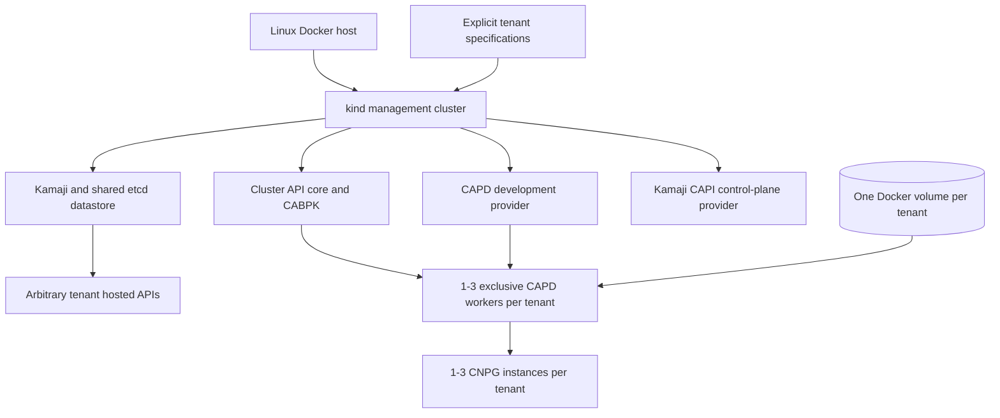

# Cluster API Kamaji local experiment design

## Purpose

The experiment evaluates Cluster API as the reusable tenant-cluster lifecycle
framework for a future service in which an AKS management cluster hosts
multiple Kamaji control planes and manages tenant-owned CloudNativePG
databases. The implementation includes a local Docker/CAPD profile and an
Azure AKS/CAPZ profile behind one provider-neutral tenant lifecycle.

Azure tenants are not separate AKS clusters. AKS is the shared management
cluster; each tenant remains a Kamaji hosted control plane with
CAPZ-managed Azure worker machines.

The design accepts explicit tenant specifications for isolated tenant APIs,
one to three exclusive workers, tenant-owned networking, idempotent create
retry, targeted deletion, and deterministic cleanup. The local profile also
provides tenant-owned storage and one to three PostgreSQL instances; Azure
storage and CloudNativePG remain future extensions.

## As-built topology



The management kind node mounts `/var/run/docker.sock` because CAPD creates
worker and load-balancer containers through the host Docker daemon.

## Verified acquisition and image distribution

Online acquisition is explicit. A cache generation contains the pinned file
inputs plus one checksum-recorded OCI archive for every tagged/digest image
pair. The archive retains the upstream index digest, the selected
`linux/amd64` manifest, and its content blobs. The generation becomes active
only after complete local verification; ordinary preflight does not refresh
Git tags, charts, or registry descriptors.

The host restores the exact kind node and controller images before kind or
CAPD consumes them. After kind creation, management images are imported into
the node's `k8s.io` containerd namespace before controller workloads are
applied.

The same cache is mounted read-only into every CAPD worker. Orchestration waits
for all new worker containers and their containerd sockets, then runs an
explicit concurrent import and exact-target verification barrier before
ClusterResourceSet application. The replacement path performs the same
barrier before accepting network readiness. This ordering prevents add-on and
CNPG validation from racing image availability.

## Resource model

Each tenant is represented in the management cluster by:

- one namespace and CAPI `Cluster`;
- one CAPD `DevCluster`;
- one `KamajiControlPlane`;
- one `MachineDeployment`, `KubeadmConfigTemplate`, and
  `DevMachineTemplate`;
- the requested one to three CAPI Machines and DevMachines;
- one ClusterResourceSet plus verified Calico and kube-proxy source
  ConfigMaps.

The tenant API owns its Nodes, Calico, CoreDNS, Konnectivity, repository-owned
kube-proxy, CNPG operator, PostgreSQL Cluster, Secrets, PVCs, and PVs.
Tenant Nodes and database resources are deliberately absent from the
management API.

## Provider-neutral lifecycle contract

The public tenant surface is specification-driven:

```bash
just tenant-create <profile> <spec.json>
just tenant-status <profile> <tenant>
just tenant-delete <profile> <tenant> <profile>/<tenant>
```

Specifications use a strict schema with profile, name, Kubernetes version,
worker count, Pod CIDR, and Service CIDR; local specifications additionally
select the database count. The canonical specification checksum binds
operation journals, resource markers, durable identities, Ready evidence, and
retries. Removed fixed tenant commands and pre-cutover runtime formats are not
accepted.

Owner-only state is stored below
`.runtime/lifecycle/<profile>/<tenant>/`. Create is the idempotent reconcile
and interrupted-create recovery path. Delete requires the exact
`profile/tenant` confirmation and retains its journal and sanitized discovery
evidence until authoritative absence. Status is read-only and classifies the
tenant as `ready`, `absent`, `progressing`, `deleting`, `degraded`, `failed`,
or `ownership-invalid`; inspection failures are never reported as absence.

## Authoritative endpoint strategy

MetalLB allocates deterministic VIPs from the actual kind Docker subnet. The
tenant VIP and port are preseeded consistently into the CAPI `Cluster`, CAPD
`DevCluster`, and `KamajiControlPlane`. Exported kubeconfigs are validated
against their active context and management-owned CA Secret. CABPK bootstrap
data is checked for the same endpoint.

The CAPD HAProxy container is still created because `DevCluster` expects its
development load balancer. Its container address is non-authoritative and is
rejected if it appears in CAPI resources, credentials, or bootstrap data.

The Kamaji provider uses:

- `SkipInfraClusterPatch=true`;
- `DynamicInfrastructureClusterPatch=false`.

Kamaji therefore does not need permission to patch the CAPD infrastructure
object, and endpoint ownership remains explicit.

## Worker and bootstrap lifecycle

CABPK generates kubeadm join data for CAPD workers. A narrow tenant RBAC rule
allows the bootstrap identity to read only the named kubeadm and kubelet
ConfigMaps. Bootstrap Secrets are checked for exact KubeadmConfig ownership,
type, keys, effective readers, workload denial, retention, replacement, and
cleanup.

Healthy declarations are idempotent. Replacement is controller-driven by
deleting a CAPI Machine, never by directly recreating an owned worker
container. Repair may replace workers after a missing Kamaji control plane is
reconstructed, but only after proving the full
Machine-to-MachineSet-to-MachineDeployment UID and ownership chain.

Workers are privileged `kindest/node` containers with private cgroup
namespaces. They remain a shared-host development mechanism, not hostile
tenant isolation.

A separate retained-management development mode binds the current management
identity to the user, repository root, branch and revision, configuration,
host, and Docker daemon. `dev-bootstrap` validates that management binding;
tenant selection and reconciliation remain explicit through
`tenant-create`, `tenant-status`, and `tenant-delete`. Stale, foreign, unsafe,
partial, and non-authoritative inspection results remain failures.

Active network and SQL-marker checks may create uniquely named transient pods.
Both paths delete the exact probe and confirm its absence before returning.
The retained mode never replaces the final clean-to-clean gate, and cleanup
uses the same authoritative destroy and host restoration path.

## Networking and ClusterResourceSet handoff

The tenant networking profile contains digest-pinned Calico and a distinctly
named `capi-kube-proxy`. Kamaji's standard kube-proxy add-on is disabled
because Kamaji otherwise removes standard-named resources. The custom
kube-proxy uses `conntrack.maxPerCore: 0` for nested container compatibility.

ClusterResourceSet packages the initial sources with:

- a 900 KiB maximum serialized ConfigMap size;
- deterministic splitting only at YAML document boundaries;
- at most 100 references;
- exact reference shape and unique names;
- complete one-to-one SHA-256 inventory coverage.

ClusterResourceSet handles initial delivery and verified source changes.
After handoff, status detects target drift and explicit repair reapplies the
verified target resources. This avoids claiming that ClusterResourceSet is a
general-purpose continuous drift controller.

## Local persistence model

Each tenant receives one exactly owned Docker volume. The volume mountpoint is
recorded in an owner-only identity file and mounted at
`/var/lib/capi-tenant-storage` in every tenant worker. Three prebound static
hostPath PVs point to separate PostgreSQL directories inside that path and
intentionally omit node affinity.

The persistence gate proves:

- directories are precreated as PostgreSQL UID/GID 26 with mode `0700`;
- sampled `global/pg_control` files are UID/GID 26 with mode `0600`;
- PVC and PV identities survive Machine replacement;
- a replica Pod returns with the same PVC/PV;
- another instance becomes primary after primary deletion;
- a SQL marker remains readable throughout.

This validates local byte persistence and rescheduling. It does not validate
cloud attach/detach, fencing, zones, disk snapshots, or regional failure.

## Isolation and credential checks

Every pair of selected tenants uses distinct:

- namespaces, labels, VIPs, CA certificates, Pod CIDRs, Service CIDRs, and DNS
  domains;
- Machine, DevMachine, Docker container, and Node sets;
- Docker volumes, mountpoints, PVs, PVCs, and PostgreSQL cluster names;
- Kubernetes and PostgreSQL credentials.

Cross-tenant Kubernetes checks first prove the target API is reachable and
then require an authentication rejection. Cross-tenant PostgreSQL checks use a
local port-forward and owner-only environment file so the opposite password is
never persisted in the target Kubernetes API.

## Ownership, repair, and deletion

Kubernetes controllers own Kubernetes resources. Host code mutates Docker
objects only when exact labels and persisted identities prove local ownership.
Any unowned same-name resource, changed UID, malformed record, symlink,
permission mismatch, or inspection failure blocks mutation.

Targeted deletion is ordered:

1. verify immutable inputs, management ownership, kubeconfig binding, target
   ownership, and survivor health;
2. remove CNPG, claims, static PVs, smoke storage, and add-ons through the live
   tenant API;
3. write an owner-only journal bound to the exact CAPI Cluster UID;
4. delete the Cluster and wait for CAPI/provider objects and containers;
5. remove the exact Docker volume and runtime records;
6. prove every survivor's control plane, sources, workers, database, and
   marker remain unchanged.

The journal makes retries safe both before and after Cluster deletion.
Canonical Kubernetes `NotFound` is absence; connectivity, authorization,
unknown-resource, and server failures are inspection failures.

The local lifecycle test creates three arbitrary tenants, deletes a target
with multiple survivors, refuses deletion while any survivor is unhealthy,
recreates the target, and separately proves sole-tenant deletion. Stable
endpoint allocations are bound to the exact management network and released
only after canonical tenant absence.

## Azure ownership and targeted deletion

The Azure resource group, VNet, subnets, AKS cluster, managed identity, role
assignment, and federated credentials form a shared Bicep-owned foundation.
Tenant CAPI objects do not own that foundation. CAPZ owns each tenant
MachinePool, AzureMachinePool, VMSS, VMSS instances, and NICs; ASO reconciles
the tenant NAT gateway and public IP.

Deletion verifies exact management UIDs, Azure IDs and tags, ASO objects, and
the recorded foundation before mutation. Local Cluster and Namespace deletion
and Azure orchestration deletion use Kubernetes UID/resourceVersion
preconditions. Exact tenant Machines are marked with
CAPI's whole-tenant skip-drain annotation, then the MachinePool is deleted and
Machine, AzureMachinePool, and VMSS absence is required before Cluster
deletion. Kubernetes deletes carry UID and resourceVersion preconditions.
Repeated discovery captures late or temporarily parentless children. The
normal path never directly deletes a VMSS or removes an Azure provider
finalizer.

CAPZ `v1.21.1` requires a scoped compatibility selector for Kamaji external
control planes: only labeled tenant AzureClusters bypass the AzureCluster
mutating webhook so a non-owning API-server load-balancer placeholder remains
present while `controlPlaneEnabled=false`. Foundation health verifies that the
selector is exact.

## Break-glass boundary

Finalizer removal is not normal teardown. Operators should restore
controllers and retry ordinary repair or deletion first. The break-glass
command is restricted to known finalizers from the pinned CAPI, CAPD, and
Kamaji providers.

It requires an owned deleting resource, exact UID, and fresh resource version;
writes an owner-only snapshot containing only allowlisted condition fields;
uses atomic JSON Patch tests; removes one finalizer; and verifies Docker object
inventory is unchanged.

## Shared intent and environment mapping

| Concern | Shared intent | Local implementation | Azure implementation |
|---|---|---|---|
| Management cluster | Run lifecycle controllers independently of tenants. | One kind cluster. | An independently provisioned AKS cluster; it is not managed by the tenant CAPI objects. |
| Tenant control plane | Hosted upstream Kubernetes APIs. | Kamaji on kind with MetalLB VIPs. | Kamaji on AKS with Azure load-balancer integration and production datastore design. |
| Cluster lifecycle | Declarative CAPI ownership and conditions. | CAPI core v1.14.1 with the v1beta2 contract. | CAPI/CABPK v1.10.7 and CAPZ v1.21.1 using their v1beta1 contracts behind the same tenant API. |
| Bootstrap | Generate standard kubeadm join data. | CABPK. | CABPK or another compatible bootstrap provider if required by the Azure worker image. |
| Worker infrastructure | One to three tenant-exclusive workers. | CAPD `DevMachine` Docker containers. | CAPZ `MachinePool`/`AzureMachinePool` VMSS workers with `AzureCluster.spec.controlPlaneEnabled: false`, because Kamaji supplies the hosted control plane. |
| Cloud integration | Tenant Nodes interact with their cloud environment. | No cloud provider. | External Azure cloud provider and required node identities/RBAC. |
| Networking | Tenant-specific Pod/Service networks and DNS identity. | Calico plus repository-owned kube-proxy. | Azure-compatible CNI selected during Azure design validation; CIDR and DNS separation remain required. |
| Storage | Tenant-owned durable volumes survive worker replacement. | Shared Docker volume mounted into workers, static hostPath PVs. | Azure CSI, CloudNativePG, attach/detach, fencing, zone, snapshot, and recovery remain future extensions. |
| Credentials | Explicit, scoped, non-cross-tenant access. | Owner-only kubeconfigs and generated PostgreSQL Secrets. | Azure Workload Identity/managed identities and production secret distribution; no credentials are defined here. |
| Identity | Bind operations to the intended management cluster, tenant, and cloud resources. | Active-context endpoint/CA validation, exact ownership records, labels, and UID chains. | AKS and Azure Workload Identity, scoped managed identities, and Azure resource IDs validated before mutation. |
| Add-ons | Deliver verified tenant networking and platform components. | ClusterResourceSet bootstrap sources with explicit target drift repair. | A separately selected Azure-compatible CNI and GitOps/add-on controller; integrity and tenant scoping remain mandatory. |
| Endpoint | One authoritative API endpoint per tenant. | MetalLB VIP, consistently preseeded across CAPI/Kamaji/CABPK. | Azure load-balancer endpoint, consistently represented in the same contracts. |
| Cleanup | Delete exact tenant resources while preserving shared foundations. | Survivor validation, UID journals, and exact Docker ownership. | Verified Machines skip whole-tenant drain, CAPI/CAPZ remove the worker pool and VMSS, then Cluster deletion and repeated Azure/ASO absence checks complete. |
| Verification | Prove observable health, isolation, persistence, repair, and cleanup. | Targeted suites plus a bounded representative PostgreSQL E2E. | A destructive create-delete-recreate gate proves Ready, canonical absence, exact foundation preservation, and Ready recreation. |

## Explicit non-goals

- The Azure profile does not provide production isolation, regional
  resilience, autoscaling, upgrades, or a production database/storage proof.
- The provider-neutral contract does not hide provider-specific foundation
  prerequisites or readiness checks.
- Privileged Docker workers are not presented as a production isolation
  boundary.

## Verification strategy

Fast checks are `just test-unit` and `just test-static`. Targeted lifecycle
suites prove management ownership, endpoint behavior, networking, Machines,
storage, persistence, tenant create/delete, mutation gates, and break-glass
contracts.

The final `just test-e2e` is intentionally bounded: it creates one explicitly
selected representative tenant, requires its PostgreSQL cluster and SQL marker
healthy, then performs complete teardown and host restoration. Multi-survivor
and disruption guarantees remain in targeted suites instead of being repeated
in a long mega-test.

`just test-e2e-offline` attempts the same lifecycle while blocking host
acquisition commands, forcing Docker runs not to pull, and rejecting external
HTTP/HTTPS egress from disposable node runtimes. The pinned Kamaji API has
registry/image-name overrides and extra-container fields but no supported pull
policy for its generated API-server or Konnectivity containers, while the
controller unconditionally renders `imagePullPolicy: Always`. Before
reconciliation, the offline path therefore materializes a read-only
Distribution storage tree exclusively from the verified active cache, starts
an exactly owned registry on the private management Docker network, and
configures the management node's `registry.k8s.io` containerd host to resolve
through it. The served tag and digest endpoints retain the pinned upstream OCI
index and selected `linux/amd64` manifest identities. No host port is
published, registry fallback remains subject to active egress rejection, and
teardown validates the registry container and every generated file before
removing them. Both gates emit structured durations for
cache/tools, cleanup, host preparation, management, tenant control plane,
worker/network, CNPG/SQL, and teardown phases. The offline gate additionally
emits structured per-node reject-counter evidence and exact mirror-pull
records.
