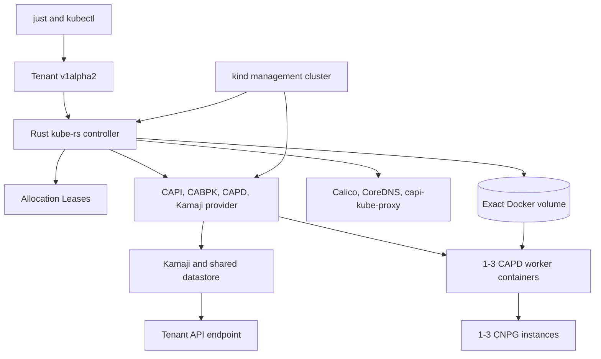

# Cluster API Kamaji tenant experiment design

## Purpose

The experiment evaluates Cluster API as the lifecycle framework for hosted
Kubernetes tenants. The local profile runs on one kind management cluster with
Kamaji control planes, CAPD Docker workers, tenant-scoped networking and
storage, and CloudNativePG. The Azure profile separately proves Kamaji on AKS
with CAPZ-owned VMSS workers.

Azure tenants are not separate AKS clusters. AKS is shared management
infrastructure; each tenant remains a Kamaji hosted control plane. The local
and Azure profiles share intent and conformance goals, but they do not share a
mutation implementation: local uses the repository-owned Tenant controller,
while Azure retains its JSON/Python lifecycle.

## Local as-built topology



The management node mounts `/var/run/docker.sock`. The controller uses it only
for exact local volume ownership and provider-container observation; CAPD
remains responsible for worker and load-balancer creation and deletion.

## Tenant API and controller

The cluster-scoped API is
`tenancy.cnpg-vcluster.io/v1alpha2`, kind `Tenant`. The immutable spec contains:

- `kubernetesVersion`;
- `workers`, from one through three;
- `databases`, from one through three.

OpenAPI and CEL reject invalid names, counts, version syntax, types, and
any spec update. A leading `v` is accepted on creation, but a spelling change
is still an immutable-spec update. The controller checks the supported
version (`1.36.4`); schema-3 slot validation rejects overlapping or
non-canonical networks. Unknown fields are pruned under
`fieldValidation=Warn` or `Ignore` and rejected under `Strict`, used by the
repository clients. There is no Tenant validating webhook.
Ordinary Kubernetes DELETE is accepted without a reservation or custom client
protocol.

Status contains the observed generation, phase, standard conditions,
`allocation.{slotId,endpoint,podCIDR,serviceCIDR}`, foundation hash, and exact
root Cluster UID. There is no persisted creation
stage, tenant-API cleanup checkpoint, child-resource UID ledger,
worker-container evidence, or Docker volume identity.

The Tokio manager uses kube-rs watches, a dedicated renewable leader-election
Lease, health probes, and one bounded reconcile worker. Allocation Leases
are separate, durable and non-expiring. Initial
creation uses a grouped desired-state path. Expected progress uses a fixed
one-second requeue. Ready and Degraded Tenants resynchronize every five minutes
to observe readiness.

## Reconciliation flow

Reconciliation proceeds through these responsibilities:

1. validate the immutable spec and bind the current foundation;
2. add the Tenant finalizer before external mutation;
3. persist the foundation hash before external mutation;
4. atomically claim one predefined endpoint/Pod CIDR/Service CIDR slot via
   a namespaced Lease and persist the allocation in status;
5. create the Namespace, CAPI Cluster, and CAPD DevCluster;
6. create the KamajiControlPlane and validate its exact kubeconfig Secret;
7. establish bootstrap RBAC;
8. create or validate the exact Docker volume and worker templates, whose
   bootstrap prepares the CNPG storage directories;
9. create missing static networking resources without rewriting existing owned
   objects;
10. require one exact worker, container, Node, and network observation;
11. create missing storage, CNPG operator, Namespace, and PV resources, then
    reconcile the dynamic CNPG Cluster;
12. reuse the worker/network observation and set Ready only after the remaining
    component observations pass.

The Python-produced, checksum-verified schema-3 foundation binds the ordered
slot catalog, networking, image archives, paths and offline inputs; the
controller reads it directly. Its lifecycle hash excludes only mutation mode
and controller image. A Lease is reused after restart only when the exact
Tenant UID, spec/foundation hashes, slot, endpoint and CIDRs match; a missing
or replaced status-bound claim fails closed before terminal deletion.

Missing objects use create-or-refuse semantics. Existing owned objects use
different contracts by role:

- static bootstrap objects are created when missing and ownership-validated
  when present, but their existing content is not generically audited or
  rewritten. Bootstrap Roles and RoleBindings retain explicit content
  validation because they establish administrative access;
- dynamic management roots and the CNPG Cluster use
  UID/resource-version-bound server-side apply.

Missing non-root children may be recreated. A missing or different-UID root
Cluster after `status.clusterUID` is recorded becomes Degraded or
OwnershipInvalid and is not silently replaced.

Objects applied by the Tenant controller have deterministic names and exact
Tenant UID, specification hash, foundation hash, and resource-role markers.
Tenant owner references are deliberately not used on lifecycle roots, because
garbage collection must not bypass ordered finalization. Provider-owned
descendants retain their normal CAPI, CAPD, Kamaji, and CNPG owner graphs.

## Readiness and conditions

Ready is a current observation, not an expiring certificate and not a second
Python evaluator. The status command accepts Ready only when:

- status and the Ready condition observe `metadata.generation`;
- phase is `Ready`;
- the Ready condition is `True`.

The controller periodically requires:

- a current affirmative aggregate `Available` condition on the CAPI Cluster;
  initial tenant access uses its current `ControlPlaneReady` or
  `ControlPlaneAvailable` condition;
- one exact requested Machine, DevMachine, worker container, and Ready Node
  topology observation, with containers running on the foundation network;
- available Calico, CoreDNS, and `capi-kube-proxy` workloads from that same
  observation;
- the expected static StorageClass;
- a CNPG Cluster in healthy state with the requested ready instance count;
- current ownership markers for every direct tenant resource and the recorded
  exact UID for the root CAPI Cluster.

False, Unknown, missing, or stale aggregate Cluster conditions are not Ready.
Same-name resources with foreign UIDs or markers produce `OwnershipInvalid`.
API inspection failures remain errors rather than success-shaped status.

Comprehensive DNS, storage, SQL, filesystem, credential-isolation, and
disruption proofs are explicit scenario gates rather than lifecycle state.

## Networking and worker image delivery

The Tenant controller is the single network writer. It transforms the
checksum-verified Calico asset and builds repository-owned kube-proxy objects,
then creates missing objects and validates existing ownership through the
tenant client without generic content repair. There is no
ClusterResourceSet, source ConfigMap inventory, or second repair writer.

The custom `capi-kube-proxy` name prevents Kamaji from removing the
repository-owned DaemonSet. `conntrack.maxPerCore: 0` avoids the nested
container `nf_conntrack_max` write failure.

Worker image preparation is part of kubeadm bootstrap. The
`KubeadmConfigTemplate` contains `preKubeadmCommands` that verify archive
SHA-256 values, import required archives into containerd, add exact
digest/tag aliases, configure the offline mirror when enabled, and install
offline HTTP/HTTPS rejection rules. A failed preparation prevents bootstrap
and therefore prevents worker convergence. The cache is mounted read-only in
the DevMachine containers.

## Endpoint and ownership model

Each Tenant receives one address from the management Docker subnet endpoint
pool. The same address and API port must appear in Cluster, DevCluster,
KamajiControlPlane, the active kubeconfig context, and CABPK bootstrap data.
The CAPD HAProxy container remains a provider readiness dependency but is not
the authoritative tenant endpoint.

The controller refuses destructive mutation unless exact target ownership is
proved. Kubernetes resources are checked by deterministic API coordinates,
provider owner chain, and lifecycle markers; destructive deletes use live UID
and resource-version preconditions. The root CAPI Cluster must also match its
recorded UID. The Docker volume is checked by exact name and complete labels,
and its live mountpoint is used when building worker resources.
Provider-owned worker containers are observed but never directly deleted by
the Tenant controller.

Unrelated kind clusters do not block first activation. Clean cutover rejects
legacy local runtime records, nonempty old endpoint ledgers, existing
Tenant/CAPI/provider objects, allocation Leases, exact
tenant-storage volumes, owned tenant worker containers, and CAPD external
load-balancer containers. Lifecycle epoch changes first scale the old
controller to zero, wait for every old manager Pod to terminate, run this
clean-cutover gate, start the new epoch mutation-disabled, verify the running
epoch, and then enable mutation.

## Finalization and recovery

DELETE uses an ordinary Kubernetes deletion timestamp and one finalizer. The
target does not depend on peer Tenant health, and multiple deleting Tenants do
not acquire a shared destructive lock.

Finalization is ordered:

1. revalidate the target Tenant, foundation binding, status-bound allocation
   Lease, and
   live ownership;
2. delete the exact recorded CAPI Cluster with UID/resourceVersion preconditions and
   Background propagation;
3. wait for authoritative Cluster/provider descendant absence and CAPD
   container absence, deleting only exactly owned residual management roots
   with ordinary Kubernetes deletion;
4. delete only the exact owned Docker volume;
5. delete the Namespace and its credentials;
6. delete/re-observe only the exact target allocation Lease with
   UID/resourceVersion preconditions;
7. remove the finalizer last.

Each local Tenant has dedicated worker containers and an exactly labelled
storage volume. Tenant-internal CNPG, storage, networking, and bootstrap RBAC
resources are disposable with that cluster: finalization neither contacts the
tenant API nor persists a tenant-cleanup checkpoint. Tenant API unavailability
does not block the Tenant finalizer from requesting Cluster deletion; provider
controllers still complete their own ordinary finalizers.
Only after every old provider, Namespace, Secret, worker/load-balancer
container, and volume identity is proved absent may a missing old Lease or a
successor-owned Lease count as a completed release. The successor is never
mutated; earlier missing/replaced claims retain the finalizer.
Partial creation is handled from live management and host state, even when a
Cluster, control plane, or workers were never created. An observed root Cluster
UID is recorded before deletion. Ownership conflicts, failed management/host
inspection, and foundation hash changes still block destructive progress.
The `rust-operator-v1` lifecycle epoch requires a clean cutover from the
Go-managed API and state, not migration of existing Tenants. The old
Deployment/Pods, webhook stack, and CRD are removed only after clean-state
proof; the new CRD serves and stores only v1alpha2. Installation starts with
creation mutation disabled and validates live API semantics before enabling it.
The foundation lifecycle hash excludes mutation mode and controller image
identity, allowing same-epoch controller rebuilds while resource-affecting
foundation inputs remain immutable.

Controller restart recovery is exercised with a pending finalizer: the old
controller Pod is proved absent, a distinct ready Pod UID is proved after
restart, deletion completes, and the same name is recreated with a new Tenant
UID.

## Storage and persistence

Each Tenant owns one Docker volume mounted at
`/var/lib/capi-tenant-storage` in every worker. The controller creates one
no-provisioner `capi-hostpath` StorageClass and one prebound static PV per
requested CNPG instance. Worker bootstrap idempotently creates each ordinal
directory with UID/GID 26 and mode `0700` before kubeadm. The PVs intentionally
omit node affinity.

The persistence scenario writes a SQL marker, verifies PostgreSQL filesystem
ownership, replaces a Machine, restarts a replica, deletes the primary, and
requires the same PVC/PV identities and marker bytes throughout. This proves
local rescheduling and byte persistence only; it does not model cloud disks,
fencing, zones, snapshots, or regional recovery.

## Supply chain and offline operation

`just cache` acquires pinned tools, manifests, charts, and OCI archives into an
immutable verified generation. Ordinary preflight verifies the active
generation without network acquisition. The scratch controller image contains
the static manager plus checksum-verified Calico and CNPG assets.

For enforced-offline execution, the management node denies external
HTTP/HTTPS and uses an exactly owned Distribution registry on the private kind
network. Its read-only content is materialized from the verified active cache.
Worker bootstrap configures the mirror and egress rules before kubeadm.
Cleanup verifies the exact registry container and generated files before
removal.

## Public workflow and verification

The supported local interface is:

```bash
just local-tenant-apply config/tenants/examples/local.yaml
just local-tenant-status tenant-example
just local-tenant-delete tenant-example
```

The legacy local JSON adapter, imperative create/delete modules, runtime
journals, and callable local mutators have been removed. Azure commands remain:

```bash
just tenant-create azure config/tenants/examples/azure.json
just tenant-status azure tenant-example
just tenant-delete azure tenant-example azure/tenant-example
```

Targeted live gates cover endpoint authority, network workloads, controller
restart, three-worker replacement, storage rescheduling, CNPG failover,
foreign ownership refusal, asset tampering, three-Tenant deletion, pending
finalizer restart recovery, and name reuse. `just test-e2e` and
`just test-e2e-offline` run clean-to-clean and verify complete residue removal
and host-setting restoration.

## Azure boundary

Bicep owns the Azure resource group, VNet, subnets, identity, role/federation,
and AKS foundation. CAPZ owns tenant MachinePools, AzureMachinePools, VMSS
instances, and NICs. The local Tenant CRD/controller is not installed as the
Azure lifecycle API in this work.

Azure deletion continues to verify exact Kubernetes UIDs, Azure resource IDs,
tags, ASO objects, and the recorded foundation. CAPI/CAPZ remove the
MachinePool and VMSS before Cluster deletion. The normal path does not issue a
direct VMSS delete or strip Azure provider finalizers.

## Isolation and limitations

Tenant namespaces, endpoints, CAs, networks, worker sets, volumes, PV/PVC
sets, and database credentials are distinct. Tenant Nodes and database objects
do not appear in the management API.

CAPD workers are privileged Docker containers sharing the host kernel, Docker
daemon, storage hardware, network, power, and failure domain. This is not a
hostile-tenant security boundary. The management node and Tenant controller
also have Docker socket access. The API is experimental `v1alpha2`; incompatible
changes require an explicit version transition rather than silently changing
the meaning of stored objects.
