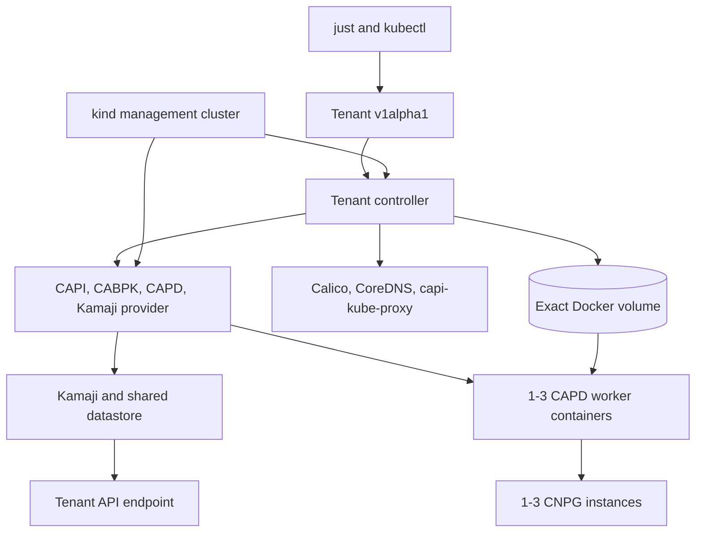

# Cluster API Kamaji tenant experiment design

## Purpose

The experiment evaluates Cluster API as the lifecycle framework for hosted
Kubernetes tenants. The local profile runs on one kind management cluster with
Kamaji control planes, CAPD Docker workers, tenant-scoped networking and
storage, and CloudNativePG. The Azure profile separately proves Kamaji on AKS
with CAPZ-owned VMSS workers.

Azure tenants are not separate AKS clusters. AKS is shared management
infrastructure; each tenant remains a Kamaji hosted control plane. The local
and Azure profiles share intent and conformance goals, but they do not share a
mutation implementation: local uses the repository-owned Tenant controller,
while Azure retains its JSON/Python lifecycle.

## Local as-built topology



The management node mounts `/var/run/docker.sock`. The controller uses it only
for exact local volume ownership and provider-container observation; CAPD
remains responsible for worker and load-balancer creation and deletion.

## Tenant API and controller

The cluster-scoped API is
`tenancy.cnpg-vcluster.io/v1alpha1`, kind `Tenant`. The immutable spec contains:

- `kubernetesVersion`;
- `workers`, from one through three;
- `databaseCount`, from one through three;
- `podCIDR`;
- `serviceCIDR`.

Admission rejects unknown fields, invalid types, unsupported versions,
non-canonical or overlapping networks, and non-equivalent spec updates.
Ordinary Kubernetes DELETE is accepted without a reservation or custom client
protocol.

Status contains the observed generation, phase, stage, standard conditions,
endpoint, specification and foundation hashes, current exact resource
identities, current worker container identities, exact Docker volume identity,
and the minimum teardown checkpoint needed for restart-safe ordering.
Historical replacement journals, readiness certificates, observation hashes,
survivor snapshots, and foundation snapshots are intentionally absent.

The manager uses leader election and one bounded reconcile worker. Each
reconcile performs a small mutation or observation step and persists progress.
This keeps endpoint allocation simple without holding a long polling loop.

## Reconciliation flow

Creation proceeds through these responsibilities:

1. validate the immutable spec and bind the current foundation;
2. add the Tenant finalizer before external mutation;
3. allocate one endpoint with ConfigMap resource-version compare-and-swap;
4. create the Namespace, CAPI Cluster, CAPD DevCluster, and
   KamajiControlPlane;
5. validate and use the exact Kamaji kubeconfig Secret;
6. create the exact Docker volume and worker templates;
7. wait for the requested worker topology and Ready Nodes;
8. directly apply tenant networking through the tenant client;
9. create the static StorageClass, CNPG operator, static PVs, and CNPG Cluster;
10. set Ready only after current live observations pass.

Objects applied by the Tenant controller have deterministic names and exact
Tenant UID, specification hash, foundation hash, and resource-role markers.
Tenant owner references are deliberately not used on lifecycle roots, because
garbage collection must not bypass ordered finalization. Provider-owned
descendants retain their normal CAPI, CAPD, Kamaji, and CNPG owner graphs.

## Readiness and conditions

Ready is a current observation, not an expiring certificate and not a second
Python evaluator. The status command accepts Ready only when:

- status and the Ready condition observe `metadata.generation`;
- phase is `Ready`;
- the Ready condition is `True`.

The controller periodically requires:

- affirmative current readiness on Cluster, DevCluster, and
  KamajiControlPlane;
- the exact requested Machine, DevMachine, worker container, and Ready Node
  topology;
- available Calico, CoreDNS, Konnectivity, and `capi-kube-proxy`;
- the expected static StorageClass;
- a healthy CNPG Cluster with the requested Ready Pods and Bound PVCs;
- unchanged exact identities and ownership markers for every recorded direct
  tenant resource.

False, Unknown, missing, or stale provider conditions are not Ready.
Same-name resources with foreign UIDs or markers produce `OwnershipInvalid`.
API inspection failures remain errors rather than success-shaped status.

Comprehensive DNS, storage, SQL, filesystem, credential-isolation, and
disruption proofs are explicit scenario gates rather than lifecycle state.

## Networking and worker image delivery

The Tenant controller is the single network writer. It transforms the
checksum-verified Calico asset and builds repository-owned kube-proxy objects,
then applies them directly through the tenant client. There is no
ClusterResourceSet, source ConfigMap inventory, or second repair writer.

The custom `capi-kube-proxy` name prevents Kamaji from removing the
repository-owned DaemonSet. `conntrack.maxPerCore: 0` avoids the nested
container `nf_conntrack_max` write failure.

Worker image preparation is part of kubeadm bootstrap. The
`KubeadmConfigTemplate` contains `preKubeadmCommands` that verify archive
SHA-256 values, import required archives into containerd, add exact
digest/tag aliases, configure the offline mirror when enabled, and install
offline HTTP/HTTPS rejection rules. A failed preparation prevents bootstrap
and therefore prevents worker convergence. The cache is mounted read-only in
the DevMachine containers.

## Endpoint and ownership model

Each Tenant receives one address from the management Docker subnet endpoint
pool. The same address and API port must appear in Cluster, DevCluster,
KamajiControlPlane, the active kubeconfig context, and CABPK bootstrap data.
The CAPD HAProxy container remains a provider readiness dependency but is not
the authoritative tenant endpoint.

The controller refuses destructive mutation unless exact target ownership is
proved. Kubernetes resources are checked by API identity, UID, provider owner
chain, and lifecycle markers. The Docker volume is checked by exact name,
creation time, mountpoint, and complete labels. Provider-owned worker
containers are observed but never directly deleted by the Tenant controller.

Unrelated kind clusters do not block first activation. Clean cutover rejects
legacy local runtime records, nonempty legacy endpoint allocations, existing
Tenant/CAPI/provider objects, controller endpoint allocations, exact
tenant-storage volumes, owned tenant worker containers, and CAPD external
load-balancer containers.

## Finalization and recovery

DELETE uses an ordinary Kubernetes deletion timestamp and one finalizer. The
target does not depend on peer Tenant health, and multiple deleting Tenants do
not acquire a shared destructive lock.

Finalization is ordered:

1. revalidate the target Tenant, foundation binding, endpoint allocation, and
   exact recorded ownership;
2. delete controller-applied CNPG, storage, networking, and bootstrap resources
   through the live tenant API;
3. persist the exact Cluster-UID-bound live-cleanup checkpoint;
4. delete the CAPI Cluster, then the Namespace, with UID/resourceVersion
   preconditions and Background propagation;
5. wait for authoritative Kubernetes absence and CAPD container absence;
6. delete only the exact owned Docker volume;
7. release only the target endpoint;
8. remove the finalizer last.

If the tenant API becomes unavailable after exact management ownership
preflight, a local disposable-cluster checkpoint can authorize provider
teardown without pretending that ownership or absence was observed.
Ownership conflicts still block. Deletion-time foundation loading does not
require the active cache, registry, controller image, or running management
container, so teardown can recover from foundation degradation.

Controller restart recovery is exercised with a pending finalizer: the old
controller Pod is proved absent, a distinct ready Pod UID is proved after
restart, deletion completes, and the same name is recreated with a new Tenant
UID.

## Storage and persistence

Each Tenant owns one Docker volume mounted at
`/var/lib/capi-tenant-storage` in every worker. The controller creates one
no-provisioner `capi-hostpath` StorageClass and one prebound static PV per
requested CNPG instance. The PVs intentionally omit node affinity.

The persistence scenario writes a SQL marker, verifies PostgreSQL filesystem
ownership, replaces a Machine, restarts a replica, deletes the primary, and
requires the same PVC/PV identities and marker bytes throughout. This proves
local rescheduling and byte persistence only; it does not model cloud disks,
fencing, zones, snapshots, or regional recovery.

## Supply chain and offline operation

`just cache` acquires pinned tools, manifests, charts, and OCI archives into an
immutable verified generation. Ordinary preflight verifies the active
generation without network acquisition. The scratch controller image contains
the static manager plus checksum-verified Calico and CNPG assets.

For enforced-offline execution, the management node denies external
HTTP/HTTPS and uses an exactly owned Distribution registry on the private kind
network. Its read-only content is materialized from the verified active cache.
Worker bootstrap configures the mirror and egress rules before kubeadm.
Cleanup verifies the exact registry container and generated files before
removal.

## Public workflow and verification

The supported local interface is:

```bash
just local-tenant-apply config/tenants/examples/local.yaml
just local-tenant-status tenant-example
just local-tenant-delete tenant-example
```

The legacy local JSON adapter, imperative create/delete modules, runtime
journals, and callable local mutators have been removed. Azure commands remain:

```bash
just tenant-create azure config/tenants/examples/azure.json
just tenant-status azure tenant-example
just tenant-delete azure tenant-example azure/tenant-example
```

Targeted live gates cover endpoint authority, network workloads, controller
restart, three-worker replacement, storage rescheduling, CNPG failover,
foreign ownership refusal, asset tampering, three-Tenant deletion, pending
finalizer restart recovery, and name reuse. `just test-e2e` and
`just test-e2e-offline` run clean-to-clean and verify complete residue removal
and host-setting restoration.

## Azure boundary

Bicep owns the Azure resource group, VNet, subnets, identity, role/federation,
and AKS foundation. CAPZ owns tenant MachinePools, AzureMachinePools, VMSS
instances, and NICs. The local Tenant CRD/controller is not installed as the
Azure lifecycle API in this work.

Azure deletion continues to verify exact Kubernetes UIDs, Azure resource IDs,
tags, ASO objects, and the recorded foundation. CAPI/CAPZ remove the
MachinePool and VMSS before Cluster deletion. The normal path does not issue a
direct VMSS delete or strip Azure provider finalizers.

## Isolation and limitations

Tenant namespaces, endpoints, CAs, networks, worker sets, volumes, PV/PVC
sets, and database credentials are distinct. Tenant Nodes and database objects
do not appear in the management API.

CAPD workers are privileged Docker containers sharing the host kernel, Docker
daemon, storage hardware, network, power, and failure domain. This is not a
hostile-tenant security boundary. The management node and Tenant controller
also have Docker socket access. The API is experimental `v1alpha1`; incompatible
changes require an explicit version transition rather than silently changing
the meaning of stored objects.
