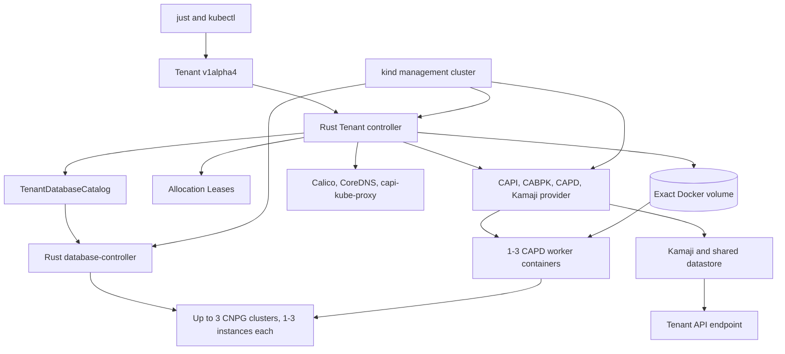

# Cluster API Kamaji tenant experiment design

## Purpose

The experiment evaluates Cluster API as the lifecycle framework for hosted
Kubernetes tenants. The local profile runs on one kind management cluster with
Kamaji control planes, CAPD Docker workers, tenant-scoped networking and
storage, and CloudNativePG. The Azure profile separately proves Kamaji on AKS
with CAPZ-owned VMSS workers.

Azure tenants are not separate AKS clusters. AKS is shared management
infrastructure; each tenant remains a Kamaji hosted control plane. The Tenant
API represents local and Azure provider intent. One manager binary starts in
an explicit provider mode and installs exactly one `ProviderLifecycle`.

## Local as-built topology


```mermaid
flowchart TB
  User[just and kubectl]
  Mgmt[kind management cluster]
  TenantCR[Tenant v1alpha4]
  Controller[Rust Tenant controller]
  Catalog[TenantDatabaseCatalog]
  DatabaseController[Rust database-controller]
  Slots[Allocation Leases]
  Providers[CAPI, CABPK, CAPD, Kamaji provider]
  Kamaji[Kamaji and shared datastore]
  API[Tenant API endpoint]
  Workers[1-3 CAPD worker containers]
  Network[Calico, CoreDNS, capi-kube-proxy]
  Volume[(Exact Docker volume)]
  CNPG[Up to 3 CNPG clusters, 1-3 instances each]

  User --> TenantCR
  TenantCR --> Controller
  Controller --> Catalog --> DatabaseController
  DatabaseController --> CNPG
  Controller --> Slots
  Controller --> Providers
  Providers --> Kamaji --> API
  Providers --> Workers
  Controller --> Network
  Controller --> Volume
  Volume --> Workers --> CNPG
  Mgmt --> Controller
  Mgmt --> DatabaseController
  Mgmt --> Providers
```

The management node mounts `/var/run/docker.sock`. The controller uses it only
for exact local volume ownership and provider-container observation; CAPD
remains responsible for worker and load-balancer creation and deletion.

## Tenant Admin and unsafe SQL console

Each management cluster also runs one `tenant-admin` Deployment and ClusterIP
Service in `tenant-system`. A Leptos client-side WebAssembly application calls
an Axum/kube-rs server for overview, sorted Tenant list, detail, and
deterministic topology data. Kubernetes is the only durable platform data
source; the server has no application database, filesystem state, watch cache,
or Azure credentials. Overview and management topology use only the management
API. Tenant detail reads its exact management catalog identity and renders
entry-scoped cards and topology on both providers. Local and Azure SQL
queries validate exact Tenant credentials and per-entry CNPG identity through
an in-memory Tenant client.

The generated admin ClusterRole grants exact `get` and `list` permissions plus
top-level Tenant `create`/`delete`, and excludes subresources and Leases. A
separate `tenant-system` Role grants named `get` only for the
`tenant-controller` Deployment, so capability discovery cannot read a
same-named Deployment in another namespace. Local mode deliberately adds only
`get` on core Secrets; it never grants Secret list or watch.
Application logic accepts only the selected Tenant's deterministic kubeconfig
Secret after endpoint, marker, and owner validation. Local topology accepts
exact controller markers and owner UID chains, while live CNPG topology comes
only from the exact managed Cluster. Azure topology requires durable status
UIDs, binding markers, and recorded owner UIDs and never reads Tenant
credentials. Ambiguous or foreign resources are omitted. Refresh is manual.

Both providers' Ready entry cards expose an explicitly unsafe administrator
SQL console. Each execution rechecks Tenant/catalog, CNPG Cluster, selected
Pod UID and cluster-specific superuser Secret, opens an ephemeral Kubernetes
port-forward to that exact Pod, and executes arbitrary multi-statement SQL
as PostgreSQL superuser. Passwords, connection strings, Tenant kubeconfigs,
and raw Secrets remain server-side. The console has bounded request,
execution-time and response-memory limits but no SQL authorization or
read-only enforcement.

The provider-neutral scratch image contains the static native server and the
generated browser bundle. Local management loads it into Kind; Azure
management pushes it to shared ACR, verifies the digest, deploys the immutable
reference, and records the image plus Deployment UID in foundation inventory.
See [`admin-ui-design.md`](admin-ui-design.md).

## Tenant API and controller

The cluster-scoped API is
`tenancy.cnpg-vcluster.io/v1alpha4`, kind `Tenant`. The immutable spec contains
common `kubernetesVersion` and `workers` fields plus one tagged `provider`:

- `type: local`; or
- `type: azure`; the controller assigns reviewed Pod and Service networks from
  the approved Azure allocation catalog.

OpenAPI and CEL reject invalid names, worker counts, version syntax, types, and
any spec update. A leading `v` is accepted on creation, but a spelling change
is still an immutable-spec update. The controller checks its configured
supported version; slot validation rejects overlapping or
non-canonical networks. Unknown fields are pruned under
`fieldValidation=Warn` or `Ignore` and rejected under `Strict`, used by the
repository clients. There is no Tenant validating webhook.
Ordinary Kubernetes DELETE is accepted without a reservation or custom client
protocol.

Status contains the observed generation, phase, standard conditions, and
provider-specific state. Local status contains
`status.provider.allocation.{slotId,endpoint,podCIDR,serviceCIDR}`,
`status.provider.foundationHash`, and the exact root
`status.provider.clusterUID`. Azure status binds the exact foundation,
specification, operation, management UIDs, kubeconfig identity, endpoint,
VMSS/Node inventory, add-on components, provider descendants, and deletion
barriers. `status.provider.networkAllocation` records the Azure slot,
Pod/Service CIDRs, catalog hash/UID, and exact Lease identity.
`status.catalogCreateIntent`, creation outcome and database capability
persist exact catalog namespace/UID identity; there is no generic
infrastructure creation stage or child-resource UID ledger.
Ordinary Tenant create/status/delete commands persist no separate Tenant
specification or deletion journal. The guarded management installer does
persist an owner-only bootstrap CREATE probe/activation record on the local
filesystem while cutover is uncertain. Local validation may create one
owner-only kubeconfig cache from
the management-cluster Secret when it needs direct Tenant API access. That
cache is non-authoritative, validated against the live Secret, removed after
Tenant deletion, and explicitly clearable.

The generic Tenant reconciler validates and dispatches through
`ProviderLifecycle`. `LocalProvider` owns allocation, CAPI/CAPD/Kamaji,
Docker, network, static storage capability, infrastructure readiness and
finalization. `AzureProvider` owns Kubernetes CAPI/CAPZ/Kamaji/add-on desired
state and finalization but has no Azure credentials; CAPZ/ASO perform cloud
mutation. A provider not installed in the selected manager mode reports
unsupported without acquiring a new finalizer. A provider/status
discriminator mismatch reports `OwnershipInvalid`.

### Catalog and independent database-controller

Each Tenant gets one owned v1alpha1 `TenantDatabaseCatalog` in
`tenant-db-<tenant>`, initially open with zero entries. Its spec maps at
most three immutable logical UUIDs to names, instance counts and monotonic
deletion intent. Admin and the Tenant controller conditionally mutate the
spec with exact UID/resourceVersion; the independent database-controller
reconciles entries and owns `/status`, including create intent, CNPG/storage
identity and terminal absence. A deleting entry still occupies its slot
until exact finalization and controller removal. There is no per-entry CRD,
admission webhook, quota, or permanent gate. The Tenant controller records
catalog creation intent before CREATE and closes/drains the catalog before
provider finalization. Unexpected or foreign identity blocks progress
([controller reconcile](../controller/src/reconcile/mod.rs#L103-L209);
[catalog API](../database-controller/src/api.rs#L11-L102);
[drain](../database-runtime/src/catalog_runtime.rs#L277-L409)).

The Tokio manager uses kube-rs watches, a dedicated renewable leader-election
Lease, health probes, and one bounded reconcile worker. Allocation Leases
are separate, durable and non-expiring. Initial
creation uses a grouped desired-state path. Expected progress uses a fixed
one-second requeue. Ready and Degraded Tenants resynchronize every five minutes
to observe readiness.

## Reconciliation flow

Reconciliation proceeds through these responsibilities:

1. validate the immutable spec and bind the current foundation;
2. add the Tenant finalizer before external mutation;
3. persist the foundation hash before external mutation;
4. atomically claim one predefined endpoint/Pod CIDR/Service CIDR slot via
   a namespaced Lease and persist the allocation in status;
5. create the Namespace, CAPI Cluster, and CAPD DevCluster;
6. create the KamajiControlPlane and validate its exact kubeconfig Secret;
7. establish bootstrap RBAC;
8. create or validate the exact Docker volume and worker templates; the
   database-controller later prepares per-entry CNPG storage directories;
9. create missing static networking resources without rewriting existing owned
   objects;
10. require one exact worker, container, Node, and network observation;
11. ensure the database runtime, bind an empty catalog and its recorded
    identity, then publish database capability separately;
12. reuse the worker/network observation and publish infrastructure Ready
    without waiting for any database entry to become Ready.

The database-controller observes that capability and exact Tenant/catalog
UIDs before creating entry namespaces, credentials, static storage and
CNPG Clusters. It writes independent entry phases/conditions/topology;
an unavailable database never silently changes infrastructure Ready.

The Python-produced, checksum-verified schema-3 foundation binds the ordered
slot catalog, networking, image archives, paths and offline inputs; the
controller reads it directly. Its lifecycle hash excludes only mutation mode
and controller image. A Lease is reused after restart only when the exact
Tenant UID, spec/foundation hashes, slot, endpoint and CIDRs match; a missing
or replaced status-bound claim fails closed before terminal deletion.

Missing objects use create-or-refuse semantics. Existing owned objects use
different contracts by role:

- static bootstrap objects are created when missing and ownership-validated
  when present, but their existing content is not generically audited or
  rewritten. Bootstrap Roles and RoleBindings retain explicit content
  validation because they establish administrative access;
- dynamic management roots use UID/resource-version-bound server-side
  apply; the separate database-controller owns per-entry CNPG Clusters.

Missing non-root children may be recreated. A missing or different-UID root
Cluster after `status.provider.clusterUID` is recorded becomes Degraded or
OwnershipInvalid and is not silently replaced.

Objects applied by the Tenant controller have deterministic names and exact
Tenant UID, specification hash, foundation hash, and resource-role markers.
Tenant owner references are deliberately not used on lifecycle roots, because
garbage collection must not bypass ordered finalization. Provider-owned
descendants retain their normal CAPI, CAPD, Kamaji, and CNPG owner graphs.

## Readiness and conditions

Ready is a current observation, not an expiring certificate and not a second
Python evaluator. The status command accepts Ready only when:

- status and the Ready condition observe `metadata.generation`;
- phase is `Ready`;
- the Ready condition is `True`.

The controller periodically requires:

- a current affirmative aggregate `Available` condition on the CAPI Cluster;
  initial tenant access uses its current `ControlPlaneReady` or
  `ControlPlaneAvailable` condition;
- one exact requested Machine, DevMachine, worker container, and Ready Node
  topology observation, with containers running on the foundation network;
- available Calico, CoreDNS, and `capi-kube-proxy` workloads from that same
  observation;
- the expected static StorageClass;
- current ownership markers for every direct tenant resource and the recorded
  exact UID for the root CAPI Cluster.

False, Unknown, missing, or stale aggregate Cluster conditions are not Ready.
Same-name resources with foreign UIDs or markers produce `OwnershipInvalid`.
API inspection failures remain errors rather than success-shaped status.
The separate catalog capability and each database entry have their own
readiness and blocker observations; Tenant Ready does not assert SQL
availability or catalog entry health.

Comprehensive DNS, storage, SQL, filesystem, credential-isolation, and
disruption proofs are explicit scenario gates rather than lifecycle state.

## Networking and worker image delivery

The Tenant controller is the single network writer. It transforms the
checksum-verified Calico asset and builds repository-owned kube-proxy objects,
then creates missing objects and validates existing ownership through the
tenant client without generic content repair. There is no
ClusterResourceSet, source ConfigMap inventory, or second repair writer.

The custom `capi-kube-proxy` name prevents Kamaji from removing the
repository-owned DaemonSet. `conntrack.maxPerCore: 0` avoids the nested
container `nf_conntrack_max` write failure.

Worker image preparation is part of kubeadm bootstrap. The
`KubeadmConfigTemplate` contains `preKubeadmCommands` that verify archive
SHA-256 values, import required archives into containerd, add exact
digest/tag aliases, configure the offline mirror when enabled, and install
offline HTTP/HTTPS rejection rules. A failed preparation prevents bootstrap
and therefore prevents worker convergence. The cache is mounted read-only in
the DevMachine containers.

## Endpoint and ownership model

Each Tenant receives one address from the management Docker subnet endpoint
pool. The same address and API port must appear in Cluster, DevCluster,
KamajiControlPlane, the active kubeconfig context, and CABPK bootstrap data.
The CAPD HAProxy container remains a provider readiness dependency but is not
the authoritative tenant endpoint.

The controller refuses destructive mutation unless exact target ownership is
proved. Kubernetes resources are checked by deterministic API coordinates,
provider owner chain, and lifecycle markers; destructive deletes use live UID
and resource-version preconditions. The root CAPI Cluster must also match its
recorded UID. The Docker volume is checked by exact name and complete labels,
and its live mountpoint is used when building worker resources.
Provider-owned worker containers are observed but never directly deleted by
the Tenant controller.

The manager loads one immutable foundation snapshot at startup. A stable
accepted-identity ConfigMap permits same-identity restarts with active Tenants.
Changed identity requires a candidate-bound activation ticket plus direct
Tenant, provider, Lease, and Docker inventory. The installer checks host-only
inventory, drains the prior controller, and restores it if candidate
activation fails. Known private local compatibility files are not lifecycle
identity and are discarded only by explicit cleanup; live unsupported
Kubernetes, provider, or Docker residue still blocks activation.

Management resource identity is generated once from the Rust catalog and
consumed by builders, ownership validation, RBAC, watches, activation
inventory, worker observation, finalization, Python installation checks, and
deletion evidence. The catalog declares exact served API identity, scope,
naming, watch suffix/label routing, inventory namespace/policy, and
named/observed/allocation evidence participation with checked exemptions.
Allocation names, fixed controller infrastructure, provider-only CRDs,
break-glass allowlists, and tenant-internal resources remain domain-owned.

## Finalization and recovery

DELETE uses an ordinary Kubernetes deletion timestamp and one finalizer. The
target does not depend on peer Tenant health, and multiple deleting Tenants do
not acquire a shared destructive lock.
The finalizer owns the management Kubernetes client directly; there is no
test-only Kubernetes adapter in the production path. Allocation release uses
the same exact live implementation in direct tests and finalization.

Status and finalizer writes use one exact Tenant mutation contract. Every
write binds UID and resourceVersion after revalidating UID, generation,
literal spec, and deletion timestamp. General status conflicts refresh and
retry only while that identity remains exact; finalizer conflicts requeue
without a failure-status write. Allocation clearing explicitly publishes
`null` before finalizer removal.

Finalization is ordered:

1. close the exact catalog and mark all entries deleting; wait until the
   database-controller proves each UID-specific workload, credential and
   storage absent, removes every entry, and retires catalog/namespaces;
2. revalidate the target Tenant, foundation binding, status-bound allocation
   Lease, and
   live ownership;
3. delete the exact recorded CAPI Cluster with UID/resourceVersion preconditions and
   Background propagation;
4. wait for authoritative Cluster/provider descendant absence and CAPD
   container absence, deleting only exactly owned residual management roots
   with ordinary Kubernetes deletion;
5. delete only the exact owned Docker volume;
6. delete the Tenant infrastructure Namespace and its credentials;
7. delete/re-observe only the exact target allocation Lease with
   UID/resourceVersion preconditions;
8. remove the finalizer last.

Each local Tenant has dedicated worker containers and an exactly labelled
storage volume. Database cleanup now requires validated Tenant API access
before Tenant infrastructure can be finalized. After the catalog drain,
remaining tenant-internal networking and bootstrap resources are disposable
with the cluster; provider controllers complete their own ordinary finalizers.
Only after every old provider, Namespace, Secret, worker/load-balancer
container, and volume identity is proved absent may a missing old Lease or a
successor-owned Lease count as a completed release. The successor is never
mutated; earlier missing/replaced claims retain the finalizer.
Partial creation is handled from live management and host state, even when a
Cluster, control plane, or workers were never created. An observed root Cluster
UID is recorded before deletion. Ownership conflicts, failed management/host
inspection, and foundation hash changes still block destructive progress.
The clean-install-only installer does not migrate or automatically remove
legacy `TenantDatabase` CRDs, objects or host state. The Tenant CRD serves
and stores only v1alpha4; an existing draft CRD stops preflight before
cutover mutation.
The foundation identity excludes controller image identity, allowing
same-configuration controller rebuilds while resource-affecting inputs remain
immutable. Creation-only foundation errors block creation without preventing
deletion through the validated minimal startup core.

Controller restart recovery is exercised with a pending finalizer: the old
controller Pod is proved absent, a distinct ready Pod UID is proved after
restart, deletion completes, and the same name is recreated with a new Tenant
UID.

## Storage and persistence

Each Tenant owns one Docker volume mounted at
`/var/lib/capi-tenant-storage` in every worker. The controller creates one
no-provisioner `capi-hostpath` StorageClass. The database-controller binds
one prebound static PV/PVC and at least 1 GiB per entry ordinal in a
catalog/entry-UID-specific directory, using fd-relative no-follow traversal
and PostgreSQL UID/GID 26. A single entry deletion removes only its exact
subtree; the Tenant volume remains for siblings. The PVs intentionally omit
node affinity.

The persistence scenario writes a SQL marker, verifies PostgreSQL filesystem
ownership, replaces a Machine, restarts a replica, deletes the primary, and
requires the same PVC/PV identities and marker bytes throughout. This proves
local rescheduling and byte persistence only; it does not model cloud disks,
fencing, zones, snapshots, or regional recovery.

Azure entries use a separate Tenant storage namespace, pinned ASO Disk
objects and static Azure Disk CSI PV/PVC bindings with 4-GiB
StandardSSD_LRS disks per ordinal. Expected ARM IDs are recorded before
create, and exact direct ARM NotFound is required before catalog entry
removal. Missing, ambiguous or foreign outcomes remain blocked. The
credentialed destructive nine-disk proof is still a release-acceptance gate,
not an observed live pass
([Azure reconcile](../database-controller/src/reconcile/azure.rs#L26-L52);
[Azure cleanup](../database-controller/src/finalize/azure.rs#L20-L160)).

## Supply chain and offline operation

`just cache` acquires pinned tools, manifests, charts, and OCI archives into an
immutable verified generation. Ordinary preflight verifies the active
generation without network acquisition. The scratch controller image contains
the static manager plus checksum-verified Calico and CNPG assets.

For enforced-offline execution, the management node denies external
HTTP/HTTPS and uses an exactly owned Distribution registry on the private kind
network. Its read-only content is materialized from the verified active cache.
Worker bootstrap configures the mirror and egress rules before kubeadm.
Cleanup verifies the exact registry container and generated files before
removal.

## Public workflow and verification

The supported local interface is:

```bash
just local-tenant-apply config/tenants/examples/local.yaml
just local-tenant-status tenant-example
just local-tenant-delete tenant-example
```

The legacy local JSON adapter, imperative create/delete modules, runtime
journals, profile lock, and callable local mutators have been removed. The
superseded Azure rendering/lifecycle/deletion adapter and filesystem Tenant
runtime are also removed. Azure commands remain:

```bash
just tenant-create azure config/tenants/examples/azure.json
just tenant-status azure tenant-example
just tenant-delete azure tenant-example azure/tenant-example
```

Targeted live gates cover endpoint authority, network workloads, controller
restart, three-worker replacement, storage rescheduling, CNPG failover,
foreign ownership refusal, asset tampering, three-Tenant deletion, pending
finalizer restart recovery, and name reuse. `just test-e2e` and
`just test-e2e-offline` run clean-to-clean and verify complete residue removal
and host-setting restoration.

## Azure boundary

Bicep owns the Azure resource group, VNet, subnets, identity, role/federation,
AKS, shared ACR, and AcrPull foundation. The Azure-mode Tenant operator owns
exact Kubernetes desired state and status; CAPZ/ASO own tenant Azure mutation,
including MachinePools, AzureMachinePools, VMSS instances, and NICs.

Azure deletion records exact Kubernetes and Azure identities, deletes exact
roots with UID/resourceVersion preconditions, waits for descendants, and
removes the Tenant finalizer last. External Python proof verifies Azure IDs,
tags, and unchanged foundation after finalization. The normal path does not
issue a direct VMSS delete, patch CAPZ compatibility state, or strip provider
finalizers; only the explicit destructive gate deletes one VMSS instance.

## Isolation and limitations

Tenant namespaces, endpoints, CAs, networks, worker sets, volumes, PV/PVC
sets, and database credentials are distinct. Tenant Nodes and database objects
do not appear in the management API.

CAPD workers are privileged Docker containers sharing the host kernel, Docker
daemon, storage hardware, network, power, and failure domain. This is not a
hostile-tenant security boundary. The management node and Tenant controller
also have Docker socket access. The API is experimental `v1alpha4`; this work intentionally replaces the
earlier implicit single-cluster spec. Existing Tenant objects must complete
ordinary deletion and cleanup and be recreated with explicit catalogs.
