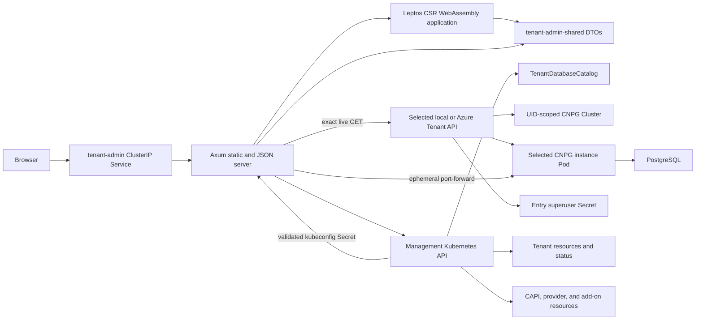

# Tenant Admin UI design

## Purpose and boundary

Tenant Admin is an administrative application deployed once in each local
Kind or Azure AKS management cluster. It gives administrators a browser view
of the same `Tenant` resources, conditions, provider status, and management
resources used by the lifecycle controller. Local and Azure Tenant detail
pages each show a database catalog and a separate, explicitly unsafe
PostgreSQL superuser console for every Ready cluster. The overview can create
provider-compatible Tenants, and detail pages can delete the exact displayed
Tenant identity.

Kubernetes is the only durable data source. The application has no database,
filesystem journal, watch cache, persisted Tenant kubeconfig, Azure cloud
credentials, or direct browser-to-Kubernetes connection. Overview requests
perform bounded reads against the management API. Detail reads the selected
Tenant and exact owned database catalog and returns sanitized per-entry
status/topology. Local and Azure query requests validate the exact Tenant
credential binding, construct an in-memory Tenant client, read the selected
CNPG Cluster, instance Pod and per-cluster superuser Secret, then open an
ephemeral Kubernetes API port-forward. SQL and results are transient.

Browser mutation requests must have a same-authority `Origin`/`Host` pair and the
`X-Tenant-Admin-Unsafe-Request: 1` header emitted by the Leptos client. The
host must be `localhost` or an IPv4/IPv6 literal, preserving local and WSL
access while rejecting DNS names that can be rebound to the forwarded service.
The custom header also blocks simple cross-origin form requests. No-`Origin`
Kubernetes service-proxy requests remain available for operational validation.

The management-cluster ServiceAccount can create and delete only top-level
Tenant resources and conditionally update the exact database catalog spec.
It reads the exact controller Deployments and temporary cutover lock to
discover capability; it has no allocation-Lease, catalog `/status`, disk or
downstream infrastructure mutation authority. The SQL endpoint is a separate,
deliberately unsafe data-plane capability obtained through the
validated Tenant administrative kubeconfig. It can execute DDL, DML,
transaction control, and multiple statements as PostgreSQL superuser.

## Architecture



The browser is a Leptos client-side WebAssembly application, and the native
process is an Axum server. The Cargo workspace contains three crates:

| Crate | Responsibility |
|---|---|
| `admin/shared` | Versioned JSON envelopes, query DTOs, route constants, and topology types shared by native and Wasm targets. |
| `admin/server` | Native Axum server, kube-rs reads, status projection, topology identity validation, health endpoints, and static-file fallback. |
| `admin/web` | Leptos client-side application, manual refresh, tables, detail panels, errors, and deterministic SVG layout. |

The server listens on `0.0.0.0:8080`. The generated Deployment,
ServiceAccount, ClusterRoleBinding, and ClusterIP Service are named
`tenant-admin` in `tenant-system`; a namespace-scoped capability Role and
RoleBinding are named `tenant-admin-controller-capability`. Local installs the
`tenant-admin-local` ClusterRole and Azure installs `tenant-admin-azure`.
The Service exposes port `80`. These checked-in resources and deployment
templates are canonical indented JSON, generated and validated with only the
Python standard library so offline installation never needs PyYAML or pip.

## Data and security model

The server initializes one management-cluster kube-rs client. It lists at most 500
Tenants, at most 500 resources of one catalog kind, and at most 2,000
management resources for one detail request. Catalog requests have bounded
concurrency. Kubernetes errors become typed service errors; oversized results
fail rather than being silently truncated.

Secrets remain excluded from management-resource inventory and responses.
Provider-specific ClusterRoles are derived from the matching
management-resource catalog. Tenants receive `get`, `list`, `create`, and
`delete`; the catalog grants `get` and conditional spec `update`, not
`/status` access. Leases are excluded from Admin inventory and authority. A separate
Role in `tenant-system` grants named `get` for the exact `tenant-controller`
Deployment, preventing capability discovery from reading same-named
Deployments elsewhere. The deterministic cluster-scoped Namespace
receives `get`, and every provider resource actually scanned receives `list`.
Local mode additionally receives only `get` on core Secrets so it can fetch
the deterministic `<tenant>-kubeconfig` Secret. Kubernetes RBAC cannot scope a
ClusterRole to dynamically named Secrets, so this is deliberately broad
administrative read authority; the server narrows use to the selected Tenant
namespace and validates the exact Secret name, control-plane ownership,
markers, endpoint, CA, context, and credential structure before use. It never
lists or watches Secrets. Azure uses an exact named Tenant credential
Role/RoleBinding for its management Secret rather than a broad cluster-scoped
Secret grant; that binding and the status-recorded Secret UID are revalidated
before an Azure query.

The validated Tenant kubeconfig exists only in request memory. The resulting
client has fixed connect/read/write timeouts, no proxy URL, and retries
disabled. Catalog reads exact-GET the Tenant-bound catalog in
`tenant-db-<tenant>` and validate its UID, namespace, owner and entry spec.
Queries additionally exact-GET the selected CNPG Cluster, instance Pod and
`<cluster>-superuser` Secret in that entry's namespace, then use its Pod
port-forward subresource through the Tenant client. They never list Tenant
workloads or Secrets. Management roles grant no provider-irrelevant
resource, wildcard, watch, `/status`, patch or downstream delete access
([catalog reads](../admin/server/src/source/catalog.rs#L65-L136);
[credential checks](../admin/server/src/source/catalog.rs#L461-L653)).

Installation and health checks compare the owned ServiceAccount, binding, and
selected ClusterRole with the tracked generated resources. They also submit
an impersonated `SelfSubjectRulesReview` in every live Namespace from a
bounded management-admin inventory and compare the complete effective
resource permissions with the generated contract. This catches additive
RoleBindings outside `tenant-system`. Incomplete evaluations, extra bindings,
mutations, subresources, wildcards, or provider-irrelevant rights fail health.
Only the exact Kubernetes self-review permissions and bounded authenticated
discovery URLs supplied by default cluster roles are accepted outside the
generated contract. The browser receives no ServiceAccount token, kubeconfig,
certificate, PostgreSQL credential, connection URI, pgpass value, or raw
unbounded Kubernetes object.

Displayed strings and identities are bounded and sanitized. Azure resource
IDs shown by the UI come from durable Tenant status; the server does not call
Azure APIs.

## Views and refresh behavior

### Management overview

The overview reports provider mode, total Tenant count, Ready, Progressing,
Degraded, Failed, and Deleting counts, plus the available management component
summary. It also reports creation capability independently from Tenant reads.
The create form uses the controller-supported Kubernetes version and accepts
name/workers. Database clusters are added separately to the Tenant catalog;
Azure CIDRs are controller allocated.

### Tenant table

The table shows name, provider, generation-aware classification, Kubernetes
version, requested workers, endpoint, age, and summarized
conditions. An empty management cluster produces a valid empty table and zero
counts.

### Tenant workspace

Each Tenant has stable **Overview**, **Resources**, **Databases**, **Status**,
and **Settings** locations. The shell keeps the Tenant classification,
provider, Kubernetes version, requested workers, age, UID, snapshot time and
manual refresh action visible across sections.

Overview shows current resource-health counts, representation-provenance
subtotals, desired/available/unavailable worker capacity, the ordered
Request accepted → Infrastructure → Control plane → Workers → Add-ons →
Databases → Ready lifecycle, and Needs Attention links. These are
point-in-time snapshot visualizations and never imply historical telemetry.
Missing or stale authoritative evidence is Unknown rather than zero or
inferred completion.

Resources derives the approved Tenant, Control plane, Compute, Databases,
Add-ons, Provider infrastructure and Other groups from typed semantic kinds in
the accepted topology. Search covers available name, generic and semantic
kind, ownership, representation provenance, health, database role, placement,
namespace, UID and display attributes; health, kind, namespace and group
filters are local operations over the loaded snapshot. The default graph
contains the Tenant and group summaries. Active filters instead produce a
deterministic matching graph, and a selected resource, relationship or group
expansion produces a deterministic graph of at most 20 resource nodes.
Filtering away the selected resource or either focused relationship endpoint
clears that focus across inventory, graph and inspector.

The graph uses fixed Tenant, Control plane, Compute, Databases, Add-ons,
Provider infrastructure and Other architecture bands rather than generic kind
columns. Compute roles and database cluster/instance roles have stable
positions inside their bands. Database instances are grouped with their
surviving cluster parent and ordered Primary → Standby → Unknown; an omitted
parent yields a stable orphan row. Available worker-pool, worker-node and zone
placement is compact node metadata, not a set of additional graph edges.
Unavailable placement remains `Not reported` in native details and is never
inferred from display strings. Edges without an explicit source label have no
visible label; relationship type remains in accessible and textual details.

Ownership (`tenant-owned`, `provider-owned` or `unknown`) is independent of
representation provenance. Exact Kubernetes resources, logical database
representations, external provider representations, recorded representations
and synthetic summaries remain labeled separately. Health, ownership,
provenance, database role and selection use distinct text/style channels;
synthetic summaries are not ordinary resource counts.

Tenant navigation, inventory selection, filters, textual relationship
selection and all lifecycle/database controls use native links, buttons and
form controls with visible focus. Health always includes text and shape in
addition to color. The SVG graph is supplemental rather than the sole
interaction path: the keyboard-operable inventory and inspector expose the
same semantic identity, ownership, representation provenance, health,
placement, attributes and directional relationships. Loading,
partial-failure, mutation and error changes retain status, alert and live
region semantics. Reduced-motion preferences minimize animation.

At the existing responsive breakpoints the Tenant context and explorer
collapse from coordinated columns to sequential content. Tables and topology
retain bounded internal horizontal and vertical overflow, including tall
architecture bands; primary navigation and page content remain reachable
without page-level horizontal scrolling at the 320 CSS-pixel minimum viewport.

Status shows current conditions, reconciliation blockers, section
availability, and links to an affected snapshot node when the server can bind
one safely. Settings contains the immutable specification, endpoint, sanitized
provider status, and the Tenant danger zone. Tenant deletion is no longer
adjacent to routine exploration.

Databases independently reads the schema-v7 catalog, showing at most three
compact list entries for either provider. A stable logical-UID location opens
one detail containing identity, reconciliation phase, ready instances,
storage, blockers, conditions, finalization progress, entry-scoped topology,
SQL and deletion controls. Add accepts
a lowercase DNS-label name and one to three instances when the Tenant and its
database capability are Ready, the catalog is open and matches the Tenant
UID, and fewer than three slots are occupied (including deleting entries).
Delete requires typing the exact name and sends the displayed catalog and
logical UIDs; deleting or stale entries disable unsafe controls. Each
console offers only Ready instances of its own entry and sends the catalog,
logical, and instance UIDs. A lost mutation response triggers an authoritative
catalog reread; the UI locks mutations pending inspection rather than
automatically replaying them. Missing catalog/capability observations leave
the rest of the Tenant detail visible, with SQL and mutations disabled.

The legacy local-only database observation remains a compatibility field in
the Tenant snapshot but is not rendered by the web UI. On catalog-capable
Tenants it directs callers to the separate catalog endpoint rather than
claiming an implicit `capi-postgres` Cluster exists. A failed catalog read
leaves Tenant detail and topology usable with database controls disabled;
Azure and local catalog cards use the same UI
([detail projection](../admin/server/src/app.rs#L427-L483)).

Settings exposes destructive Tenant deletion. The administrator
must type the exact Tenant name, and the server binds deletion to the displayed
UID and current resourceVersion. Same-name replacements are rejected.
Deletion is asynchronous; refresh shows Deleting conditions and blockers.

On a Ready catalog entry, the detail page shows an unsafe SQL console. The
administrator selects a Ready instance in that cluster, chooses the PostgreSQL
database, and submits arbitrary SQL. The backend executes the request on
that exact instance and returns
ordered result sets with column names, text values, NULL values, affected-row
counts, timing, and explicit truncation state. PostgreSQL errors remain
visible with SQLSTATE and sanitized server messages.

Execution has a 30-second transport deadline. On expiry the server opens a
second UID-revalidated port-forward, sends a PostgreSQL cancellation request,
and reaps the query connection. It reports a timeout only when termination is
confirmed; otherwise it returns the explicit non-retryable
`query-outcome-unknown` error so the administrator does not assume that a
mutation stopped. PostgreSQL backend frames are length-checked before they are
forwarded to the client decoder, preventing a single declared value from
bypassing the response-memory boundary.

Refresh is manual. Loading a page or selecting **Refresh** issues new API
requests; there is no polling, SSE stream, browser persistence, or server-side
cache. On database locations the persistent action refreshes both the Tenant
snapshot and catalog through distinct epochs. **Refresh catalog** reloads only
catalog state. A successful catalog mutation updates authoritative catalog
state and requests a snapshot refresh without clearing uncertain-outcome
locks.

The exact Tenant read remains mandatory. Management-inventory failure is
all-or-nothing at the Admin boundary and returns a successful Tenant snapshot
with Resources/live Topology explicitly unavailable. It is never converted to
an empty successful inventory, zero capacity, healthy counts or inferred
lifecycle completion. Tenant conditions/provider status and independently
available catalog state remain usable. A Tenant deleted between list and
detail returns a typed not-found response and recovery links.

## HTTP API and DTO contract

Every successful JSON response is:

```json
{"schemaVersion":7,"data":{}}
```

Errors use schema version 7 plus a typed error code, sanitized message,
retryable flag, and optional bounded field errors. The routes are:

| Route | Response |
|---|---|
| `GET /healthz` | Process liveness. |
| `GET /readyz` | Management Kubernetes API readiness. |
| `GET /api/v1/overview` | One `OverviewSnapshot` containing the overview and sorted Tenant summaries from the same list operation. |
| `GET /api/v1/tenants` | Sorted `TenantSummary[]`. |
| `POST /api/v1/tenants` | Create one Tenant for the configured provider using the active supported version. |
| `GET /api/v1/tenants/{name}` | One `TenantSnapshot` containing observation time, section availability, exact identity, detail, lifecycle, capacity, compatibility database observation, and topology. |
| `DELETE /api/v1/tenants/{name}` | Delete the exact displayed Tenant UID with typed-name confirmation. |
| `GET /api/v1/tenants/{name}/topology` | `TopologyGraph`. |
| `GET /api/v1/tenants/{name}/databases` | Current `CatalogView` with exact Tenant/catalog UIDs, capability availability, and at most three database entries. |
| `POST /api/v1/tenants/{name}/databases` | Add a named cluster with one to three instances against the exact catalog UID. |
| `DELETE /api/v1/tenants/{name}/databases/{uid}` | Mark only the exact logical UID deleting with name confirmation and catalog UID. |
| `POST /api/v1/tenants/{name}/databases/{uid}/query` | Execute unsafe SQL against the exact Ready entry and observed instance UID. |
| `POST /api/v1/tenants/{name}/database/query` | Retained singular compatibility route; refuses catalog-capable Tenants because it cannot bind a logical UID. |
| `GET /*` | Static asset or `index.html` fallback for browser routes. |

Browser routes are `/tenants/{name}` (Overview alias),
`/tenants/{name}/{overview|resources|databases|status|settings}`, and
`/tenants/{name}/databases/{logical-uid}`. Resources accepts an optional
bounded percent-encoded `select` query value. That graph node identity is
snapshot-scoped; malformed or stale selections are explained and never
retargeted.

`/overview` and `/tenants/{name}` are the coherent snapshot routes. The
`/tenants` and `/tenants/{name}/topology` compatibility routes are validated
independently for schema and shape; health does not compare their values with
a snapshot returned by a separate request because normal reconciliation may
advance between calls. If a per-Tenant request fails, health re-reads the
overview once and accepts the failure only when that coherent snapshot proves
the Tenant was concurrently deleted.

The shared DTOs include:

- `TenantSummary`, generation-aware classifications, and bounded conditions;
- `TenantDetail`, `TenantSpecificationView`, provider status, lifecycle,
  worker capacity, blockers with optional node targets, and accepted
  management-resource identities;
- top-level observation time and explicit Resources/Databases section
  availability;
- local allocation/foundation/Cluster identity;
- explicit available, unavailable, or not-applicable database observation;
- bounded CNPG identity, phase, primary/standby instances, placement, storage,
  Services, conditions, and observation timestamp;
- database query request, ordered result sets, NULL values, affected-row
  counts, timing, and truncation state without credentials;
- creation capability, provider-neutral create request/result, UID-bound
  delete request/result, and field-associated validation errors;
- Azure binding, management roots, worker pool, Nodes, add-ons, and recorded
  provider resources;
- topology nodes, edges, generic and semantic kind, ownership, representation
  provenance, database role, placement, health, display attributes and exact
  resource identity.

Catalog additions use `{"catalogUid","name","instances"}` and require a
Ready Tenant, open catalog, available database capability and current
controller rollout. Deletes require `{"catalogUid","logicalUid","confirmation"}`
with URL UID and typed exact name matching. Queries additionally bind
`instanceUid`, selected instance, database and SQL; API errors distinguish
stale identity, capacity conflict and unavailable dependencies. A lost
write reply triggers an authoritative read, never an automatic destructive
retry ([route handlers](../admin/server/src/app.rs#L151-L238);
[request DTOs](../admin/shared/src/catalog.rs#L6-L62)).
Schema changes require a deliberate `schemaVersion` change and coordinated
server/web deployment. The UI treats a mismatched schema as a visible
non-retryable error.

## Topology identity rules

The projection never associates resources by a broad Tenant label alone.

For local Tenants, roots must match the controller catalog, deterministic
name, Tenant name and UID annotations, canonical specification hash,
foundation hash, resource role, recorded Cluster UID where applicable, and
the existing provider-owner validation contract. Descendants are accepted
only through a validated exact owner UID chain to an accepted root.

For Azure Tenants, roots must match the Azure catalog, durable binding and
operation markers, and UIDs recorded in Tenant status. Descendants must match
recorded GVK/name/namespace/UID entries and recorded owner UIDs, then connect
to an accepted root through the live owner chain. Secrets and ambiguous,
foreign, marker-only, missing-UID, or owner-inconsistent objects are excluded.

Node and add-on information is rendered only when already represented by
sanitized durable status. For each local or Azure catalog entry, the Admin
server validates its catalog-recorded Cluster and observed instance UIDs;
its topology is scoped to the logical UID. Raw objects, arbitrary labels,
internal IPs, system IDs, managed roles, Secrets, and credentials are
excluded.
Partially reconciled Tenants retain available trusted nodes and show missing
components as blockers rather than inventing topology.

Every topology node is marked as an exact Kubernetes resource, database
logical representation, external provider representation, recorded resource
representation, or synthetic summary. Resource-health totals exclude the
Tenant root and synthetic summaries. The client deduplicates by server-issued
node ID, preserves directional typed edges, and provides textual relationship
output for graph information.

## Build and packaging

Rust `1.98.1`, the `wasm32-unknown-unknown` target, Trunk `0.21.14`, and
wasm-bindgen CLI `0.2.129` are pinned. `just cache` is the only online
acquisition path for Trunk and wasm-bindgen; `just cache admin-build` is the
CI-focused subset. Admin builds then use locked Cargo dependencies, Trunk
`--locked --offline`, and the verified local binaries. Run `just admin-fetch`
before an enforced-offline build to prepare the locked workspace dependency
graph in Cargo's shared home.

Useful commands are:

```bash
just admin-fetch
just admin-generate-check
just admin-lint
just admin-test
just admin-metrics
just admin-package-check
just admin-image
```

`admin-package-check` performs two release builds and compares the static
server plus the exact HTML, JavaScript, Wasm, and CSS inventory by SHA-256.
The server is rejected if ELF `INTERP` or `NEEDED` entries are present. The
scratch image contains only `/tenant-admin` and `/web` and runs as UID/GID
65532.

The Deployment uses `Recreate` rather than a rolling update. Each image owns
one content-hashed frontend generation, so old and new server/assets are never
simultaneously selected by the Service. Missing `.js`, `.wasm`, and `.css`
paths return 404; only extensionless browser routes receive the SPA shell.

Generated browser bundles under `.runtime/rendered/admin/web` are ignored
build output, not source or checked-in generated fixtures. The authoritative
inputs are the Rust, HTML, CSS, Trunk configuration, Cargo lockfile, pinned
tool identities, generated Kubernetes resources, and Dockerfile.

Fast CI uploads the static server and exact web inventory with both
controller managers. PR E2E accepts those files only when they are owned, non-writable,
regular sibling artifacts below `.tools/artifacts`; it revalidates the static
ELF and exact browser inventory before copying them into private runtime state.
Scheduled/manual high-capacity CI rebuilds independently from the verified
cache.

### Local Kind

Management creation builds or accepts the validated CI artifact, creates the
provider-neutral scratch image, loads its exact tag into Kind, applies the
local least-privilege resources and Deployment, waits for rollout, and
validates Deployment UID, image, provider mode, Pod, Service, complete
effective RBAC, health, overview, list, detail, and topology.

### Azure AKS

`azure-create-management` builds the same provider-neutral image, pushes the
configured repository/tag to the shared ACR, verifies the registry digest,
and deploys the immutable digest with provider mode `azure`. Foundation
inventory records `adminImage` and `adminDeploymentUid` together after a
healthy rollout. Foundation health validates repository binding, immutable
image, Deployment UID and readiness, Pod security, provider mode, resource
limits, probes, Service, the Azure-specific complete effective RBAC contract,
and API health. Existing
pre-admin foundation inventory remains valid until management installation
adds both optional fields.

## Usage

After management creation:

```bash
just admin-status
just admin-port-forward
```

`just admin-port-forward` runs:

```text
kubectl -n tenant-system port-forward service/tenant-admin 8080:80
```

Open <http://127.0.0.1:8080/>. The Service is ClusterIP-only; there is no
Ingress, public endpoint, or application authentication in this experiment.
Access therefore depends on the operator's authenticated management-cluster
kubeconfig and local port-forward process. Anyone who can load this UI can use
the local SQL console as PostgreSQL superuser and can destroy Tenant data.

## Troubleshooting

- **`admin-fetch` fails offline**: refresh Cargo dependencies with the explicit
  online `just admin-fetch` before an enforced-offline gate.
- **Trunk or wasm-bindgen is missing or has the wrong version**: run
  `just cache` followed by `just tools`; do not install an unpinned global
  replacement.
- **Generated resources are stale**: run
  `python3 scripts/generate_admin_resources.py`, review the exact RBAC and
  Deployment changes, then rerun `just admin-generate-check`.
- **`/readyz` returns 503**: inspect management API reachability and
  ServiceAccount authorization. Liveness can remain healthy while Kubernetes
  reads fail.
- **Overview works but detail omits resources**: inspect Tenant status UIDs,
  controller markers, and owner references. Foreign or ambiguous objects are
  intentionally excluded.
- **Catalog panel is unavailable**: inspect the exact Tenant/catalog UID
  binding, closed flag, database-controller rollout, provider runtime,
  Tenant credential Role/RoleBinding and endpoint reachability. For an
  entry-scoped SQL error, inspect its recorded CNPG Cluster/Pod/credential
  identity; never infer a default `database/capi-postgres`. A stale or
  unavailable observation disables mutations instead of guessing.
- **Nested browser route returns an error**: verify the static web inventory
  and server/web schema are from the same build; the Axum fallback should
  return `index.html`.
- **Azure foundation health reports admin drift**: compare the recorded
  immutable digest and Deployment UID with the live `tenant-admin` resources;
  rerun `azure-create-management` only after resolving unexpected ownership
  or identity changes.

## Limitations

This is an experimental administrative tool, not a production control plane.
It has no Ingress, application authentication, authorization by Tenant,
pagination UI, watch/poll stream, historical data, metrics backend, audit
store, or general Tenant workload topology. Per-entry CNPG metadata is a
point-in-time exact read, not monitoring: there are no LSN, replication-lag,
or historical metrics. The SQL console is intentionally unrestricted and can
modify schemas, roles, configuration, and data. Transport and response limits
protect the Admin process but are not a safety boundary. The local admin ServiceAccount can
read any known Secret name because Kubernetes ClusterRole rules cannot filter
dynamic Tenant Secret names; deployment compromise therefore has
administrative Tenant impact despite application-level exact-name and
ownership checks. The validated Tenant kubeconfig and CNPG superuser Secret
raise that impact to complete Tenant and PostgreSQL administration for
either provider. The credentialed Azure three-by-three nine-disk destructive
proof and real browser/service-proxy agreement passed manually on 2026-10-03;
they remain outside CI and do not imply production storage guarantees. The fixed list limits
intentionally fail closed for larger management clusters and will require a
separately designed pagination model.
