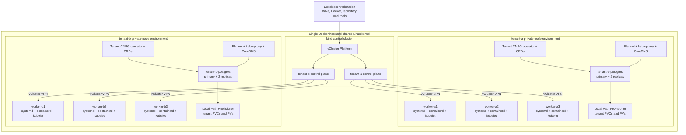

# CloudNativePG on Private-Node vCluster Tenants

## Status

Implemented as a local evaluation environment.

The repository automation is complete. The local validation run created the
kind control cluster and vCluster Platform, but current vCluster releases
require interactive Free-tier activation before a linked private-node tenant
can be created. The unactivated Platform rejected the first tenant with
`license limits are exceeded`. Setup detects this state, records an explicit
blocker, and never falls back to shared nodes or independent Docker clusters.

## Purpose

Build a repeatable single-host environment for evaluating two independently
operated CloudNativePG tenants. One kind cluster hosts vCluster Platform and
both tenant control planes. Each tenant receives three exclusive private worker
containers and owns its networking, service routing, storage, CNPG operator,
CNPG CRDs, and one three-instance PostgreSQL cluster.

This is a development and compatibility experiment. It is not a production
database platform or a hard infrastructure-isolation boundary.

## Architecture decisions

### One central control cluster

The Docker host runs exactly one kind cluster. Its single control-plane
container hosts:

- vCluster Platform.
- The `tenant-a` vCluster control plane.
- The `tenant-b` vCluster control plane.

Tenant workloads do not run on the kind node. kind provides control-plane
hosting only.

### Two private-node tenants

Both tenant clusters enable `privateNodes` at creation. Private-node mode
enables the tenant scheduler and disables all vCluster resource synchronization
to the central cluster. Pods, Services, PVCs, PVs, CNPG CRDs, and CNPG custom
resources therefore stay in the tenant API and on tenant workers.

Each tenant receives three fixed-name systemd-capable Ubuntu 24.04 Docker
containers. A worker joins only one tenant through the official vCluster node
join script and is labeled for that tenant. The containers run their own
containerd, kubelet, and vCluster VPN services.

vCluster's support matrix names systemd-capable Linux machines such as Ubuntu
22.04 and 24.04; it does not name privileged Docker containers as supported
private-node machines. The worker implementation is therefore an experimental
container-as-machine approximation. Setup fails clearly if it cannot pass node
bootstrap.

### Tenant-owned networking and storage

Each private-node tenant retains vCluster's supported defaults:

- Flannel for pod networking.
- kube-proxy for Service routing.
- CoreDNS as the tenant control-plane DNS component.
- Rancher Local Path Provisioner and its default StorageClass.

Tenant pod and Service CIDRs do not overlap. Workers share a Docker bridge and
can reach one another directly, so only node-to-control-plane VPN is enabled.
Node-to-node VPN remains disabled in accordance with upstream guidance to avoid
VPN when direct connectivity is available.

Local Path Provisioner stores each database volume on the selected private
worker. A volume is not portable to another worker. PostgreSQL replication,
not volume relocation, provides the failover path evaluated by this lab.

### Per-tenant CloudNativePG ownership

CloudNativePG 1.30.0 is installed independently through each tenant API. Each
tenant owns its:

- CNPG CRDs.
- Operator Deployment and ServiceAccount.
- ClusterRoles and bindings.
- Admission webhook configurations and Service.
- One CNPG `Cluster`.

The two CNPG clusters are named `tenant-a-postgres` and
`tenant-b-postgres`. Each uses PostgreSQL 18.4, three instances, one 1 GiB claim
per instance, and required hostname anti-affinity so that the instances occupy
three distinct tenant workers.

## Logical topology

## Resource ownership

| Resource | kind control cluster | tenant-a | tenant-b |
|---|---|---|---|
| vCluster Platform | Hosted | Linked | Linked |
| Tenant control plane | Hosted | Native API | Native API |
| Private workers | Not Kubernetes nodes | Three exclusive nodes | Three exclusive nodes |
| Tenant pods and Services | Not synchronized | Native | Native |
| Flannel, kube-proxy, CoreDNS | Not tenant runtime | Tenant-owned | Tenant-owned |
| StorageClass and provisioner | Not used by tenant data | Tenant-owned | Tenant-owned |
| PostgreSQL PVCs and PVs | Absent | Tenant-owned | Tenant-owned |
| CNPG operator, CRDs, webhooks, RBAC | Absent | Tenant-owned | Tenant-owned |
| CNPG `Cluster` | Absent | One, three instances | One, three instances |

## Control and data flow

1. Repository-local pinned tools create the named kind cluster.
2. vCluster Platform 4.11.2 starts on kind and publishes an HTTPS Loft Router
   endpoint.
3. The operator activates Platform Free mode through the upstream account/email
   flow when required.
4. The CLI creates and links `tenant-a` and `tenant-b` with private nodes
   enabled from initial creation.
5. Six systemd worker containers start on the kind Docker network.
6. A tenant bootstrap token supplies the official join script. Three workers
   join each tenant and establish node-to-control-plane VPN.
7. Tenant Flannel, kube-proxy, CoreDNS, and Local Path Provisioner become ready.
8. CNPG is installed independently in each tenant, then each three-instance
   database is created.
9. SQL clients use each tenant's CNPG read/write Service and generated
   application secret.

No tenant workload or storage object is translated through a vCluster syncer.
The central cluster sees control-plane components, not tenant data-plane
resources.

## Verification model

`make verify` checks:

- One central kind cluster and exactly two Platform-linked tenants.
- Three Ready, disjoint private worker names per tenant and no private workers
  in kind.
- Ready Flannel, kube-proxy, CoreDNS, default StorageClass, and local-path
  provisioner in each tenant.
- CNPG CRDs, operator, admission resources, and RBAC in each tenant and absent
  from kind.
- Exactly one healthy three-instance CNPG cluster per tenant.
- Three bound claims and volumes and three distinct PostgreSQL worker names per
  tenant.
- Distinct SQL markers with no cross-tenant result.
- Replica restart, PVC reuse, and data reread.
- Primary deletion, promotion to a different primary, and post-failover data
  reread.

`make status` is read-only and summarizes every layer. `make diagnose` adds
events plus worker systemd, kubelet, containerd, and VPN state.

## Reproducibility

Direct inputs are pinned:

| Component | Version |
|---|---|
| kind | 0.33.0 |
| kind Kubernetes image | 1.36.4 with digest |
| tenant Kubernetes | 1.36.0 |
| kubectl | 1.36.4 |
| Helm | 3.19.0 |
| vCluster CLI/chart | 0.36.1 |
| vCluster Platform | 4.11.2 |
| CloudNativePG | 1.30.0 |
| PostgreSQL | 18.4 system-trixie with digest |
| Verification utility | BusyBox 1.37.0 with digest |
| Worker userspace | Ubuntu 24.04 with digest |

The pinned vCluster release controls transitive private-node components such as
Flannel, kube-proxy, Local Path Provisioner, containerd, kubelet, and
`vcluster-vpn`. Status and diagnostics report the resolved runtime versions and
images; repository automation does not override supported bundled defaults.

## Security and isolation limits

Private nodes prevent Kubernetes scheduling and API visibility across tenants,
but all kind, Platform, tenant control-plane, worker, and database containers
still run on one Docker host and share its Linux kernel. Privileged worker
containers can access host kernel capabilities. The topology does not protect
against host compromise, kernel failure, Docker daemon failure, resource
exhaustion, or workstation loss.

The environment must not be described as production multi-tenancy or high
availability. Three PostgreSQL instances test replication and failover only
within one shared host failure domain.

## Teardown

Teardown removes tenant database resources, resets and removes private workers,
deletes tenant control planes, uninstalls Platform, deletes the named kind
cluster, and removes generated runtime state. All names and Docker labels use
the `cnpg-private` prefix. Unrelated containers, clusters, and Kubernetes
contexts are not targeted.

## Upstream references

- [vCluster Private Nodes Quick Start](https://www.vcluster.com/docs/vcluster/quick-start/private-nodes)
- [vCluster Private Nodes](https://www.vcluster.com/docs/vcluster/deploy/worker-nodes/private-nodes)
- [vCluster Node Requirements](https://www.vcluster.com/docs/vcluster/deploy/worker-nodes/private-nodes/node-requirements)
- [vCluster VPN](https://www.vcluster.com/docs/vcluster/configure/vcluster-yaml/private-nodes/vpn)
- [vCluster OSS and Free tiers](https://www.vcluster.com/docs/vcluster/introduction/oss-vs-free)
- [vCluster AddOns](https://www.vcluster.com/docs/vcluster/configure/vcluster-yaml/deploy)
- [CloudNativePG supported releases](https://cloudnative-pg.io/docs/devel/supported_releases)
- [CloudNativePG scheduling](https://cloudnative-pg.io/docs/1.30/scheduling)
- [kind quick start](https://kind.sigs.k8s.io/docs/user/quick-start/)
