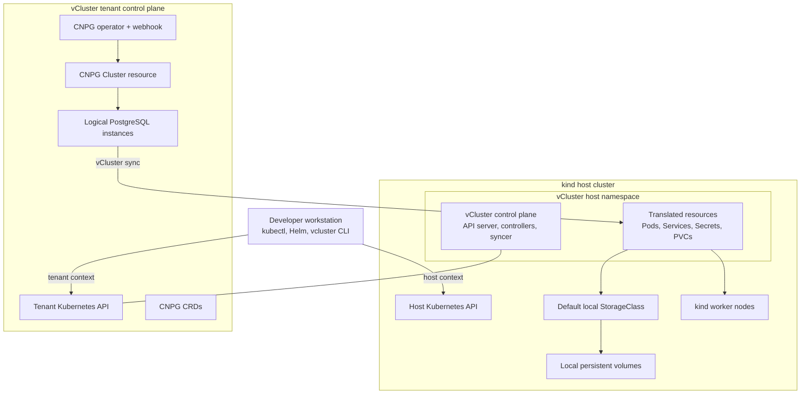

# CloudNativePG on vCluster: Local Experiment Design

## Status

Proposed.

## Purpose

Build a repeatable local environment for evaluating CloudNativePG (CNPG) inside
a vCluster tenant cluster hosted by kind. The experiment should show whether
CNPG installation, PostgreSQL lifecycle management, storage, networking, and
failover behave as expected through the vCluster abstraction.

This environment is for development and evaluation only. It is not a model for
production database hosting.

## Goals

- Create the complete environment on a developer workstation.
- Run the CNPG operator and its CRDs inside the tenant cluster.
- Run PostgreSQL pods on the kind host cluster through vCluster shared nodes.
- Provision PostgreSQL PVCs through the host cluster's local storage provider.
- Connect to PostgreSQL and verify basic reads and writes.
- Exercise CNPG reconciliation, scaling, restart, and primary failover.
- Make tenant resources and their translated host resources easy to inspect.
- Keep setup and teardown deterministic and suitable for later automation.

## Non-goals

- Production-grade durability, security, performance, or disaster recovery.
- A supported multi-tenant database platform.
- Benchmarking kind storage or drawing performance conclusions from it.
- Testing cloud load balancers, external DNS, CSI snapshots, or object-store
  backups in the first iteration.
- Preserving database data after the kind cluster is deleted.

## Architecture decision

Install CNPG **inside the vCluster tenant cluster**, not on the kind host
cluster.

CNPG installs cluster-scoped CRDs, admission webhooks, RBAC, and an operator
that reconciles `Cluster` resources. A vCluster provides an isolated Kubernetes
API and control plane, so CNPG can use those APIs as it would in a conventional
cluster. The generated pods, services, secrets, and PVCs are translated by the
vCluster syncer into a dedicated namespace on the host cluster, where kind
provides actual scheduling, networking, and storage.

This arrangement tests the most useful hypothesis: a tenant can own and operate
CNPG without installing CNPG CRDs or its operator into the host control plane.
It also avoids custom-resource synchronization, which would instead delegate
reconciliation to a host-installed operator and test a materially different
architecture.

## Logical architecture



The tenant and host views are intentionally different:

| Resource | Tenant cluster | Host cluster |
|---|---|---|
| CNPG CRDs and `Cluster` | Native, tenant-owned | Not installed or visible |
| CNPG operator and webhook | Native workloads | Translated pods/services |
| PostgreSQL pods and services | Native names and namespaces | Translated into the vCluster host namespace |
| PVCs | Created and observed by CNPG | Synced and bound by the host provisioner |
| PVs and backing paths | Abstracted from the tenant | Owned by the host cluster |

## Components

### Local container runtime

Docker is the preferred baseline because kind and vCluster are commonly tested
with it. Podman or nerdctl may be evaluated later, but rootless networking and
mount behavior can add unrelated variables.

### kind host cluster

Use a named kind cluster with one control-plane node and two worker nodes. This
supports a three-instance PostgreSQL experiment and makes scheduling and
failover behavior visible. A reduced one-node profile can be added later for
resource-constrained workstations.

The host cluster is responsible for:

- Running the vCluster control plane and translated tenant workloads.
- Supplying the default StorageClass used by translated CNPG PVCs.
- Providing pod networking and DNS below the vCluster abstraction.

The implementation must verify that exactly one default StorageClass exists
before deploying PostgreSQL. If the selected kind/node image does not provide a
working default provisioner, setup must install a pinned local-path provisioner
on the host. The CNPG example should initially omit `storageClassName` so the
host default is used.

Local volumes are suitable only for this experiment. Node loss can make a
node-local volume unavailable even though CNPG can promote another replicated
instance.

### vCluster

Deploy one vCluster in a dedicated host namespace using shared nodes, the
default and lowest-complexity mode for trusted local development.

The vCluster configuration should:

- Persist its control-plane state for the lifetime of the kind cluster.
- Keep default synchronization enabled for pods, services, secrets, config
  maps, and PVCs.
- Avoid syncing CNPG custom resources to the host.
- Avoid enabling a virtual scheduler until a test requires tenant-side
  scheduling semantics.
- Use explicit, pinned chart and image versions in the eventual implementation.

Shared nodes provide API isolation, not a security boundary between untrusted
workloads. That limitation is acceptable for a single-user local experiment.

### CloudNativePG

Install a pinned CNPG release against the tenant kubeconfig. All CNPG CRDs,
RBAC, operator resources, and admission webhooks belong to the tenant API.

Deploy an initial CNPG `Cluster` with:

- Three PostgreSQL instances.
- Small development PVCs, such as 1 GiB per instance.
- A pinned PostgreSQL image version.
- Default replication settings from the selected CNPG release.
- No backup, WAL archive, tablespace, monitoring stack, or separate WAL volume
  in the baseline.

The three instances validate replication and failover behavior, but do not make
the local environment highly available: all kind nodes still share one
workstation and container runtime.

### Client access

Use two access paths:

1. Run a disposable PostgreSQL client pod inside the tenant cluster for the
   least ambiguous connectivity test.
2. Port-forward the CNPG read/write service through the tenant kubeconfig for
   interactive access from the workstation.

Credentials must come from the CNPG-generated application secret. They should
never be copied into committed manifests.

## Resource and control flow

1. The developer creates the kind host cluster.
2. The host storage provisioner becomes ready and exposes a default
   StorageClass.
3. vCluster starts in its dedicated host namespace and publishes a tenant
   kubeconfig/context.
4. CNPG CRDs and the operator are installed through the tenant API.
5. A CNPG `Cluster` resource is submitted to the tenant API.
6. The tenant-side CNPG operator creates PostgreSQL pods, services, secrets,
   and PVCs.
7. The vCluster syncer translates those resources into the vCluster namespace
   on the host.
8. The host scheduler places pods on kind nodes and the host storage
   provisioner binds the translated PVCs.
9. Status updates flow back through the syncer. CNPG observes ready instances,
   selects a primary, and reports cluster readiness in the tenant API.
10. Clients use the CNPG read/write service, while operators can inspect both
    tenant and host contexts to troubleshoot either side of the abstraction.

## Experiment plan

### Phase 1: Bootstrap

- Check required tools and minimum versions.
- Create the multi-node kind cluster.
- Verify nodes, DNS, and the default StorageClass.
- Create vCluster and obtain the tenant context.
- Verify that host and tenant API contexts are clearly named and selectable.

Success means both APIs are reachable and a basic tenant pod becomes ready on a
kind node.

### Phase 2: CNPG installation

- Install CNPG into the tenant cluster.
- Wait for its operator and webhook to become ready.
- Confirm CNPG CRDs exist in the tenant and do not exist in the host.

Success means the tenant API accepts a valid CNPG resource and rejects an
invalid one through admission validation.

### Phase 3: PostgreSQL lifecycle

- Create the three-instance PostgreSQL cluster.
- Wait for the CNPG `Cluster` to report ready.
- Confirm each tenant PVC has a bound translated PVC and PV on the host.
- Connect through the read/write service, create test data, and read it back.
- Restart a replica and verify it rejoins.
- Delete or stop the current primary and verify CNPG promotes a healthy replica.
- Read the original test data through the read/write service after failover.
- Scale the cluster down and back up, observing PVC and pod lifecycle.

Success means CNPG converges without manual host-side resource changes and test
data remains available through pod restarts and a primary transition.

### Phase 4: Teardown

Delete the PostgreSQL `Cluster`, CNPG installation, vCluster, and kind cluster
in that order. At each boundary, verify which host resources and volumes are
removed. Destructive cleanup should require an explicit command and target only
the named local environment.

## Observability and troubleshooting

The implementation should expose concise status commands for:

- CNPG cluster status, instances, and operator logs in the tenant.
- Tenant pods, services, secrets, PVCs, events, and node views.
- Translated pods, services, PVCs, events, and vCluster syncer logs on the host.
- Mapping a tenant resource to its translated host resource.

Metrics and Grafana are deferred. Kubernetes events, CNPG status, and component
logs are sufficient to validate the first experiment.

Failures should be diagnosed at the layer that owns them:

| Symptom | First inspection point |
|---|---|
| CNPG resource rejected or not reconciled | Tenant CNPG webhook/operator |
| Tenant pod remains pending | Tenant events, then translated host pod events |
| PVC remains pending | Host default StorageClass and provisioner |
| Service cannot reach PostgreSQL | Tenant endpoints, translated service, pod readiness |
| vCluster API unavailable | Host vCluster pod, service, and persistent state |

## Risks and mitigations

| Risk | Mitigation |
|---|---|
| Local machine lacks enough CPU or memory | Document a reduced single-worker/two-instance profile after the baseline works. |
| CNPG depends on an API behavior not faithfully represented by vCluster | Pin versions, capture tenant and syncer events, and record any required vCluster setting as an explicit compatibility rule. |
| Local PVC behavior is mistaken for durable storage | Label the environment as ephemeral and test only restart/failover within a running kind cluster. |
| Primary failover succeeds but a node-local volume cannot move | Treat replication, not volume relocation, as the expected recovery path. |
| Host and tenant commands are accidentally mixed | Require an explicit context for every automated `kubectl` and `helm` invocation. |
| Floating versions make the experiment irreproducible | Pin kind node, vCluster chart/image, CNPG operator, and PostgreSQL image versions in implementation artifacts. |
| Teardown leaves translated resources behind | Verify namespace ownership and enumerate leftovers before deleting the kind cluster. |

## Alternatives considered

### Host-installed CNPG with custom-resource synchronization

Install CNPG and its CRDs on the host, then sync CNPG `Cluster` resources from
the tenant. This can reduce per-tenant operator overhead, but it moves
reconciliation and CRD ownership into the host and requires custom-resource
sync configuration. It does not answer whether CNPG itself works inside a
vCluster, so it is not the baseline.

### vind

vCluster's Docker-based `vind` mode removes kind and offers a direct local
tenant-cluster experience. It is a useful follow-up comparison, especially for
simpler networking and load balancers, but kind remains the baseline because
the experiment specifically needs the nested host/tenant boundary.

### Minikube or k3d host

Either can host vCluster and may offer simpler storage on some workstations.
The design keeps host-cluster-specific configuration isolated so one can be
substituted later, but supporting multiple providers in the first iteration
would reduce reproducibility.

## Expected implementation shape

A later implementation should keep declarative configuration separate from
orchestration:

```text
config/
  kind.yaml
  vcluster.yaml
manifests/
  cnpg-cluster.yaml
scripts/
  prerequisites
  create
  verify
  destroy
```

The top-level entry points may be a `Makefile` or task runner already accepted
by the repository. Scripts should be idempotent where practical, stop on
errors, pin external dependencies, and always specify the intended Kubernetes
context.

## Acceptance criteria

- A fresh workstation with the documented prerequisites can create the
  environment using repository-owned configuration.
- CNPG CRDs exist only in the tenant control plane.
- The CNPG operator becomes ready in the tenant cluster.
- A three-instance PostgreSQL cluster becomes healthy.
- Every PostgreSQL PVC binds through the host storage provisioner.
- A client can write and read data through the CNPG read/write service.
- PostgreSQL remains reachable and test data remains readable after primary
  failover.
- Tenant resources can be correlated with translated host resources.
- Teardown removes the named local environment without affecting other
  Kubernetes contexts.

## Upstream references

- [vCluster architecture](https://www.vcluster.com/docs/vcluster/introduction/architecture)
- [vCluster shared-nodes quick start](https://www.vcluster.com/docs/vcluster/quick-start/shared-nodes)
- [vCluster synchronization configuration](https://www.vcluster.com/docs/vcluster/configure/vcluster-yaml/sync)
- [vCluster custom-resource synchronization](https://www.vcluster.com/docs/vcluster/configure/vcluster-yaml/sync/to-host/advanced/custom-resources)
- [CloudNativePG quickstart](https://cloudnative-pg.io/documentation/current/quickstart/)
- [CloudNativePG storage guidance](https://cloudnative-pg.io/documentation/current/storage/)
- [kind quick start](https://kind.sigs.k8s.io/docs/user/quick-start/)
