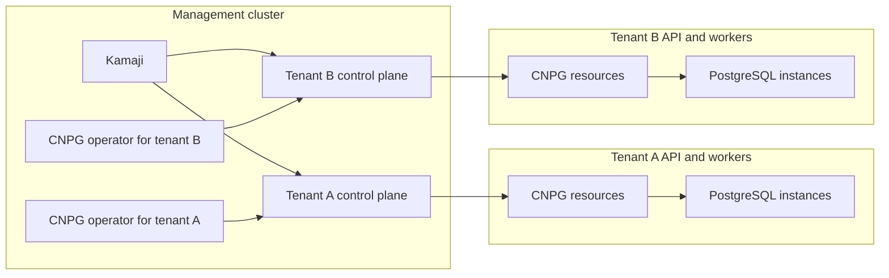

# Management-Hosted CloudNativePG Operators

## Status

Draft proposal for evaluation.

## Context

The Cluster API and Kamaji topology uses a management cluster to host tenant
control planes while tenant worker nodes run tenant workloads. CloudNativePG
currently runs inside each tenant cluster and reconciles PostgreSQL resources
through that tenant's Kubernetes API.

Running the operator on tenant workers has a small per-tenant resource cost.
That cost can become significant when many small tenant clusters are packed
densely or when tenant compute is billed independently from management
compute.

CloudNativePG supports an operator managing resources in multiple namespaces
of one Kubernetes cluster. It does not provide a supported multi-cluster
operator mode: each operator instance manages one Kubernetes API.

## Proposal

Host one CloudNativePG operator instance per tenant on shared management
cluster compute. Each instance remains logically associated with exactly one
tenant cluster and reconciles only that tenant's Kubernetes API.

This changes the physical placement of the operator without changing
CloudNativePG's tenant ownership model:

- PostgreSQL clusters and their supporting resources remain tenant resources.
- Each tenant retains an independent operator reconciliation boundary.
- Operator processes share management-cluster compute but not credentials,
  caches, or reconciliation state.
- The management cluster owns the lifecycle and placement of operator
  processes.

## Architectural Boundaries

### One operator per tenant API

An operator instance is dedicated to one tenant cluster. A shared operator
that switches between tenant APIs is outside this proposal because
CloudNativePG is built around one Kubernetes client, cache, discovery view,
and leader-election domain per process.

### Tenant resource ownership

CloudNativePG custom resources, PostgreSQL Pods, Services, Secrets, storage,
RBAC, and status remain in the tenant API. They must not be represented as
management-cluster resources or mirrored into the management API.

### Management ownership

The management cluster owns only the operator runtime and its association with
a tenant. Tenant deletion or credential revocation must make the corresponding
operator unable to affect any other tenant.

### Admission and connectivity

The tenant API must be able to use CloudNativePG admission services, and the
operator must be able to reach the tenant API and CloudNativePG instances.
These paths cross the management-to-tenant boundary and are platform
dependencies of this model.

### Failure isolation

Failure, restart, upgrade, or credential loss for one tenant's operator must
not interrupt reconciliation for another tenant. Shared management-cluster
capacity must not create shared application state between operator instances.

## Expected Benefits

- Removes the operator's steady-state resource request from tenant workers.
- Allows operator instances to be densely packed on shared management
  compute.
- Centralizes operator placement, observability, and lifecycle control.
- Preserves separate reconciliation and credential boundaries for each
  tenant.
- Avoids adding a dedicated system worker pool to every tenant cluster.

## Tradeoffs

- This is not a standard or upstream-supported CloudNativePG deployment
  topology.
- Management-cluster availability becomes part of every tenant database's
  control-plane availability.
- Cross-cluster admission, certificate, and network dependencies increase the
  failure surface.
- The platform must validate compatibility with each CloudNativePG upgrade.
- Per-tenant operator processes remain necessary, so compute is consolidated
  rather than eliminated.

## Alternatives

### Operator on existing tenant workers

Keep the supported CloudNativePG topology and schedule the operator alongside
tenant workloads. This has the lowest architectural complexity and may not
increase node count when spare tenant capacity is available.

### Dedicated tenant system workers

Run the operator on a tenant-owned system pool. This preserves upstream
assumptions but increases tenant compute cost and operational footprint.

### Centralized installation with tenant-local operation

Use management-cluster automation to install and upgrade CloudNativePG in each
tenant while leaving the operator runtime on tenant workers. This centralizes
lifecycle management but does not remove tenant compute usage.

### Shared multi-tenant operator

Use one process to reconcile several tenant APIs. CloudNativePG does not expose
this architecture, and it would weaken isolation by combining tenant
credentials and reconciliation state. It is outside this proposal.

## Open Questions

- Whether the saved tenant compute justifies ownership of a non-standard
  CloudNativePG topology.
- Whether management-to-tenant admission and instance connectivity can meet
  the required availability and isolation properties.
- How operator availability should relate to tenant and management cluster
  failure domains.
- Which CloudNativePG capabilities require additional compatibility
  validation when the operator is hosted outside the tenant cluster.

## References

- [CloudNativePG architecture](https://cloudnative-pg.io/docs/devel/architecture)
- [CloudNativePG operator configuration](https://cloudnative-pg.io/docs/devel/operator_conf)
- [Kamaji architecture](https://kamaji.clastix.io/concepts/)
