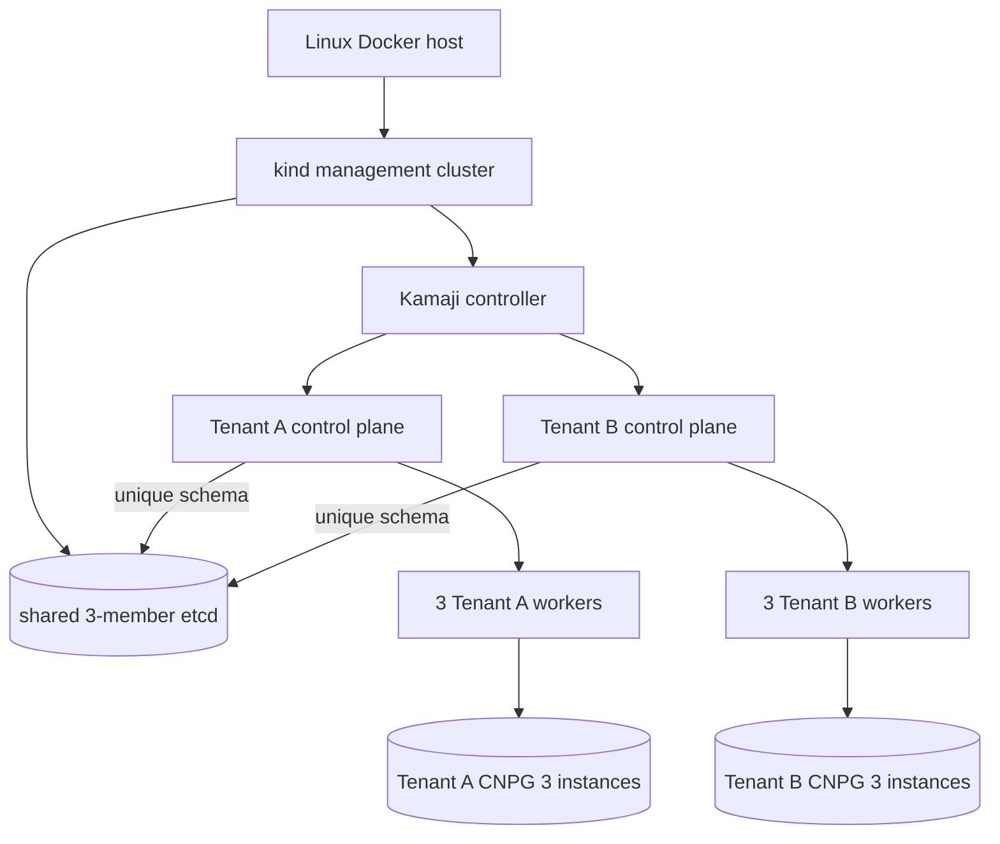

# Kamaji tenant lab high-level design

## Status and purpose

The lab is a development experiment built from the public edge Kamaji
26.8.6-edge source release. It requires no account, activation, product key,
or paid artifact; the freely downloadable edge channel is experimental.

The as-built topology is one Kubernetes 1.36.4 kind management
cluster hosting cert-manager, MetalLB, Kamaji, a shared three-member datastore,
and two hosted tenant control planes. Each tenant owns three exclusive
worker containers, networking, dynamic storage, one CloudNativePG 1.30.0
operator, and one three-instance PostgreSQL 18.4 cluster.

## Independence and ownership

Everything used or generated by this lab is below `kamaji/`. Product scripts
do not source another experiment's shell libraries, use its runtime state, or
delegate to the repository Makefile. Docker objects will use the distinct
`io.cnpg-vcluster.kamaji-lab` ownership label and exact Kamaji-specific names.

The ignored `.tools/` tree contains downloaded binaries, source archives,
charts, manifests, rendered output, and local temporary files. The ignored
`.runtime/` tree is reserved for management and tenant kubeconfigs, blockers,
network assignments, logs, and generated credentials.

## Deterministic supply chain

`config/versions.env` records the source URL and SHA-256 or OCI digest for every
direct input:

- kind 0.33.0 and `kindest/node:v1.36.4`;
- kubectl 1.36.4 and Helm 3.21.4;
- host prerequisite `just` 1.58.0;
- Kamaji 26.8.6-edge source commit
  `80f32baafe34cba9d739c41208c21090dbe1827d`;
- the release source archive, upstream `Chart.lock`, lock digest, and exact
  `kamaji-etcd` 0.15.0 dependency package;
- cert-manager 1.21.1 OCI descriptor and chart package;
- MetalLB 0.16.1, Calico 3.32.2, Local Path Provisioner 0.0.37, and
  CloudNativePG 1.30.0 manifests;
- PostgreSQL 18.4, Konnectivity 0.36.0, worker, and verification images.

The cert-manager controller, webhook, cainjector, and startup API check plus
the MetalLB controller and speaker are independently resolved and recorded by
digest. The cert-manager chart consumes its supported digest values. MetalLB
uses a deterministic transform of the immediately checksum-verified native
manifest. Both rendered inputs and the live controller workloads are checked
against the recorded references and provenance.

The upstream Kamaji chart identifies itself with moving chart/app versions and
renders `repository:tag` image fields. The lab therefore prepares the chart
from the verified release source instead of a moving chart repository. It
preserves and verifies the upstream checked-in `Chart.lock`, injects only the
verified kamaji-etcd package, templates against Kubernetes 1.36.4, and applies
a deterministic post-render transformation.

That transformation replaces the directly selected Kamaji controller,
datastore, datastore bootstrap kubectl, and datastore bootstrap etcd images
with approved OCI digest references. The renderer emits a deterministic
transitive image inventory and fails unless every rendered image is
digest-pinned and no `latest` reference remains.

The tracked spike add-on manifests are deterministic transforms of the
checksum-verified Calico 3.32.2 and Local Path Provisioner 0.0.37 inputs.
Calico selects `10.66.0.0/16` and digest-pins its CNI, node, and controller
images. Local Path is the sole default StorageClass, stores data below
`/var/lib/kamaji-local-path`, and digest-pins both provisioner and helper
images. Their rendered checksums are recorded in `config/versions.env`.

The directly selected etcd server image comes from
`kamaji-etcd` 0.15.0 `values.image`; the shell-capable etcd setup image comes
from `values.jobs.etcd`; and the kubectl setup image is the lab's explicit
`values.jobs.kubectl` override. Their resolved digests and provenance fields
are recorded together in `config/versions.env`.

The renderer is also Helm's argument-less post-renderer during installation.
This is the same transformation used by the checked render, so the installed
controller and StatefulSet receive the validated digest references. Helm 3
does not pass hook manifests through post-renderers, so installation disables
native hook execution and applies the locked chart's rendered hook
prerequisites and post-install Job separately from the same digest-validated
manifest. No dependency update or repository lookup occurs: the checked-in
lock and exact local `kamaji-etcd-0.15.0.tgz` package must re-verify before
render or install.

## Management reconciliation and networking

The kind cluster is always addressed by its exact name and explicit
`.runtime/kubeconfigs/management.yaml`. On first creation the lab records the
full control-plane container ID, expected container name, and kind cluster
label. A later run may reuse the cluster only when the live identity and label
match that mode-0600 record. Same-named unrecorded, replaced, or partial state
is refused before adoption or deletion.

After kind is ready, the network library inspects the actual `kind` Docker
network, selects the highest two unassigned IPv4 host addresses
deterministically, rejects overlap with every management and tenant Pod or
Service CIDR, persists the subnet and addresses, and renders a two-`/32`
MetalLB pool with `autoAssign: false` plus one explicit L2 advertisement.
Every repeated management create revalidates the recorded addresses against
current Docker endpoint allocation before applying the pool.

Management dependencies reconcile in strict order:

1. Kubernetes 1.36.4 API and owned kind identity;
2. cert-manager 1.21.1 controller, cainjector, webhook, and CRDs;
3. MetalLB 0.16.1 controller, speaker, webhook, pool, and advertisement;
4. the locked Kamaji chart, controller/webhooks/CRDs, three-member etcd
   StatefulSet, three retained `1Gi` PVCs, and ready `DataStore/default`.

Helm installs use atomic bounded waits. A newly introduced component is
target-cleaned when its readiness gate fails and cleanup is safe; an existing
owned component is preserved for diagnosis. Errors identify `kubernetes`,
`cert-manager`, `metallb`, `kamaji`, or `datastore`, return `1`, and never
select a different, moving, or paid artifact.

## Security model

All shell entry points use strict error handling and `umask 077`. Lab-owned
directories are mode `0700`; generated kubeconfigs, credentials, blocker
records, manifests, and inventories are mode `0600` where sensitive or
stateful. Management and tenant command wrappers set explicit kubeconfig paths;
the user's current Kubernetes context is never an implicit input.

Read-only status and diagnostics do not create `.runtime`, export credentials,
start containers, or reconcile resources. They report only tool metadata,
Docker metadata, owned resource names/status, runtime filenames/modes, blocker
records, and API state reachable through an already existing explicit
kubeconfig. Tenant views include CNPG CRDs, webhooks, RBAC, controller image
and readiness, PostgreSQL services and primary, instance placement, PVC/PV
state, and recent operator/database events. They also expose each tenant
control-plane container's restart count, current state, and last terminated
reason/exit code. A retained `OOMKilled` last state is reported as unhealthy.

## Preflight and capacity

Preflight orders no-mutation checks before the short-lived privileged probe:

1. exact `just` and lab-local tool versions;
2. Linux Docker Engine, cgroup v2, and non-rootless operation;
3. 12 logical CPUs, 24 GiB Docker memory, and 30 GiB Docker storage;
4. host inotify floors of 1024 instances and 524288 watches;
5. pairwise CIDR and Docker-network non-overlap;
6. local source, chart, lock, package, and manifest integrity;
7. deterministic chart rendering and remote digest availability;
8. a bounded, automatically removed privileged cgroup-v2 probe.

Every mutating create or repair entry point runs this full preflight.
No environment variable bypasses the admission gate.

`MIN_DOCKER_CPUS`, `MIN_DOCKER_MEMORY_GIB`, `MIN_DOCKER_STORAGE_GIB`,
`MIN_INOTIFY_INSTANCES`, and `MIN_INOTIFY_WATCHES` are
intentional environment inputs. Operators may raise them for stricter host
admission, and the static suite lowers observed fixture capacity to prove each
threshold rejects before runtime state, a probe, a kind cluster, or any owned
Docker object changes. Lowering the configured floors weakens the documented
lab admission model.

All management and nested worker containers run as host root and therefore
share one initial-user-namespace inotify pool. The management plane alone used
91 of the host's former 128-instance default; a joined worker adds systemd,
containerd, kubelet, CNI, Konnectivity, and pod watches. The observed worker
exit `255` was exactly reproduced by exhausting that pool, while six identical
workers ran after setting 1024 instances. The 524288 watch floor follows the
normal multi-node kind recommendation; watches were not the observed binding
limit, but gating both avoids a predictable second bottleneck.

`just prepare-host` securely records the original values once, raises only
values below those floors with runtime non-interactive `sudo sysctl -w`, and
verifies them. If sudo cannot authenticate in a non-interactive session but
the operator already has Docker-daemon access, the recipe explicitly reports
and uses a short-lived privileged pinned worker container for the equivalent
host-global runtime write. It is idempotent, does not persist configuration
under `/etc`, and is never called implicitly by creation. Full teardown restores the originals only after every nested worker and the
owned management cluster have been removed.

The admission model counts six worker Docker caps (7.5 CPUs and 15 GiB),
management requests (1.2 CPUs and 2.25 GiB), and a kind/system reserve (2 CPUs
and 3 GiB). The resulting 10.7 CPU and 20.25 GiB admission leaves 1.3 CPU and
3.75 GiB at the 12-CPU/24-GiB floor. The management memory request arithmetic
is 128 MiB for Kamaji, 768 MiB for three datastore replicas, 1024 MiB for two
tenant control planes, and 384 MiB for cert-manager and MetalLB.

Each tenant control plane requests 512 MiB in aggregate. Its component limits
sum to 1536 MiB: 1 GiB for kube-apiserver and 256 MiB each for controller
manager and scheduler. The API server request remains 256 MiB. Clean lifecycle
evidence showed both tenant API servers terminated with exit 137 and
`OOMKilled` at the former 512 MiB limit while the host still had about 22 GiB
available, so the 1 GiB ceiling addresses a measured per-cgroup constraint
without inflating requests or weakening the 24 GiB host gate. Tenant pod
limits run inside worker caps and are not added to host admission a second
time; management limits are burst ceilings rather than admission quantities.

## Finite failure semantics

Downloads, remote descriptor/image checks, Kubernetes requests, probes, and
future readiness checks consume finite environment-overridable durations.
Status uses `1` for an unhealthy or not-yet-created lab. Ordinary failures also
use `1`. Status `2` is reserved solely for a recognized compatibility blocker
recorded by an evidence classifier and the dedicated blocker function.
Ordinary add-on timeouts, API errors, topology differences, capacity
overcommit, and validation failures return `1`, preserve all pre-existing
healthy tenants and data, and do not write a blocker. Blocker cleanup is
limited to tenant state introduced by the failing create.

## Experimental worker boundary

Kamaji's supported worker documentation describes ordinary Linux machines,
not privileged Docker workers. The privileged workers share the Docker host kernel.
They also share its daemon, physical storage, networking, power, and failure
domain. A privileged worker can affect the host and other workers, so this
topology is not a hostile-tenant or production security boundary.

The spike has distinct namespace, TCP, schema/user, worker, volume, kubeconfig,
and runtime identities. It borrows the persisted Tenant A VIP only after
proving that no final tenant TCP, schema credential, kubeconfig, worker, or
volume exists. Refusal occurs before blocker clearing or management
reconciliation, so controlled or real final state is preserved.

The compatibility ladder is deliberately ordered:

1. the upstream-equivalent privileged `kindest/node` join shape;
2. target Kubernetes 1.36.4, systemd kubelet configuration, fixed VIP, Docker
   CPU/memory caps, and persistent `/var/lib`;
3. Calico plus Kamaji-managed CoreDNS, kube-proxy, and Konnectivity, including
   worker access to ports 6443/8132 and pod DNS/service routing;
4. one default Local Path class, a bound PVC, scheduled request validation
   against the Docker cap, and a marker read after recreating and rejoining the
   worker with its owned volume.

The first 1.36.4 attempt proved an edge-release RBAC gap before kubeadm
preflight: the bootstrap identity could not read `kubelet-config`. The narrow
compatibility patch is a namespaced Role limited to `get` on the named
`kubeadm-config` and `kubelet-config` ConfigMaps, bound only to
`system:bootstrappers:kubeadm:default-node-token`. It does not use an ignored
preflight error or grant list/watch access.

The same investigation proved that Kubernetes 1.36.4's generated
`KubeletConfiguration` omits `cgroupDriver` before customization. The explicit
RFC 6902 operation is therefore the narrow `add /cgroupDriver = systemd`
rather than the upstream sample's `replace`, which fails when the key is
absent.

The CNI rung also records three container-only bootstrap facts. Konnectivity
needs an explicit `not-ready:NoSchedule` toleration before CNI makes the node
Ready. Calico's installer cannot use the Service VIP before kube-proxy works,
so its documented `kubernetes-services-endpoint` ConfigMap points only to the
fixed control-plane VIP and port. Finally, kube-proxy's default conntrack setup
tries to update `nf_conntrack_max`. On this host, the Linux kernel exposes
`net.netfilter.nf_conntrack_max` read-only in every separate network namespace,
including a single-level privileged container; nesting, Docker/runc masking,
and missing privilege are not the cause. The viable paths are to configure
kube-proxy with `conntrack.maxPerCore: 0` before startup, as kind does for
container nodes. The lab implements that path without replacing kube-proxy or
Calico. Kamaji's `spec.addons.kubeProxy` image repository/tag fields do not
directly expose the setting, and an unpaused ConfigMap patch is reverted within
two seconds. The lab temporarily uses Kamaji's pause annotation, patches the generated
ConfigMap through the explicit tenant kubeconfig, verifies the exact value
immediately and after ten seconds, and only then joins workers. Successful
creation retains the pause after worker, add-on, and storage validation because
an unpaused controller restores the incompatible generated value. The pause
stops future Kamaji reconciliation, not the hosted control-plane APIs or tenant
workloads: control-plane pods, workers, networking, DNS, Konnectivity, and
storage continue running. This is an experimental container-worker workaround
and a deliberate limitation, not normal fully reconciled Kamaji operation.
Teardown unpauses before deletion.

### Alternatives considered

- **Self-managed kube-proxy:** omitting Kamaji's managed kube-proxy and
  applying a lab-owned DaemonSet would expose the needed configuration, but
  would replace a core Kamaji-managed add-on and require the lab to own
  versioning, RBAC, ConfigMaps, upgrades, and migration. It is not a surgical
  workaround for this experiment.
- **Kube-proxy-free Calico/eBPF:** this would avoid the conntrack write but
  changes the dataplane, kernel requirements, service-routing verification,
  and compatibility scope. It is a viable future architecture, not an
  equivalent repair of the reviewed iptables-mode topology.

The TCP explicitly selects digest-pinned `KONNECTIVITY_AGENT_IMAGE` and
`KONNECTIVITY_SERVER_IMAGE` by splitting each valid `tag@digest` reference
between the CRD's image and version fields. `hostNetwork: true` gives the agent
an out-of-band bootstrap path before Calico converges.

`KUBEADM_IGNORE_PREFLIGHT_ERRORS` in `config/settings.env` is the only
preflight exception source. Its current exact value is empty
(`KUBEADM_IGNORE_PREFLIGHT_ERRORS=""`). Every join first executes a target
attempt without ignores, extracts the exact `[ERROR ...]` identifiers, and
continues only when that set exactly equals the configured allowlist. Unknown,
broader, or invented ignores block the kubeadm rung; an allowed retry first
runs a scoped `kubeadm reset`. The short-lived token TTL
is `10m`; token and join files are removed after each attempt.

The exit trap always deletes smoke storage, node, worker, owned volume, TCP,
namespace, kubeconfig, and spike runtime subtree. TCP finalization is verified
against the exact `/${SPIKE_SCHEMA}/` etcd prefix, exact user and role,
credential Secret, and `DataStore.status.usedBy`. If Kamaji leaves any identity,
a digest-pinned etcd maintenance Pod mounts only the datastore client
certificate and performs exact prefix/user/role deletion before rechecking
`DataStore/default` health. Only result/blocker evidence and the healthy
management plane remain.

## Fixed final topology

The final configuration declares exactly two one-replica TCPs:

- `tenant-a` in `kamaji-tenant-a`, schema/user `kamaji-tenant-a`, VIP
  `172.18.255.254`, Pod CIDR `10.64.0.0/16`, Service CIDR
  `10.128.0.0/16`, DNS `10.128.0.10`, domain
  `tenant-a.cluster.local`, certificate DNS SAN
  `api.tenant-a.kamaji.local`;
- `tenant-b` in `kamaji-tenant-b`, schema/user `kamaji-tenant-b`, VIP
  `172.18.255.253`, Pod CIDR `10.65.0.0/16`, Service CIDR
  `10.129.0.0/16`, DNS `10.129.0.10`, domain
  `tenant-b.cluster.local`, certificate DNS SAN
  `api.tenant-b.kamaji.local`.

Both select Kubernetes 1.36.4, the systemd kubelet patch, CoreDNS,
kube-proxy, and digest-pinned Konnectivity images. Workers are named
`kamaji-<tenant>-worker-{1,2,3}` with matching persistent `-var-lib` volumes.
Calico and Local Path render separately for each tenant with its exact Pod
CIDR and `/var/lib/kamaji-local-path/<tenant>` root.

The remediated one-worker ladder passes CNI, DNS/Service routing, endpoint
reachability, a bound Local Path PVC, and marker persistence after an owned
worker recreation/rejoin. Full creation then installs the checksum-verified
CNPG 1.30.0 manifest independently through each tenant API, substitutes only
the approved controller digest in memory, and creates one tenant-specific
three-instance PostgreSQL 18.4 Cluster. Required hostname anti-affinity spreads
each cluster across its three exclusive workers; each instance requests
`100m/256Mi`, is limited to `1 CPU/1Gi`, and owns a tenant-local `1Gi` claim.
Node capacity still reflects the shared host, so
the enforced capacity contract computes each non-terminal Pod's effective
request using Kubernetes 1.36 native-sidecar semantics. It compares the
steady-state sum of application containers plus restartable init containers
(`restartPolicy: Always`) with each regular init container plus the
restartable init containers that precede it, selects the maximum, and adds Pod
overhead. The node total is then compared with each `1.25` CPU/`2560MiB`
Docker cap. Verification clients have explicit `25m/32Mi` requests and
`100m/128Mi` limits.

The behavioral verifier proves that the management API owns only the hosted
control planes and none of either tenant's CNPG or database resources. For
Kubernetes identity checks it combines each source tenant's client credentials
with the opposite tenant's already verified endpoint and CA, requiring an
authentication rejection rather than accepting a network failure. PostgreSQL
negative checks likewise use a reachable target-tenant client with the source
tenant's transient password and require database authentication rejection.
Distinct markers must survive replica replacement with the same PVC/PV and
deletion of each current primary followed by promotion of a different
instance.

The former worker-2 Docker state
`running=false,exit=255,oom=false,error=` was host inotify-instance exhaustion
at systemd startup. It was not an OOM, CPU/memory/storage capacity failure, or
proof of an unsupported substrate. Worker failures now record sanitized
mode-`0600` Docker inspect state and log tails before removal; systemd and
runtime probes are attempted only while the container is running. The one
bounded retry deliberately retains the owned `/var/lib` volume.

The prepared-host validation completed an initial create, an idempotent repeat
with all six container IDs unchanged, and a missing-worker recovery where only
`kamaji-tenant-b-worker-2` received a new container ID. Both TCPs were Ready
and intentionally paused after initial reconciliation and patching; both APIs
exposed three Ready disjoint workers; CoreDNS,
kube-proxy, Konnectivity, Calico, Local Path, and both smoke PVCs were healthy.
Repeated create fails closed if either pause/remediation annotation or
`maxPerCore: 0` has drifted. A behavioral regression deletes one kube-proxy
pod, waits for its replacement to become Ready without the
`nf_conntrack_max` permission crash, and proves the retained configuration is
still zero.

Existing stopped or transiently NotReady credentialed workers receive a
bounded Ready grace before destructive reset/rejoin. Final joins install
scoped return and signal cleanup immediately after creating material, revoke
the token best-effort, and remove both container and host join directories on
every path. Already-Ready workers clean or refuse stale exact join material.

## Version summary

| Component | Pin |
|---|---|
| Kubernetes / kubectl | 1.36.4 |
| kind | 0.33.0 |
| Helm | 3.21.4 |
| just prerequisite | 1.58.0 |
| Kamaji | 26.8.6-edge |
| kamaji-etcd chart | 0.15.0 |
| cert-manager | 1.21.1 |
| MetalLB | 0.16.1 |
| Calico | 3.32.2 |
| Local Path Provisioner | 0.0.37 |
| CloudNativePG | 1.30.0 |
| PostgreSQL | 18.4 |

## Teardown and recovery

Tenant teardown deletes the tenant's CNPG Cluster before its operator, removes
test resources and Node identities through the tenant API, then removes only
exactly named, correctly labelled worker containers and volumes. The paused
TCP is deliberately unpaused only for finalization. Deletion is not complete
until its management namespace, kubeconfig/PKI and datastore credential
Secrets, exact etcd prefix/user/role, API VIP claim, and
`DataStore.status.usedBy` reference are absent. The opposite tenant must still
have a reachable API, both credential Secrets, three current workers, and a
healthy three-instance PostgreSQL cluster. Teardown always proves PostgreSQL
connectivity. If `kamaji_verification` exists it also requires the survivor's
exact marker; a create-only lab has no such table, and its absence is valid.
The operation begins by proving `DataStore/default` and all tri-state
prefix/user/role probes are inspectable. Maintenance Pod, API, or TLS failure
is `inspection-failed`, never `absent`; targeted teardown returns `1` and
retains namespace/runtime evidence until a retry can prove cleanup.

Full teardown performs spike cleanup and both tenant cleanups before removing
the kubectl-applied Kamaji hook ServiceAccount, Role, and RoleBinding, the
shared DataStore and Kamaji release/CRDs, MetalLB, cert-manager, and the exact
owned kind cluster. The kind deletion uses the lab-local kubeconfig and never
rewrites unrelated contexts. Original inotify values are restored only after
nested workers and the management node are absent; the secure original-value
record is removed only after the restored values re-read exactly. Exact
ownership records and Docker labels prevent adoption or deletion of
same-named foreign objects. Repeated teardown tolerates absence.
Deletion enumerates the exact management, spike, six worker, and six volume
identities and checks recorded container and volume identities. Unexpected
objects carrying the lab label fail closed rather than being swept.

`just repair tenant-a|tenant-b` is the bounded explicit path for an incomplete
owned TCP. It refuses absent or unowned state, restores reconciliation,
reapplies the pause/kube-proxy workaround, reconciles that tenant's workers,
add-ons, and CNPG resources, and requires any existing database marker to
survive. The lifecycle suite removes the remediation revision and changes the
owned kube-proxy configuration, then proves repair restores the Ready paused
state without replacing worker, CNPG Cluster, PVC, or PV identities or either
tenant's marker.

If `.runtime` ownership or network evidence is lost while resources remain,
teardown refuses to adopt or delete them. Recovery is deliberately manual:
independently verify the exact kind node identity and labels on every object,
remove only proven lab-owned resources, and restore inotify values from a
separately maintained host baseline. Operators must not reconstruct evidence,
guess prior sysctl values, or use broad prune commands.

Docker IPAM does not reserve the selected VIPs. A collision is therefore a
fail-closed exception: stop the conflicting Docker endpoint, verify the
recorded VIP is free, and retry without changing a healthy tenant. Kamaji's
generated CoreDNS and kube-proxy images also remain an explicit upstream
exception because its current managed-add-on fields cannot express the
required digest references without a new self-managed dataplane architecture.

Status and diagnostics enumerate the FR-014 layers in clean, partial, and
healthy states without reconciliation: tools, Docker, management Kubernetes,
Kamaji/datastore, TCPs and endpoints, workers, add-ons, storage, CNPG
operators, and PostgreSQL clusters. Ordinary failures and unhealthy observers
return `1`; `2` is exclusive to a recognized compatibility blocker with
persisted evidence and successful cleanup. `verify` accepts a blocked outcome
only when the compatibility revision is current, code and nonempty evidence
match the final blocker record, cleanup is proved, and live state contains a
healthy owned management plane with no final or spike TCPs, workers, worker
volumes, namespaces, kubeconfigs, runtime subtrees, borrowed-VIP claims,
datastore prefixes, users, roles, or `DataStore.status.usedBy` entries. The
shared status/verify predicate treats any inspection failure as unhealthy
rather than absence. A digest-pinned owned inspector Deployment keeps the
client certificate mounted and services read-only `etcdctl get`, `user get`,
and `role get` executions without creating Kubernetes resources during
observation.

## Upstream references

- [Kamaji release](https://github.com/clastix/kamaji/releases/tag/26.8.6-edge)
- [Kamaji on kind](https://kamaji.clastix.io/getting-started/kamaji-kind/)
- [Kamaji workers](https://kamaji.clastix.io/concepts/tenant-worker-nodes/)
- [Kamaji telemetry](https://kamaji.clastix.io/telemetry/)
- [cert-manager Helm install](https://cert-manager.io/docs/installation/helm/)
- [MetalLB installation](https://metallb.io/installation/)
- [CloudNativePG 1.30](https://cloudnative-pg.io/docs/1.30/)
